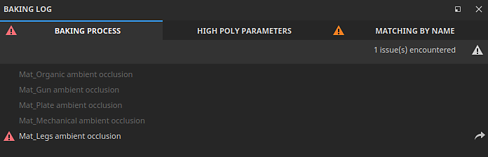

# 如何烘焙网格图

借助Substance 3D Painter的专用烘焙模式，可轻松烘焙网格图，进而制作令人惊叹的智能素材和其他工具。 继续阅读或观看下面的视频，了解如何开始使用Substance 3D Painter进行烘焙。

## 1 — 切换到烘焙模式

默认情况下，创建或打开项目时，Painter会以绘画模式启动。 为了能够生成网格图，您需要切换到“生成”模式。 使用以下选项之一切换到烘焙模式：

* 使用视口右上角上下文工具栏中的<b>烘焙模式按钮</b> （<b>羊角图标</b>）

  

  >[!NOTE]
  >
  > 有时，<b>烘焙模式按钮</b>可以隐藏在其他面板后面，具体取决于您的工作区布局。
* 使用“模式”菜单并选择<b>烘焙网格图。\
  </b>
* 使用<b>F8</b>键盘快捷键。

### 2 — 选择纹理集和UV磁贴

在<b>纹理集列表</b>中，使用每个纹理集旁的复选框（如果存在，则使用UV磁贴编号）来选择要烘焙的部分：

### 3 — 选择烘焙师

在“网格映射生成器”窗口中，使用复选框选择要生成的映射：

### 4 — 更改常用设置

在“网格图烘焙器”面板中，单击常用设置以更改在所有图之间共享的已烘焙贴图分辨率、扩展宽度和高多边形参数等设置：

在公共设置中，可以定义用作高清晰度网格的文件。 通过选取高清晰度网格，可以定义如何为网格生成保持架：

* 基于距离：使顶点相对于网格膨胀到跨模型的均匀距离，以创建保持架。
* 自动（实验性）：Painter将分析网格并自动生成保持架，尝试在不创建相交的情况下保持保持保持架靠近表面，以获得最佳效果。
* 自定文件：导入已创建用作笼架的文件。 请注意，导入文件的顶点数必须与基础网格的顶点数相同，才能正常工作。

如果您不是从高多边形网格进行烘焙，请启用<b>使用低多边形网格作为高多边形网格</b>复选框。

### 5 — 调整固定架

根据您使用的笼架方法，有不同的选项可用于调整笼架。 使用基于距离的保持架，您可以调整正面和后面的距离，以最大限度地减少保持架与网格之间的交叉量。

>[!NOTE]
>
> 当保持架与模型的几何相交时，会出现红点。 相交的笼子通常会导致相交区域出现伪影和问题。

### 6 — 开始烘焙过程

在视区底部，单击“烘焙”按钮以开始烘焙过程。

### 7 - Inspect烘焙日志中的错误

烘焙过程完成后，您可以查看“烘焙日志”窗口以检查是否报告任何错误。

如果有，请使用错误消息旁边的箭头查看相关的烘焙器设置：

