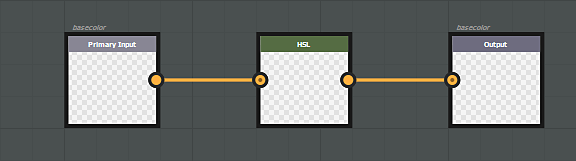

# 特定于通道的滤镜

效果可以特定于特定通道。 在这种情况下，如果要影响特定声道，则需要创建标识此声道的输入和输出。 作为一般规则，输入/输出结构应始终遵循1:1规则。 如果要输入特定声道，必须输出相同的声道。

仅影响&#x200B;**基色**&#x200B;通道的滤镜示例：

>[!NOTE]
>
> 无法合并通用设置（输入/输出节点）和特定通道（基色/基色）。

## Alpha组件管理

存储为RGBA的通道支持Alpha（例如基色）。 对于这些通道，alpha输入/输出可以直接存储在Substance输出中。 但是，Substance引擎不支持对灰度图像进行Alpha：必须使用辅助映射对其进行管理。 要获取Substance图形中特定通道的Alpha组件，请创建一个名为“**通道名称\_Alpha**”的灰度输入，例如： **基色\_Alpha**、**粗糙度\_Alpha**&#x200B;等。\
要输出此Alpha组件，请创建一个具有相同名称惯例的输出节点。

>[!NOTE]
>
> 每个通道的特定“**\_Alpha**”输出不适用于常规&#x200B;**材质**。 要使用蒙版隐藏通道，必须按照以下命名约定创建特定输出：
> 
> * 标识符： **channels\_Alpha**
> * 用法： **channels\_Alpha**

## 输入/输出用法和标识符列表

>[!NOTE]
>
> 可以在输入节点中使用&#x200B;**用法**&#x200B;或&#x200B;**标识符**（用法具有优先级）。

| 频道名称 | 使用情况 | 标识符/标识符Alpha |
| --- | --- | --- |
| *环境遮蔽* | **ambientOcclusion** | **ambientOcclusion / ambientOcclusion\_Alpha** |
| *各向异性角度* | **各向异性角度** | **各向异性角度/各向异性角度\_Alpha** |
| *各向异性级别* | **各向异性层级** | **各向异性级别/各向异性级别\_Alpha** |
| *基色* | **基色** | **baseColor / baseColor\_Alpha** |
| *混合蒙版* | **混合蒙版** | **blendingmask / blendingmask\_Alpha** |
| *扩散* | **扩散** | **扩散/扩散\_Alpha** |
| *位移* | **位移** | **位移/位移\_Alpha** |
| *具发射性* | **具发射性** | **发送/发送\_Alpha** |
| *光泽度* | **光泽度** | **光泽度/光泽度\_Alpha** |
| *Height* | **Height** | **Height/Height\_Alpha** |
| *IOR* | **或** | **i或/ ior\_Alpha** |
| *金属质感* | **金属质感** | **金属/金属\_Alpha** |
| *正常* | **正常** | **正常/正常\_Alpha** |
| *不透明度* | **不透明度** | **不透明度/不透明度\_Alpha** |
| *反射* | **反射** | **反射/反射\_Alpha** |
| *粗糙度* | **粗糙度** | **粗糙度/粗糙度\_Alpha** |
| *散布* | **散布** | **散布/散布\_Alpha** |
| *Specular* | **Specular** | **Specular/Specular\_Alpha** |
| *Specular level* | **specularlevel** | **specularLevel / specularLevel\_Alpha** |
| *传输* | **传输** | **传输/传输\_Alpha** |
| *用户0* | **用户0** | **用户0/用户0\_Alpha** |
| *用户1* | **用户1** | **用户1 / user1\_Alpha** |
| *用户2* | **用户2** | **用户2/用户2\_Alpha** |
| *用户3* | **用户3** | **用户3/用户3\_Alpha** |
| *用户4* | **用户4** | **用户4/用户4\_Alpha** |
| *用户5* | **用户5** | **用户5 / user5\_Alpha** |
| *用户6* | **用户6** | **用户6/用户6\_Alpha** |
| *用户7* | **用户7** | **用户7/用户7\_Alpha** |

## 示例

{width="650px"}

在此示例中，通过灰度节点提取基色Alpha通道以覆盖&#x200B;**粗糙度**&#x200B;通道。

{width="650px"}

在此示例中，**粗糙度**&#x200B;通道乘以&#x200B;**基色**。
