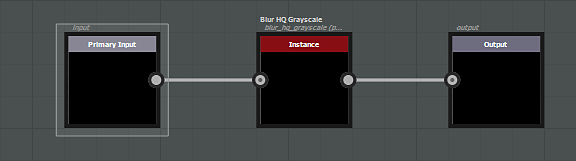

# 通用过滤器

通用效果将应用于所有文档通道，包括不透明度。 通用筛选器可以是：

* **灰度**，它将应用于每个通道（基色、金属、粗糙度等）的每个分量（R、G、B和A）
* **颜色**，它将按原样应用于彩色通道，或在内部转换为灰度以影响灰度通道

效果的输入节点必须具有&#x200B;**标识符**&#x200B;或&#x200B;**用法**&#x200B;定义&#x200B;**输入**，并且其输出节点必须具有&#x200B;**输出**。 请注意，基于&#x200B;**颜色**&#x200B;的滤镜无法用于图层的蒙版，只有&#x200B;**灰度**&#x200B;滤镜兼容。

>[!NOTE]
>
> 可以在输入节点中使用&#x200B;**用法**&#x200B;或&#x200B;**标识符**（用法具有优先级）。

示例：

{width="575px"}
