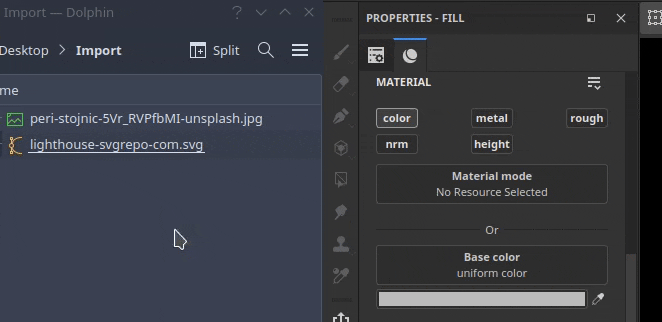

# 通过拖放添加资源

只需将文件从应用程序外部拖放到界面的不同区域，即可导入资源。

## 导入到“资源”窗口

要将资源导入Painter，只需将其拖放到“资源”窗口中即可。

这将打开“导入资源”窗口，该窗口允许控制将资源放在何处（项目内部、磁盘上以跨项目重复使用或在会话中临时使用）。 此窗口还允许正确配置资源的使用情况，因为有时某些文件格式可能并不明确。

### 导入到视区

要将素材直接导入并应用到项目中，只需将素材拖放到视区中即可。 拖动文件时，它应突出显示网格，以指示将应用于项目的哪个部分。

也可以通过将SVG文件拖放到视区中来导入此文件。 此操作将使用变形投影模式和资源<b>图形到材质</b>创建新图层，从而便于创建贴花。

### 导入到图层栈栈

将资源拖放到层中将创建层（或效果）。 如果资源不是Substance素材或滤镜，可能会出现一个菜单，询问将资源放入哪个通道。

<table>
<tr style="border: 0;">
<td style="border: 0;" valign="top">

<b>音频</b>

调整或添加音频到项目。

* 如果源视频有音频，请调整其音量。
* 添加、删除或替换外部音频文件。
* 调整外部音频文件音量。

</td>
<td style="border: 0;" valign="top">

</td>
</tr>
</table>

### 导入到资源槽

将文件拖放到接口中的一个资源插槽中（例如，拖放到填充层内的通道中），将导入资源并自动应用它。

