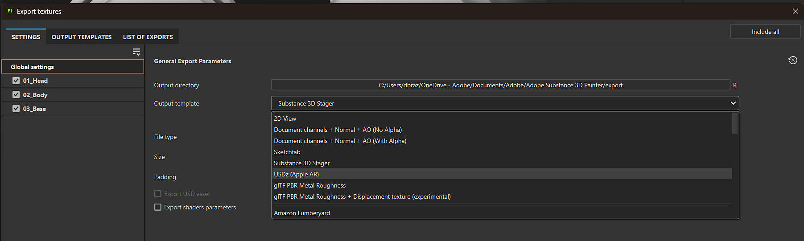

# USDz (Apple AR)预定义模板

>[!NOTE]
>
> 要使用自定义输出模板导出为美元，不要使用USDz (Apple AR)模板。 而是使用您选择的输出模板，并在<b>“设置”选项卡</b>的底部启用<b>导出USD资源</b>。

USDz (Apple AR)预定义输出模板可导出配置为与Apple AR应用程序一起使用的资源。

要使用USDz (Apple AR)模板，请执行以下操作：

1. 使用<b>文件>导出纹理</b>或键盘快捷键<b>Ctrl + Shift + E</b>打开“导出”窗口。
1. 在<b>设置选项卡</b>中，打开<b>输出模板下拉列表</b>，然后选择<b>USDz (Apple AR)</b>。

{zoomable="yes"}

创建并保存五个纹理文件（基色、金属、法线、遮蔽和粗糙度）。 除法线映射外，所有文件都存储为JPG，法线映射存储为PNG以避免因有损压缩而产生伪像。

此外，还将创建两个扩展名为usdc和usdz的其他文件：

以下是从Finder中直接在MacOS中打开的JadeToad的示例：

{width="400px"}

以下是一个发送到iPhone的USDZ文件示例，其中使用AR模式将JadeToad模型放置在真实环境中：

{width="500px"}
