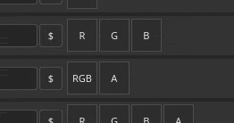
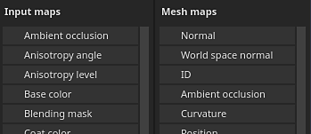

# 输出模板

{width="500px"}

“输出模板”选项卡允许您管理和创建新输出模板。 您可以使用输出模板来修改导出的纹理的名称、格式和配置。

## 预设列表

预设列表会显示所有可用的输出模板。 此列表包含[默认输出模板](../export-presets/default-presets.md)的集合，以及您创建的所有自定义模板。

在此列表中，模板可以<b>创建</b>、<b>重命名</b>、<b>重复、</b>或<b>删除</b>。

| 操作 | 视觉 | 描述 |
| --- | --- | --- |
| **重复** | 

 | 创建列表中当前所选输出模板的副本。 |
| **删除** | 

 | 删除列表中当前选定的输出模板。  **注意：**&#x200B;删除模板的操作无法撤消。 |
| **添加** | 

 | 添加新的空输出模板。 |
| **双击** | 

 | 重命名所选输出模板。 |
| **右键单击** | 

 | 右键单击模板以打开上下文菜单，您可以在其中删除、重命名或复制模板。 |

## 输出映射列表

本节列出了模板及其合成将生成的所有纹理。

### 映射类型和关键字

顶行列出所有可建立的纹理类型：

| 按钮 | 视觉 | 描述 |
| --- | --- | --- |
| **灰色** | 

 | 添加新的灰度地图。 |
| **RGB** | 

 | 添加新的RGB色图。 |
| **R+G+B** | 

 | 添加具有3个单独灰度插槽的新RGB图。 |
| **RGB+A** | 

 | 添加一个新的RGB映射以及一个Alpha（灰度）插槽。 |
| **R+G+B+A** | 

 | 添加具有4个单独的灰度插槽的新RGBA映射。 |

>[!NOTE]
>
> 当某些类型为空或共享相同的输入映射时，可以合并/折叠：
> 
> 

### 映射名称

每个纹理都可以使用自定义命名约定来命名。 可以添加一些关键字（借助&#x200B;**$**&#x200B;按钮），以便在生成最终文件时自动替换为应用程序：

| 关键字 | 描述 |
| --- | --- |
| **$项目** | 替换为项目文件的名称(.spp)。 |
| **$mesh** | 替换为网格文件的名称（输入网格文件，如.fbx） |
| **$textureset** | 替换为从中生成纹理的材质/纹理集的名称。 |
| **$udim** | 替换为从中生成纹理的UDIM编号。 |
| **$色彩空间** | 替换为给定通道所用的色彩空间名称（RGB或G，忽略Alpha）。 |

### 映射文件格式和位深度

第一个下拉菜单可用于指定当前输出映射的文件格式。

第二个下拉列表用于指定输出映射的位深度。 位深度取决于所选的文件格式。 有关更多详细信息，请参阅[导出设置](export-settings.md)。

>[!NOTE]
>
> 要在导出时考虑格式和位深度设置，请确保将常规设置中的文件类型设置为&#x200B;**基于输出模板**。

## 源映射列表

### 输入映射

输入映射列表将可以通过[纹理集设置](../../interface/texture-set/texture-set-settings.md)添加的所有通道重新分组。

>[!NOTE]
>
> **用户**&#x200B;通道基于其原始名称（**用户\_x**），自定义名称将被忽略。

### 网格图

网格图是烘焙纹理：

| 名称 | 描述 |
| --- | --- |
| **正常** | 烘焙法线图。 |
| **世界空间正常** | 烘焙世界空间正常。 |
| **ID** | 烘焙标识。 |
| **环境遮蔽** | 烘焙环境遮蔽 |
| **曲率** | 烤曲率。 |
| **位置** | 烘焙位置。 |
| **Thickness** | 烘焙Thickness。 |
| **Height** | 烘焙Height。 |
| **弯曲法线** | 烘焙弯曲的法线。 |

### Converted maps

转换后的映射是由应用程序从其他源生成的映射：

| 名称 | 描述 |
| --- | --- |
| **普通OpenGL** | 将烘焙法线和“纹理集”法线通道的OpenGL格式组合为法线图。 |
| **普通DirectX** | 以烘焙法线和“纹理集”法线通道的DirectX格式组合法线图。 |
| **混合AO** | 烘焙环境遮蔽和纹理集环境遮蔽通道的组合环境遮蔽。 |
| **扩散** | 从&#x200B;**基色**&#x200B;和&#x200B;**金属**&#x200B;通道生成的漫射纹理（金属区域将替换为黑色）。 |
| **Specular** | 从&#x200B;**基色**&#x200B;和&#x200B;**金属**&#x200B;通道生成的Specular纹理。 |
| **光泽度** | 由粗糙度通道的倒数生成的光泽纹理。 |
| **Unity4扩散** | 已弃用。 从&#x200B;**基色**&#x200B;通道生成的漫射纹理以匹配Unity 4着色器。 |
| **Unity4光泽** | 已弃用。 从&#x200B;**粗糙度**&#x200B;和&#x200B;**金属质感**&#x200B;通道生成的光泽纹理，以匹配Unity 4着色器。 |
| **反射** | 白色表示介电材料和其他颜色作为金属材料的纹理。 |
| **1/i或** | 包含1除以&#x200B;**IOR**&#x200B;值的纹理。 **IOR**&#x200B;从金属图生成：1.4表示电介质，100表示金属（黑色）。 |
| **光泽度2** | **光泽度**&#x200B;声道的方形版本（**光泽度** \* **光泽度**） |
| **f0** | 纹理包含菲涅耳值0（介电材料为0.04，金属材料为1.0）。 |
