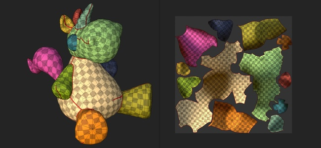

# 自动UV展开

\
自动展开允许在导入3D模型时自动生成UV 岛。 它可用于绘画没有任何现有UV的3D模型。

## 启用自动展开

创建新项目或将网格重新导入现有项目时，请确保选中设置“自动展开”。 如果禁用，则将跳过该过程，并且网格UV将保持原样。

## UV展开设置

在导入网格并使用展开过程时，可以使用以下设置。 可通过界面中的“选项”按钮使用某些设置。

| 章节 | ***设置*** | ***描述*** |
| --- | --- | --- |
| **取消包装序列** | **接缝** | 控制是否应该只为没有或总是重新生成接缝的网格生成UV 岛（颜色边框）。可能的值：<ul data-preserve-html="true"><li data-preserve-html="true"><strong>生成缺少的数据</strong> （默认）：将为缺少数据的网格生成接缝。</li><li data-preserve-html="true"><strong>重新计算所有</strong> ：将为所有网格生成接缝。</li></ul> |
| **UV 岛** | 控制是否应从没有UV的网格或任何网格生成UV展开。 可能的值：<ul data-preserve-html="true"><li data-preserve-html="true"><strong>生成缺失数据</strong>（默认）：将为缺失UV的网格生成UV解包。</li><li data-preserve-html="true"><strong>重新计算所有</strong> ：将为所有网格生成UV展开。</li></ul> |  |
| **打包** | 控制UV 岛的打包/布局。可能的值：<ul data-preserve-html="true"><li data-preserve-html="true"><strong>生成缺少的数据</strong> （默认）：为缺少UV的网格打包UV 岛。</li><li data-preserve-html="true"><strong>重新计算所有</strong> ：打包所有UV 岛。</li></ul> |  |
|  |  |  |
| **布局自定义** | **边距大小** | 定义UV 岛之间的间距。 此设置应用与分辨率无关的一般百分比。可能的值：<ul data-preserve-html="true"><li data-preserve-html="true"><strong>无边距</strong> ： 0%</li><li data-preserve-html="true"><strong>小</strong> （默认）： 0.2%</li><li data-preserve-html="true"><strong>中等</strong> ： 0.5%</li><li data-preserve-html="true"><strong>大</strong> ： 1%</li></ul> |
|  | **UV 岛方向** | 在打包过程中控制UV 岛的方向。可能的值：<ul data-preserve-html="true"><li data-preserve-html="true"><strong>不受约束</strong>（默认）：未应用任何约束来计算方向。</li><li data-preserve-html="true"><strong>与3D 网格对齐</strong>：将UV 岛限制为面向网格方向</li></ul> |
|  |  |  |
| **UV 平铺** | **最大UV 平铺数** | 如果启用UV 平铺工作流程，此设置将确定在UV 岛上要生成的最大磁贴数。 |
|  |  |  |
| **优化** | **避免拉长的UV 岛** | 如果启用，此过程将拆分认为过长的UV 岛，以改进纹理空间的使用。修改前（上）和修改后（下）示例： 

 |

## 已知限制

以下列出与展开过程相关的限制：

* 处理高多边形网格可能需要很长时间。
* 将合并完全相同坐标的顶点
* 在极少数情况下，某些网格部件上的UV生成可能会失败
* 在某些情况下，单个UV 岛中的非均匀或高度扭曲的纹理比率
* 纹理集间非均匀纹理比
* 生成的UV 岛可能会很长，在某些情况下，不适合UV空间
* 具有小边缘或重叠边缘的退化脸部或非三角形网格脸部可能无法展开UV
