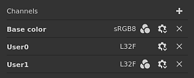
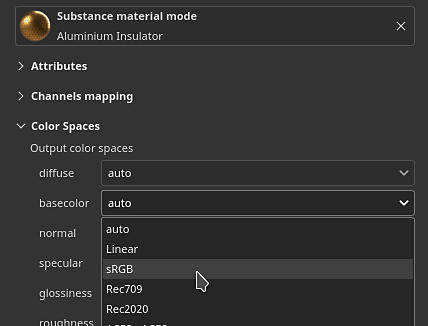

# 色彩管理

色彩管理是对颜色的处理和转换。 从导入资源到在屏幕上显示颜色，最后导出纹理。 颜色校准对于确保跨应用程序的相同外观非常重要。

在应用程序中，色彩管理通过[OpenColorIO](https://opencolorio.org/)（简称OCIO）版本2的集成来处理。 OCIO是电影和动画中转换和显示颜色的标准。 要启用色彩管理，只需创建一个新项目或打开一个现有项目并启用专用设置即可。

>[!NOTE]
>
> 色彩管理从版本7.4.0开始可用。

## Project settings

色彩管理设置：

* [使用AdobeACE - ICC进行色彩管理](color-management-with-adobe-ace-icc.md)
* [使用OpenColorIO进行色彩管理](color-management-with-opencolorio.md)

## 词汇

为了更好地了解关联的工作流程，了解一些与色彩管理相关的技术术语可能会有所帮助：

| 关键字 | 描述 |
| --- | --- |
| **色彩空间** | 在其中定义颜色的坐标系。 |
| **工作空间** | 应用程序内部用于混合纹理、绘画等的色彩空间。 |
| **显示变换** | 显示变换将线性颜色从工作空间转换为显示器的色彩空间，以感性的方式（肉眼可见）显示颜色。 显示变换通常包括色调映射通道，用于压缩颜色以适合屏幕允许的有限值范围。 |
| **配置** | OCIO配置文件。 它定义了什么是工作空间、色彩空间列表和显示变换列表。 |
| **ACES** | ACES代表Academy 颜色编码系统，是许多应用程序中交换数字图像文件的标准。 默认情况下，此标准的两个版本包含在应用程序中。 |
| **色调映射** | 它是将颜色值从HDR(高动态范围)映射到LDR（低动态范围）的过程。 此流程有助于显示近似于各种颜色的显示效果。 |

## 色彩管理的通道列表

在应用程序内，哪些通道是经过色彩管理的通道（数据/通道）是预先定义的。

| 通道 | 是否进行色彩管理 |
| --- | --- |
| **环境遮蔽** | 否 |
| **各向异性角度** | 否 |
| **各向异性级别** | 否 |
| **基色** | **是** |
| **混合蒙版** | 否 |
| **皮毛颜色** | **是** |
| **皮毛正常** | 否 |
| **皮毛不透明度** | 否 |
| **皮毛粗糙度** | 否 |
| **涂层Specular level** | 否 |
| **扩散** | **是** |
| **位移** | 否 |
| **光泽度** | 否 |
| **Height** | 否 |
| **Ior** | 否 |
| **金属质感** | 否 |
| **正常** | 否 |
| **不透明度** | 否 |
| **反射** | 否 |
| **粗糙度** | 否 |
| **散布** | 否 |
| **散布颜色** | **是** |
| **光泽颜色** | **是** |
| **光泽不透明度** | 否 |
| **光泽粗糙度** | 否 |
| **Specular** | **是** |
| **Specular edge color** | **是** |
| **Specular level** | 否 |
| **半透明** | 否 |
| **传输** | **是** |
| **用户X (0-15)** | 取决于[纹理集设置](../../interface/texture-set/texture-set-settings.md)。 默认情况下，用户通道不进行色彩管理。 

 |

## 拾色器

启用色彩管理后，[拾色器](../../interface/color-picker.md)行为会略有变化：

* 根据选定的当前显示编辑颜色。
* 界面中还添加了其他一些信息。

有关详细信息，请参阅拾色器[文档页面](../../interface/color-picker.md)。

## 视区控件

2D视图和3D视图均进行色彩管理，并在视口顶部提供专用设置来控制要使用的显示变换：

* **左键**：启用/禁用视区的显示变换。 如果禁用此复选框，视区会将颜色显示为raw/passthrough。 默认情况下，此按钮处于启用状态。
* **右侧下拉列表**：指定在屏幕上显示颜色时要使用的显示变换。 默认值基于OCIO配置。 此设置未随项目一起保存，因为它可能与监视器相关。

>[!NOTE]
>
> 在单独模式（单独查看通道）中，查看数据通道时会自动禁用色彩管理（请参阅上面的列表）。

## 导出设置

主要导出设置由项目配置驱动（请参阅上文）。

在[导出纹理](../../export/export.md)窗口中，有一个关键字可用于向文件名追加每个纹理使用的色彩空间： **$colorSpace**。

<table>
<tr style="border: 0;">
<td style="border: 0;" valign="top">

{width="320px"}

</td>
<td style="border: 0;" valign="top">

{width="500px"}

</td>
</tr>
</table>

## 覆盖色彩空间

可能需要为资源指定一个替代色彩空间，以便与默认色彩空间不同。 这可以通过色彩空间菜单来完成。

### 更改资源的色彩空间

在[属性窗口](../../interface/properties.md)内，可以覆盖特定资源（当前使用的资源）的色彩空间。

为此，请展开色彩空间部分，然后使用下拉菜单指定新的色彩空间：

### 更改环境映射的色彩空间

在[显示设置](../../interface/display-settings/display-settings.md)中，启用&#x200B;**覆盖环境映射色彩空间**，然后在列表中选择与您的资源匹配的色彩空间。

