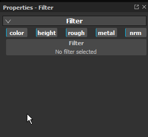

# 滤镜

滤镜效果是变换图层或蒙版内容的物质。

## 如何应用滤镜？

根据滤镜类型，必须在图层的内容或蒙版上创建滤镜效果。\
应用滤镜有两种方法，您使用哪种方法取决于预计滤镜的使用方式。

## 手动应用滤镜。

在以下示例中，模糊滤镜应用于图层的内容，但更常见的是用于应用滤镜到蒙版：

### 1 — 添加滤镜效果

首先选择图层的内容（左侧缩略图），然后单击效果按钮（或右键单击以打开上下文菜单）。\
在列表中选择选项“ **添加筛选器**”。

### 2 — 在属性窗口中选择过滤器

在属性窗口中，参数或过滤器当前为空。 只有选择按钮可用。\
单击按钮以打开迷你架并选择所需的滤镜，这里我们选择模糊滤镜。

## 从层架中拖放滤镜

此方法仅适用于应应用于整个图层栈栈的滤镜。 它将自动设置所有通道[混合模式](../../interface/layer-stack/blending-modes.md) 。 此操作不适用于将滤镜应用于蒙版。

### 1 — 打开Shelf的Filters区域

在盘架中，单击左侧的“过滤器”部分。

## 2 — 拖放滤镜

选择要在架子中使用的过滤器。 将其拖放到图层栈栈中，确保将其放置在正确位置（例如，避免将其拖放到不需要的组中）。

请注意，在上面的示例中，放置的滤镜已具有直通混合模式。 这适用于文档的所有渠道。

## 添加新型过滤器

所有过滤器都是Substance，可使用Substance 3D Designer创建过滤器。\
作为快速启动，Substance 3D Designer提供了可立即用于Substance 3D Painter的模板。

有关详细信息，请参阅此页面： [创建自定义效果](../../content/creating-custom-effects/creating-custom-effects.md)
