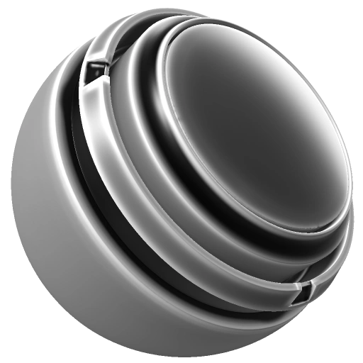

# 弯曲

<table>
  <tr style="border: 0;">
    <td style="border: 0;" valign="top"> <strong>英寸：</strong>蒙版，生成器，灰度，混合</td>
    <td style="border: 0;" valign="top"><strong>描述</strong> 曲率生成器根据烘焙的曲率图创建蒙版，并提供将纹理或微细节混合到蒙版的选项。  曲率生成器输出单色（黑白）纹理。 因此，在生成蒙版而不是直接应用于图层时非常有用。  需要烘焙位置图作为输入。 <a href="../../../baking/baking.md">在此处了解有关烘焙的更多信息</a>。</td>
  </tr>
</table>

## 输入

| 输入名称 | 描述 |
| --- | --- |
| **纹理**&#x200B;颜色 | 使用自定义纹理或锚点。 |
| **微正常**&#x200B;颜色 | 使用自定义的正常纹理或锚点。 |
| **微Height**&#x200B;颜色 | 使用自定义纹理或锚点。 |
| **曲率**&#x200B;灰度 | 使用烘焙的曲率图。 |
| **世界空间法线**&#x200B;颜色 | 使用烘焙过的世界空间法线图。 |
| **位置渐变**&#x200B;颜色 | 使用烘焙的位置图。 |

## 参数

| 参数名称 | 描述 |
| --- | --- |
| **全局反转** | 合并所有效果后反转最终结果。 |
| **全局模糊** | 在合并所有效果后，统一柔化最终蒙版。 |
| **全局平衡** | 在黑色或白色之间组合所有效果后，改变最终蒙版的平衡，例如亮度调整。 |
| **全局对比度** | 在合并所有效果后调整最终蒙版的对比度。 |
| **使用纹理** | 打开或关闭自定义纹理贴图的使用。 |
| **使用微详细信息** | 打开或关闭自定义微详细信息映射的使用情况。 |

### 弯曲

<table>
  <tr>
    <th>参数名称</th>
    <th>描述</th>
  </tr>
  <tr>
    <td><strong>反相</strong></td>
    <td>反转生成的曲率图。</td>
  </tr>
  <tr>
    <td><strong>模式</strong></td>
    <td>设置曲率模式。  <ul><li><strong>边缘</strong>：遮盖边缘（凸形区域）</li><li><strong>空腔</strong>：遮盖空腔（凹形区域）</li><li><strong>双</strong>：遮盖凹形和凸形区域。</li><li><strong>未处理</strong>：法线曲率蒙版。</li></ul></td>
  </tr>
  <tr>
    <td><strong>锐化</strong></td>
    <td>调整尖锐曲率细节的强度。</td>
  </tr>
  <tr>
    <td><strong>精细</strong></td>
    <td>调整精细曲率细节的强度。</td>
  </tr>
  <tr>
    <td><strong>柔和</strong></td>
    <td>调整柔和曲率细节的强度。</td>
  </tr>
  <tr>
    <td><strong>中</strong></td>
    <td>调整中等曲率细节的强度。</td>
  </tr>
  <tr>
    <td><strong>Large</strong></td>
    <td>调整大曲率细节的强度。</td>
  </tr>
  <tr>
    <td><strong>大</strong></td>
    <td>调整大曲率细节的强度。</td>
  </tr>
  <tr>
    <td><strong>巨大</strong></td>
    <td>调整巨大曲率细节的强度。</td>
  </tr>
  <tr>
    <td><strong>对比度</strong></td>
    <td>调整曲率的对比度/衰减。</td>
  </tr>
  <tr>
    <td><strong>Brightness</strong></td>
    <td>调整曲率的明度。</td>
  </tr>
</table>

### 纹理

<table>
  <tr>
    <th>参数名称</th>
    <th>描述</th>
  </tr>
  <tr>
    <td><strong>纹理不透明度</strong></td>
    <td>控制自定义纹理的可见性。</td>
  </tr>
  <tr>
    <td><strong>反相</strong></td>
    <td>仅反转自定义纹理。</td>
  </tr>
  <tr>
    <td><strong>灰度转换</strong></td>
    <td>选择用于将彩色输入转换为黑白输入的方法。 </td>
  </tr>
  <tr>
    <td><strong>混合模式</strong></td>
    <td>为自定纹理设置混合模式。</td>
  </tr>
  <tr>
    <td><strong>比例</strong></td>
    <td>调整自定义纹理的大小。</td>
  </tr>
  <tr>
    <td><strong>对比度</strong></td>
    <td>设置自定义纹理的对比度/衰减。</td>
  </tr>
  <tr>
    <td><strong>Brightness</strong></td>
    <td>设置自定义纹理的明度。</td>
  </tr>
  <tr>
    <td><strong>三平面</strong></td>
    <td>启用“三平面”后，纹理从三个方向（X、Y、Z轴）投影，而不是仅依赖于UV。  <ul><li>如果未启用三平面，纹理将遵循UV布局。</li><li>启用三平面后，纹理从多个角度投影并混合。</li></ul></td>
  </tr>
  <tr>
    <td><strong>三平面对比度</strong></td>
    <td>使用三平面映射投影纹理时，调整纹理混合的平滑程度。 这可以调整每个方向的投影之间混合的柔和度。</td>
  </tr>
</table>

### 微细节

<table>
  <tr>
    <th>参数名称</th>
    <th>描述</th>
  </tr>
  <tr>
    <td><strong>微型Height</strong></td>
    <td>打开或关闭自定义微Height映射的使用。</td>
  </tr>
  <tr>
    <td><strong>微法线</strong></td>
    <td>打开或关闭自定义微法线图的使用。</td>
  </tr>
  <tr>
    <td><strong>曲率类型</strong></td>
    <td>设置曲率类型。  <ul><li><strong>标准</strong>：生成的结果通常非常锐利，但可能缺少更宽的细节。</li><li><strong>Sobel</strong>：生成与标准图相似的结果，但稍微模糊一些，因为它使用Sobel滤镜评估正常图。</li><li><strong>平滑</strong>：生成不同级别的模糊（如mipmap）以累积信息。 这通常可提供更平滑的曲线，但可能会丢失细节。</li></ul></td>
  </tr>
  <tr>
    <td><strong>曲率强度</strong></td>
    <td>在<strong>标准</strong>和<strong>Sobel </strong>曲率模式下调整曲率强度。</td>
  </tr>
  <tr>
    <td><strong>Height细节强度</strong></td>
    <td>调整微Height细节的强度。</td>
  </tr>
</table>
