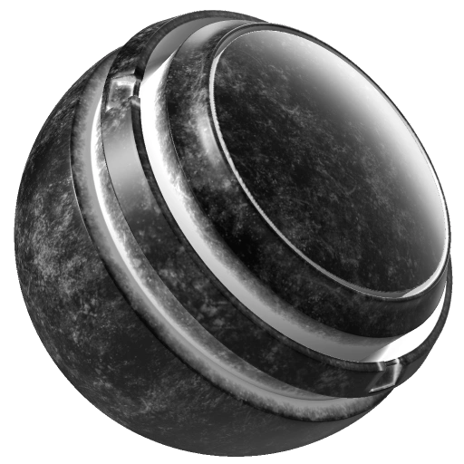

# 污垢

<table>
  <tr style="border: 0;">
    <td style="border: 0;" valign="top"> <strong>进入：</strong>蒙版，生成器</td>
    <td style="border: 0;" valign="top"><strong>描述</strong> Dirt生成器根据Dirt、污渍在裂缝、边缘和平面中添加逼真的弯曲和ambient occlusion累积。 您也可以选择使用“微Height”和“微法线图”来添加更多详细信息。  Dirt生成器输出黑白纹理。 因此，它有助于生成蒙版以向模型添加Dirt或污渍细节。  需要烘焙的位置、弯曲、ambient occlusion和世界空间法线映射作为图像输入。 <a href="../../../baking/baking.md">在此处了解有关烘焙的更多信息</a>。</td>
  </tr>
</table>

>[!NOTE]
>
> Dirt生成器是一个功能强大的工具，可快速为网格添加Dirt。 为获得最佳效果，我们建议使用额外的蒙版来控制如何应用Dirt，同时始终考虑资源的环境和历史记录。

## 输入

| 输入名称 | 描述 |
| --- | --- |
| **弯曲**&#x200B;灰度 | 使用弯曲图。 |
| **Ambient occlusion**&#x200B;灰度 | 使用烘焙的Ambient occlusion映射。 |
| **世界空间法线**&#x200B;颜色 | 使用烘焙的世界空间法线映射。 |
| **位置**&#x200B;颜色 | 使用烘焙的位置图。 |
| **自定义污渍**&#x200B;灰度 | 使用自定义纹理或锚点。 |
| **微正常**&#x200B;颜色 | 使用自定法线纹理或锚点。 |
| **微Height**&#x200B;颜色 | 使用自定义纹理或锚点。 |

## 参数

<table>
  <tr>
    <th>参数名称</th>
    <th>描述</th>
  </tr>
  <tr>
    <td><strong>Seed</strong></td>
    <td>设置用于生成Dirt纹理的种子值。  <ul><li>单击“随机”可切换到另一个随机植入。</li><li>单击铅笔以查看当前种子值，并根据需要输入特定值。</li></ul></td>
  </tr>
  <tr>
    <td><strong>反相</strong></td>
    <td>反转Dirt蒙版。</td>
  </tr>
  <tr>
    <td><strong>Dirt级别</strong></td>
    <td>调整Dirt效果的强度。</td>
  </tr>
  <tr>
    <td><strong>Dirt对比度</strong></td>
    <td>调整Dirt效果的对比度。</td>
  </tr>
  <tr>
    <td><strong>使用三平面</strong></td>
    <td>启用“三平面”后，纹理从三个方向(X、Y、Z轴)投影，而不是仅依赖UV。  <ul><li>如果未启用三平面，纹理将遵循UV布局。</li><li>启用三平面后，纹理从多个角度投影并混合。</li></ul></td>
  </tr>
  <tr>
    <td><strong>三平面混合对比度</strong></td>
    <td>使用三平面映射调整纹理投影时的混合平滑度。 它可调整各个方向投影之间混合的柔和度。</td>
  </tr>
  <tr>
    <td><strong>污渍数量</strong></td>
    <td>调整污渍细节的强度。</td>
  </tr>
  <tr>
    <td><strong>污渍比例</strong></td>
    <td>调整污渍细节的大小。</td>
  </tr>
  <tr>
    <td><strong>使用自定义污渍</strong></td>
    <td>打开或关闭自定义污渍映射的使用。</td>
  </tr>
  <tr>
    <td><strong>边缘蒙版</strong></td>
    <td>根据弯曲图调整边缘的蒙版。</td>
  </tr>
</table>

### 微细节

<table>
  <tr>
    <th>参数名称</th>
    <th>描述</th>
  </tr>
  <tr>
    <td><strong>微型Height</strong></td>
    <td>打开或关闭自定义微高度图的使用。</td>
  </tr>
  <tr>
    <td><strong>微法线</strong></td>
    <td>打开或关闭自定义微法线图的使用。</td>
  </tr>
  <tr>
    <td><strong>弯曲类型</strong></td>
    <td>设置弯曲类型。  <ul><li><strong>标准</strong>：生成的结果通常非常锐利，但可能缺少更宽的细节。</li><li><strong>Sobel</strong>：与标准结果类似，但稍微模糊一些，因为它使用Sobel滤镜评估法线图。</li><li><strong>平滑</strong>：生成不同级别的模糊（如mipmap）以累积信息。 这通常可提供更平滑的曲线，但可能会丢失细节。</li></ul></td>
  </tr>
  <tr>
    <td><strong>弯曲强度</strong></td>
    <td>在“标准”和“Sobel弯曲”模式下调整弯曲的强度。</td>
  </tr>
  <tr>
    <td><strong>Height细节强度</strong></td>
    <td>调整微Height细节的数量。</td>
  </tr>
  <tr>
    <td><strong>AO半径</strong></td>
    <td>在微观细节中调整Ambient occlusion的半径（范围）。</td>
  </tr>
  <tr>
    <td><strong>AO深度</strong></td>
    <td>在微观细节中调整Ambient occlusion的深度（强度）。</td>
  </tr>
</table>
