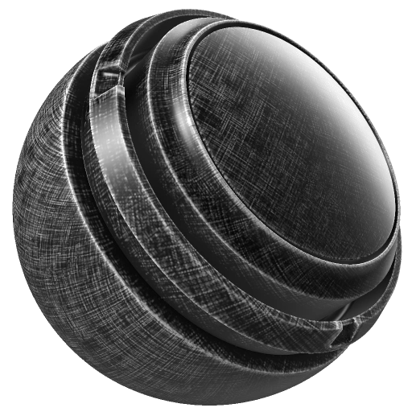

# 玻璃纤维Edge Wear

<table>
  <tr style="border: 0;">
    <td style="border: 0;" valign="top"> <strong>进入：</strong>蒙版，生成器</td>
    <td style="border: 0;" valign="top"><strong>描述</strong> 光纤玻璃Edge Wear生成器根据烘焙的弯曲和Ambient occlusion映射增加逼真的光纤玻璃边缘磨损和磨损细节。 另外，还可以使用“微Height”和“微法线图”获取详细信息。  光纤玻璃Edge Wear生成器输出单色（黑白）纹理。 因此，在生成蒙版以向图层添加玻璃纤维边缘磨损细节时非常有用。  需要烘焙的位置、弯曲、ambient occlusion和世界空间法线映射作为图像输入。 <a href="../../../baking/baking.md">在此详细了解烘焙</a>。</td>
  </tr>
</table>

## 输入

| 输入名称 | 描述 |
| --- | --- |
| **自定义污渍**&#x200B;灰度 | 使用自定义纹理或锚点。 |
| **弯曲**&#x200B;灰度 | 使用弯曲图。 |
| **Ambient occlusion**&#x200B;灰度 | 使用烘焙的Ambient occlusion映射。 |
| **世界空间法线**&#x200B;颜色 | 使用烘焙的世界空间法线映射。 |
| **位置**&#x200B;颜色 | 使用烘焙的位置图。 |
| **微正常**&#x200B;颜色 | 使用自定法线纹理或锚点。 |
| **微Height**&#x200B;颜色 | 使用自定义纹理或锚点。 |

## 参数

<table>
  <tr>
    <th>参数名称</th>
    <th>描述</th>
  </tr>
  <tr>
    <td><strong>Seed</strong></td>
    <td>设置用于生成Dirt纹理的种子值。  <ul><li>单击“随机”可切换到另一个随机植入。</li><li>单击铅笔以查看当前种子值，并根据需要输入特定值。</li></ul></td>
  </tr>
  <tr>
    <td><strong>反相</strong></td>
    <td>在将特定内部映射（例如弯曲、AO）合并到最终蒙版之前，对其进行反转。</td>
  </tr>
  <tr>
    <td><strong>磨损量</strong></td>
    <td>调整总磨损量和生成器效果的整体可见性。</td>
  </tr>
  <tr>
    <td><strong>磨损对比</strong></td>
    <td>调整最终磨损结果的对比度。</td>
  </tr>
  <tr>
    <td><strong>使用三平面</strong></td>
    <td>启用<strong>“使用三平面”</strong>后，纹理将从三个方向(X、Y、Z轴)投影，而不是仅依赖UV。  <ul><li>如果未启用三平面，纹理将遵循UV布局。</li><li>启用三平面后，纹理从多个角度投影并混合。</li></ul></td>
  </tr>
  <tr>
    <td><strong>三平面混合对比度</strong></td>
    <td>使用三平面映射调整纹理投影时的混合平滑度。 这将调整各个方向投影之间混合的柔和度。</td>
  </tr>
  <tr>
    <td><strong>污渍数量</strong></td>
    <td>调整污渍细节的强度。</td>
  </tr>
  <tr>
    <td><strong>使用自定义污渍</strong></td>
    <td>打开或关闭自定义污渍映射的使用。</td>
  </tr>
  <tr>
    <td><strong>边缘Smoothness</strong></td>
    <td>调整边缘磨损效果的柔和度。</td>
  </tr>
  <tr>
    <td><strong>ambient occlusion蒙版</strong></td>
    <td>调整ambient occlusion映射对结果的影响程度。</td>
  </tr>
  <tr>
    <td><strong>弯曲粗细</strong></td>
    <td>调整弯曲图对结果的影响程度。</td>
  </tr>
</table>

### 微细节

<table>
  <tr>
    <th>参数名称</th>
    <th>描述</th>
  </tr>
  <tr>
    <td><strong>微型Height</strong></td>
    <td>打开或关闭自定义微高度图的使用。</td>
  </tr>
  <tr>
    <td><strong>微法线</strong></td>
    <td>打开或关闭自定义微法线图的使用。</td>
  </tr>
  <tr>
    <td><strong>弯曲类型</strong></td>
    <td>确定弯曲类型。  <ul><li><strong>标准</strong>：生成的结果通常非常锐利，但可能缺少更宽的细节。</li><li><strong>Sobel</strong>：与标准结果类似，但稍微模糊一些，因为它使用Sobel滤镜评估法线图。</li><li><strong>平滑</strong>：生成不同级别的模糊（如mipmap）以累积信息。 这通常可提供更平滑的曲线，但可能会丢失细节。</li></ul></td>
  </tr>
  <tr>
    <td><strong>弯曲强度</strong></td>
    <td>在“标准”和“Sobel弯曲”模式下调整弯曲的强度。</td>
  </tr>
  <tr>
    <td><strong>Height细节强度</strong></td>
    <td>调整微Height细节的数量。</td>
  </tr>
  <tr>
    <td><strong>AO半径</strong></td>
    <td>在微观细节中调整Ambient occlusion的半径（范围）。</td>
  </tr>
  <tr>
    <td><strong>AO深度</strong></td>
    <td>在微观细节中调整Ambient occlusion的深度（强度）。</td>
  </tr>
</table>
