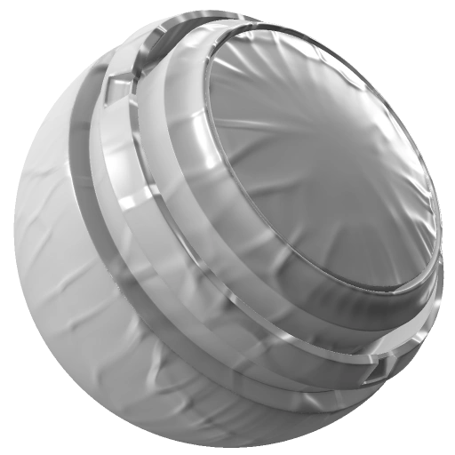

# 充气收缩套装

<table>
  <tr style="border: 0;">
    <td style="border: 0;" valign="top"> <strong>英寸：</strong>收缩包装，膨胀，生成器，随机植入</td>
    <td style="border: 0;" valign="top"><strong>描述</strong> 充气收缩包络生成器会添加皱纹，以模拟拉伸到网格表面薄材料的效果。  膨胀Shrinkwrap生成器输出单色（黑白）纹理。 因此，它对于生成可创建收缩效果的蒙版非常有用。 但是，也可以直接将其放在填充图层上，以向Height和法线通道添加皱纹。  需要烘焙的曲率图作为图像输入。 <a href="../../../baking/baking.md">在此处了解有关烘焙的更多信息</a>。</td>
  </tr>
</table>

## 输入

| 输入名称 | 描述 |
| --- | --- |
| **曲率**&#x200B;灰度 | 使用烘焙的曲率图。 |

## 参数

<table>
  <tr>
    <th>参数名称</th>
    <th>描述</th>
  </tr>
  <tr>
    <td><strong>预设</strong></td>
    <td>在“膨胀”、“真空 — 拉动”和“紧凑”预设之间切换。</td>
  </tr>
  <tr>
    <td><strong>Seed</strong></td>
    <td>设置用于生成Dirt纹理的种子值。  <ul><li>单击“随机”可切换到另一个随机植入。</li><li>单击铅笔以查看当前种子值，并根据需要输入特定值。</li></ul></td>
  </tr>
  <tr>
    <td><strong>膨胀或收缩</strong></td>
    <td>在膨胀和收缩模式之间切换。</td>
  </tr>
  <tr>
    <td><strong>接缝强度</strong></td>
    <td>调整边缘的显着性。</td>
  </tr>
  <tr>
    <td><strong>上凸边缘宽度</strong></td>
    <td>调整膨胀的边缘褶皱的程度。</td>
  </tr>
  <tr>
    <td><strong>凸出边缘强度</strong></td>
    <td>调整凸起边缘效果的强度。</td>
  </tr>
  <tr>
    <td><strong>褶皱密度</strong></td>
    <td>调整褶皱的数量。</td>
  </tr>
  <tr>
    <td><strong>褶皱紧度</strong></td>
    <td>调整UV边框上褶皱的紧密程度。</td>
  </tr>
  <tr>
    <td><strong>褶皱范围</strong></td>
    <td>调整皱纹距离UV边框的距离。</td>
  </tr>
  <tr>
    <td><strong>褶皱缩放</strong></td>
    <td>调整褶皱的大小。</td>
  </tr>
</table>

### 技术参数

| 参数名称 | 描述 |
| --- | --- |
| **Height范围** | 设置Height范围。 |
| **Height位置** | 将Height调整为黑色(0)或白色(1)。 |
| **表面大小（厘米）** | 设置曲面的物理尺寸。 |
| **表面深度（厘米）** | 设置表面的物理深度。 |
