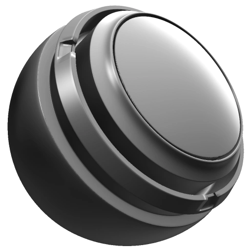

# 光线

<table>
  <tr style="border: 0;">
    <td style="border: 0;" valign="top"> <strong>进入：</strong>蒙版，生成器</td>
    <td style="border: 0;" valign="top"><strong>描述</strong> 光生成器会根据世界空间法线和位置映射伪装成照射在网格上的定向光。  可在填充图层上使用光生成器，也可将其用于创建蒙版。 当在填充图层中使用时，生成器输出Specular、金属度、粗糙度、法线和Height通道，这些通道可以用在多种组合中，以产生不同的效果。 我们建议在视口中循环切换通道视图，以了解每个通道如何受到光生成器的影响。需要  烘焙的位置和世界空间法线映射作为图像输入。 <a href="../../../baking/baking.md">在此处了解有关烘焙的更多信息</a>。</td>
  </tr>
</table>

## 输入

| 输入名称 | 描述 |
| --- | --- |
| **世界空间法线**&#x200B;颜色 | 使用烘焙的世界空间法线映射。 |
| **位置**&#x200B;颜色 | 使用烘焙的位置图。 |

## 参数

| 参数名称 | 描述 |
| --- | --- |
| **反转** | 反转输出颜色映射。 |
| **水平角度** | 设置假光线的水平角度。 |
| **垂直角度** | 设置假光的垂直角度。 |
| **高光光泽度** | 调整高亮区域的衰减跨度。 |
| **高光级别** | 调整高光的对比度。 |
| **光衰减** | 调整光线衰减。 |
