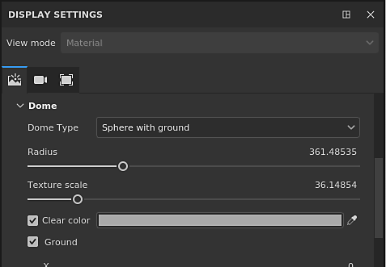

# 查看器和MDL设置

{width="400px"}

## 环境

与常规视口相同，Iray中使用的环境地图将控制光照。\
可以单击按钮或将HDR纹理拖放到其中来更改环境地图。

* **环境曝光** ：控制HDR环境映射的曝光级别。
* **环境旋转** ：移动环境纹理并围绕场景旋转光照。

>[!NOTE]
>
> 作为基于物理的渲染器，环境纹理将极大地定义光照和场景的外观。

## 圆顶

穹顶是将环境地图投影在背景中的形状。\
有3种类型的圆顶可用，可根据场景使用：

* **无限球体** ：环境在背景中投影到球体上以模拟地平线，始终远离场景
* **球体** ：环境投影在可以缩放的常规球体上
* **带地面的球体** ：与上一个形状类似，这个形状也有一个控件，用于拼合球体的底部以模拟地面。

>[!NOTE]
>
> “带地面的球面”具有定义地板大小/半径的控件，但较大的半径将在环境上创建扭曲。\
>  根据所选类型，光照可能会受到影响。

可使用其他设置：

| *设置* | *描述* |
| --- | --- |
| **半径** | 球体大小（如果不是无穷大） |
| **纹理缩放** | **地球**&#x200B;类型的纹理将被拉伸多少。 |
| **清除颜色** | 如果启用，请将环境映射的背景图像替换为统一的颜色。 这将影响光照。 |

### 地面设置

地面设置允许指定地板所在的位置。\
默认情况下，此值设置为固定场景定界框的底部。

| ***设置*** | ***描述*** |
| --- | --- |
| **X、Y、Z值** | 定义三个轴上的地板位置。   0,0，0值对应于场景定界框的中间。 |
| **反射率** | 定义地面反射的强度和颜色。   白色的亮度值表示地面是100%反射的，而黑色表示完全不反射。 

 |
| **光泽度** | 定义反射的光泽（或粗糙度）程度。 

 |
| **阴影强度** | 此参数定义在计算光照后阴影的最终不透明度。 |
| **从下面可见** | 定义地面是否从下方可见。 如果选中，则表示地面将遮挡其上的任何元素。 |

## mdl和着色器参数

图像使用MDL定义用于渲染对象的材质。 有关更多信息，请参阅格式的[正式Nvidia页面](http://www.nvidia.com/object/material-definition-language.html) 。

默认情况下，在Substance 3D Painter中，MDL与GLSL着色器相关联，允许在常规视口和Iray之间切换，而无需配置任何内容。\
然后，MDL的参数将显示在查看器设置的底部。 以下是默认MDL的参数（与PBR金属/粗糙度着色器兼容）。

>[!NOTE]
>
> 要加载自定MDL，需要自定glsl着色器。\
>  在着色器中，可以添加一些元数据来指定mdl路径：
> 
> // — 声明要用于此着色器的图像模型材料。 //： metadata { //： &quot;mdl&quot;：&quot;mdl：:alg::materials:：physical\_metallic\_roughness：：physical\_metallic\_roughness&quot; //： }
> 
> * **mdl** ：定义要与着色器一起使用的Iray mdl素材。 路径语法如下： *mdl：:folder1::folder2:：mdl\_filename：：material\_name*，其中&#x200B;*folder1：:folder2:：mdl\_filename*&#x200B;是您的托架&#x200B;*mdl*&#x200B;文件夹之一中指向mdl文件的路径，*：：material\_name*&#x200B;是此mdl文件中声明的材料的名称。 （例如： &quot;mdl&quot; ： &quot;mdl：:alg::materials:：physical\_metallic\_roughness：：physical\_metallic\_roughness&quot;）

>[!NOTE]
>
> 将为项目中的每个材质实例设置MDL。 为此，为了分离纹理集之间的材质属性，请设置新的材质实例以单独配置MDL。

Substance 3D Painter的默认MDL支持以下属性：

| *设置* | *描述* |
| --- | --- |
| **发射强度** | 发射通道的乘数。 较高的值将开始发光。 

 |
| **折射** | 控制折射量。 |
| **IOR** | 定义材料的折射率。   注：空气= 1.0，水= 1.2，玻璃= 1.5。 |
| **散布** | 控制有多少光通过曲面散射。 |
| **吸收** | 控制通过表面吸收的光量。 |
| **吸收色** | 模拟光线通过表面时的颜色变化。 |
