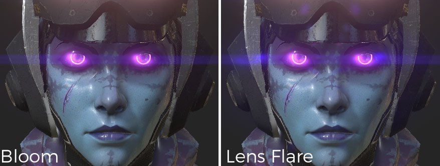

# Glare

参数说明：

| 设置 | 描述 |
| --- | --- |
| **明亮度** | 这是眩光效果的整体亮度。 将此值设置为0.0会完全禁用该效果。  实际值出现在约0.5到4.0的范围内，最大值为16.0。 |
| **阈值** | 仅提取比阈值亮的像素以产生眩光。  对于自然效果，建议使用介于0.0和1.0之间的值。 |
| **重新映射** **因子** | 指定非1.0的值导致所提取的高亮度分量被进一步非线性扩展（或压缩）。 如果传递的值大于1.0，则明亮像素的眩光会变得更强。  使用此选项可单独调整眩光的明亮度映射，而不会影响其他效果。 明亮传递后的明亮度在平滑曲线中增加，1.0的明亮度值接近&#x200B;**重新映射因子**，大于1.0的明亮度值接近（**重新映射** **因子** ^2）。 |
| **形状** | 形状定义了眩光的外观，提供了不同的模型：<ul data-preserve-html="true"><li data-preserve-html="true"><strong>开花</strong> ：仅开花效果。</li><li data-preserve-html="true"><strong>镜头光晕：</strong>开花/重影（镜头光晕）/残影。</li><li data-preserve-html="true"><strong>标准：</strong>类型包括所有基本元素的良好平衡。</li><li data-preserve-html="true"><strong>廉价镜头：</strong>廉价镜头的尖锐重影和其他表示。 </li><li data-preserve-html="true"><strong>图像之后：</strong>具有非常强残影的文字。 </li><li data-preserve-html="true"><strong>滤镜十字滤镜：</strong>附加了十字形星形滤镜生成器的镜头。</li><li data-preserve-html="true"><strong>滤镜十字筛谱</strong>：带有带有带有强光谱的十字形星形滤镜发生器的镜头。</li><li data-preserve-html="true"><strong>滤镜Snow交叉</strong> ：附加了六个方向的星形滤镜生成器的镜头。</li><li data-preserve-html="true"><strong>滤镜Snow交叉光谱</strong>：带有星型滤镜生成器的透镜，沿六个方向附加了强光谱。</li><li data-preserve-html="true"><strong>滤镜阳光十字</strong> ：附加了八个方向的星形滤镜生成器的镜头。</li><li data-preserve-html="true"><strong>滤光片阳光交叉光谱</strong>：带星光滤光片发生器的透镜，八个方向附加有强光谱。</li><li data-preserve-html="true"><strong>水平条纹</strong> ：此镜头光晕类型产生强烈的水平星条纹。</li><li data-preserve-html="true"><strong>垂直条纹</strong> ：在垂直方向上具有强星形条纹的文字。 用于CCD数码相机的涂抹等。</li></ul> |

## 形状示例

