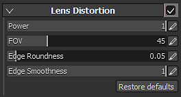

# 镜头扭曲

镜头扭曲是一种光学现象，导致图像边缘的膨胀或收缩。 膨胀称为桶状扭曲，收缩称为枕状扭曲。\
相机镜头越好，出现这种现象的次数就越少。 此效果可用于模拟不完美的镜头，从而产生更逼真的图像。

| *设置* | *描述* |
| --- | --- |
| **电源** | 控制从屏幕边缘应用扭曲的速度。 |
| **FOV** | 控制镜头扭曲量（模拟视场）。 |
| **边缘圆度** | 控制边缘或视区的倒圆角形状。 |
| **边缘Smoothness** | 控制视区的黑色边缘的硬度/Smoothness。 |
