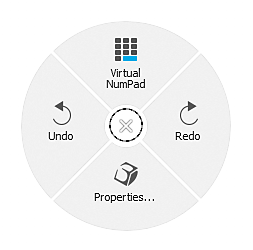

# 3Dconnection的SpaceMouse®

3Dconnection的SpaceMouse®是一种允许在3D环境中轻松导航的设备。 它可用于在应用视口中操作相机/3D模型。

* SpaceMouse®自7.4.2版起受支持。
* 若要正确使用此设备，请确保从[3Dconnection](https://3dconnexion.com/uk/drivers/)安装最新的驱动程序。

>[!NOTE]
>
> 使用紧凑模型且需要频繁旋转环境映射的用户可以选择将SHIFT键分配给左侧按钮。

## 教程

## 概述

主控件旋钮或SpaceMouse®允许您以常规鼠标/光笔和键盘控件无法实现的方式旋转、平移和缩放视区。 该装置可与鼠标和带光笔的平板电脑结合使用。

所有型号和版本都应与该应用程序兼容：

| 模型 | 描述 | 视觉 |
| --- | --- | --- |
| **紧凑模型** | 具有旋钮控件的基本模型。 | 

 |
| **专业模型** | 用于键盘快捷键的旋钮控件和其他按钮。 | 

 |
| **企业模型** | 旋钮控制、附加按钮和上下文显示。 | 

 |

>[!NOTE]
>
> Compact、Pro和Enterprise模型已经过测试和验证，可以正确使用该应用程序。

## 径向菜单

可以直接从设备访问菜单：

* 在紧凑模型上，单击左侧按钮并从径向菜单中选择属性：

  {width="250px"}
* 在Pro和Enterprise模型上，可以通过按下“菜单”按钮来访问“属性”菜单。

或者，右键单击系统任务栏中的3D连接图标（位于系统时钟旁边），然后选择&#x200B;**打开3D连接设置**。 此菜单与上下文相关，具体取决于上一个活动窗口。 其标题栏指示对应哪个程序，如果不是Adobe Substance 3D Painter，请切换到Painter窗口，然后返回设置窗口：

## 默认设置

{width="400px"}

在SpaceMouse®的设置面板中，Painter的默认设置适用于最新版本的驱动程序。 无需额外配置，只需连接设备即可即插即用。

确保从顶部的下拉菜单中选择正确的设备，默认情况下，它应该选择正确的设备。

“速度”滑块会更改所有轴和方向的灵敏度。

### 高级设置

通过单击“高级设置”按钮，可以更改主控件的详细行为。

可以修改任何默认设置。 有两个重要部分，其选项卡为&#x200B;**导航模式**&#x200B;和&#x200B;**旋转中心**。

#### 导航模式

{width="400px"}

定义在3D模式下操作旋钮的行为：

| 设置 | 描述 |
| --- | --- |
| 对象模式 | 此旋钮是3D对象本身，它是默认旋钮。 |
| 相机模式 | 在3D空间中自由控制相机。 |
| 目标摄像机模式 | 控制摄像机始终以3D空间中的点为目标。 |
| 直升机模式 | 在3D空间中控制直升机。 |
| 锁定水平线 | 锁定相机，使地平线始终保持水平。 Painter已在其设置中提供类似的选项，但可在此处单独控制它。 默认情况下，此选项处于锁定状态。 |

#### 旋转中心

{width="400px"}

定义小透视图标行为：

| 设置 | 描述 |
| --- | --- |
| 自动 | 自动移动枢轴或摄像机目标，如果关闭，它始终紧贴网格原点枢轴。 |
| 始终显示 | 即使不与设备交互，旋转点也始终显示在3D视口中。 |
| 动态显示 | 仅当与设备交互时，枢轴点才会显示在3D视口中。 这是默认选项。 |
| 隐藏 | 完全删除3D视口中的透视点。 |

>[!NOTE]
>
> “旋转点”专为Painter设计，但如果需要，它可以隐藏。

### 按钮

{width="400px"}

通过单击&#x200B;**按钮**，可以分配命令、宏或径向菜单。 有关详细信息，请参阅[3Dconnection文档](https://3dconnexion.com/uk/support/faq/)。
