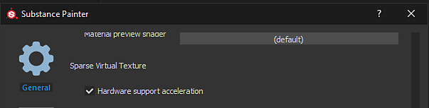

# 稀疏虚拟纹理

从版本&#x200B;**2018.3**&#x200B;开始，Substance 3D Painter在其实时视口中使用&#x200B;**稀疏虚拟纹理** ( **SVT** )来管理大量纹理。 此技术允许仅从给定视角流进和流出纹理，以便在GPU内存上保持特定占用空间。 它可以提高具有大量纹理集（或UDIM）项目的性能。

## 支持的平台

稀疏纹理依赖于特定的硬件配置，以便充分发挥性能。 如果当前配置不支持该功能，Substance 3D Painter将&#x200B;**回退**&#x200B;到软件实现（这将降低精确度和性能）。

在[设置](../interface/settings/settings.md)中，可以强制Substance 3D Painter使用软件回退而不是硬件加速。

以下是支持硬件加速稀疏虚拟纹理的配置：

| Platform | 支持（硬件加速） | 不支持（软件回退） |
| --- | --- | --- |
| **Windows** | <ul data-preserve-html="true"><li data-preserve-html="true">Nvidia GeForce（驱动程序411.63或更高版本）</li><li data-preserve-html="true">Nvidia Quadro（驱动程序411.63或更高版本）</li><li data-preserve-html="true">AMD FirePro和Radeon Pro（驱动程序18.9.3或更高版本） <strong> &#42; </strong></li><li data-preserve-html="true">AMD Radeon（驱动程序18.9.3或更高版本）&#42;</li></ul> | <ul data-preserve-html="true"><li data-preserve-html="true"> Nvidia Quadro M2000 </li><li data-preserve-html="true">  Nvidia Geforce GTX 970 </li><li data-preserve-html="true"> Intel GPU </li></ul> |
| **Mac OS** | <ul data-preserve-html="true"><li data-preserve-html="true"> 操作系统不支持的硬件功能 </li></ul> | <ul data-preserve-html="true"><li data-preserve-html="true">任何GPU型号</li></ul> |
| **Linux** | <ul data-preserve-html="true"><li data-preserve-html="true">Nvidia GeForce（驱动程序410.73或更高版本）</li><li data-preserve-html="true">Nvidia Quadro（驱动程序410.73或更高版本）</li><li data-preserve-html="true">AMD FirePro和Radeon Pro（驱动程序18.9.3或更高版本） <strong> &#42; </strong></li><li data-preserve-html="true">AMD Radeon（驱动程序18.9.3或更高版本）&#42;</li></ul> | <ul data-preserve-html="true"><li data-preserve-html="true">Intel GPU</li></ul> |

* **\*** ：默认情况下，硬件加速处于禁用状态，可以在[设置](../interface/settings/settings.md)中手动启用硬件加速。

## 为什么Substance 3D Painter使用稀疏虚拟纹理？

Substance 3D Painter使用其主引擎计算纹理，然后将这些纹理显示在视口中。 这意味着引擎和视口必须共享GPU内存(VRam)才能计算和显示这些纹理。 项目包含的&#x200B;**纹理集**（或UV磁贴）越多，视口所需的内存就越多。 如果视区占用了GPU上的过多内存，则主引擎没有足够的空间来计算纹理，并且必须将纹理逐出到系统内存(Ram)中。 这将导致性能降低和计算速度减慢。

SVT的目标是为GPU内存分配多少视口使用量，从而为主引擎执行计算提供尽可能多的空间。 该系统的优势在于，它还解锁了将更大的项目加载到Substance 3D Painter中，同时仍可正常工作的功能。

## 稀疏纹理是如何工作的？

稀疏虚拟纹理是一类不完整的纹理。 这意味着应用程序只将部分纹理加载到内存中。 只加载需要的内容，其余内容放入系统内存或磁盘（缓存）。 当再次需要时，从高速缓存中检索纹理并将其放回视区。 要使传输速度足够快，系统必须依靠&#x200B;**mipmaps**&#x200B;并在不同分辨率的纹理之间快速跳转。 这就是为什么快速进入视区可能会首先显示模糊的纹理，然后在几秒钟后提高质量。

有关更多技术知识，请参阅： [稀疏虚拟纹理](https://silverspaceship.com/src/svt/) 。

## 缓存位置

当没有足够的可用系统内存(Ram)来存储SVT缓存时，Substance 3D Painter将改为切换到计算机硬盘驱动器以存储缓存。\
此缓存的位置默认位于“操作系统临时文件”文件夹中。 可通过进入应用程序的主要设置来更改此位置，请参阅[常规首选项](https://helpx.adobe.com/cn/substance-3d/unlisted/documentation/spdoc/general-71008262.html) 。

## 着色器兼容性

为了充分利用SVT，着色器必须从稀疏系统中请求和读取纹理。 因此，先前基于&#x200B;**vec2纹理坐标**&#x200B;和&#x200B;**取样器**&#x200B;的函数已被弃用。 现在，提供了Helper函数来改用Sparse纹理。

要更新着色器，请执行以下操作：

* 对于&#x200B;**默认Substance 3D Painter着色器** ：按照[更新着色器](../interface/shader-settings/updating-a-shader.md)页面中的分步过程操作。
* 对于&#x200B;**自定义着色器** ：查看日志中的错误消息以及[着色器 API](https://helpx.adobe.com/cn/substance-3d/unlisted/documentation/spdoc/custom-shader-api-89686018.html)页。

>[!WARNING]
>
> 如果旧项目的着色器不是最新的，则旧项目可能会显示白色闪光灯。 请参阅此页面以了解更多信息：[移动相机时网格闪光灯变为白色](../technical-support/technical-issues/rendering-issues/mesh-flash-to-white-when-moving-camera.md)。
