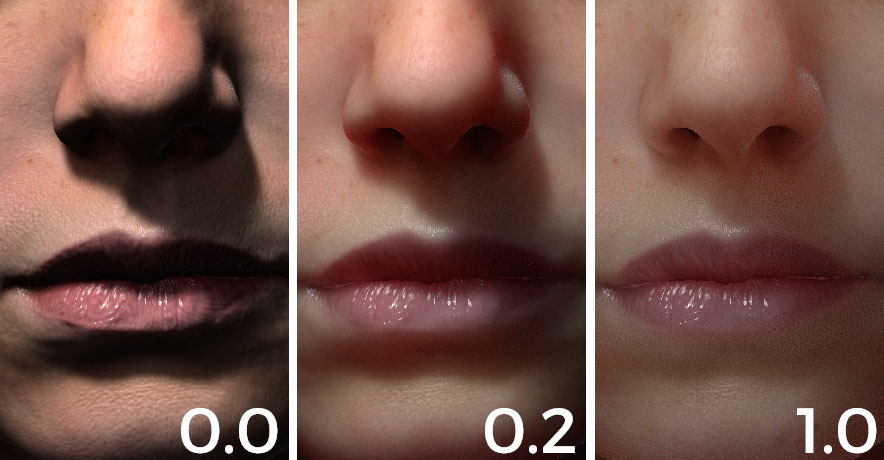

# 次曲面参数

Substance 3D Painter实时地下实施是一种屏幕空间次表面散射效果。 本页说明了控制它的参数。\
当前实现基于PIXAR](http://graphics.pixar.com/library/ApproxBSSRDF/)发布的“高效次表面散射的近似反射率配置文件”方法[。

有关基于这些参数的材料的示例，请参阅： [子曲面材料类型](subsurface-material-type.md)。

## 着色器/MDL参数

在[着色器设置](../../interface/shader-settings/shader-settings.md)窗口中可用。

| *设置* | *描述* |
| --- | --- |
| **启用** | 在此着色器/mdl实例上激活或取消激活次表面散射效果。  可用于在不需要的材料上禁用SSS效果。 |
| **散布类型** | 定义材料中光照吸收的行为：<ul data-preserve-html="true"><li data-preserve-html="true"><strong>半透明</strong>：适用于光可以深入对象的一般材料，如玉或大理石。</li><li data-preserve-html="true"><strong>皮肤</strong>：适用于有机皮肤，光线被快速吸收且仅散点在表面附近。</li><li data-preserve-html="true"><strong>红移/瑞利</strong>：比皮肤设置更准确，以模拟人类或生物的表面皮肤。</li></ul> |
| **缩放** | 控制材料中光照吸收的半径/深度。 此参数行为随场景中网格的大小而变化。人类头部的比例为0.0、0.2和1.0：   

 |
| **颜色** | 光线被材料吸收时的颜色。三种颜色之间的比较：   

 |

### 显示设置参数

在[显示设置](../../interface/display-settings/display-settings.md)窗口中可用。

>[!NOTE]
>
> 此参数&#x200B;**仅影响**&#x200B;次表面散射效果的&#x200B;**实时**&#x200B;版本。

| *设置* | *描述* |
| --- | --- |
| **样本计数** | 控制为生成屏幕空间中的次表面模糊而执行的采样量。 样本越多，噪声越少，但会影响性能。观察接近表面时，比较8、32和64个样本：   

  **注意：**&#x200B;通过启用[噪声设置](../../interface/display-settings/camera-settings.md)，也可以减少相机量而不增加样本量。 |
