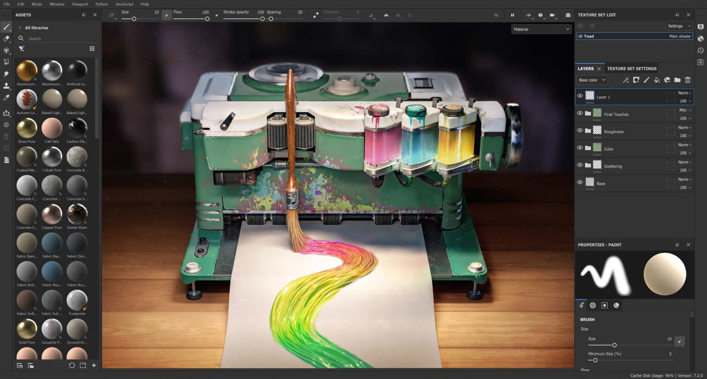

# Substance 3D Painter

<table>
<tr style="border: 0;">
<td width="41.60%" style="border: 0;" valign="top">

Substance 3D Painter是一款3D绘画软件，可以纹理化和渲染3D网格。

本文档旨在帮助您学习如何使用该软件，从基本技术到高级技术。

如果您有任何在本手册中未得到解答的问题，欢迎在我们的[论坛](https://community.adobe.com/t5/substance-3d-painter/bd-p/substance-3d-painter)上提问。 如果您想了解有关 PBR 的更多信息，您还可以下载我们的[基于物理的渲染指南](https://helpx.adobe.com/cn/substance-3d/unlisted/tutorials.html)。

</td>
<td width="58.30%" style="border: 0;" valign="top">

{width="600px"}

</td>
</tr>
</table>

## 快速入门

* [激活和许可证](getting-started/activation-and-licenses.md) — 此页面提供了有关如何激活和管理许可证的信息，以便您可以开始使用Painter。
* [系统要求](getting-started/system-requirements.md) — 此页面将系统要求和硬件兼容性信息重新分组。
* [项目创建](getting-started/project-creation.md) — 新建项目创建窗口允许创建项目文件以存储3D模型及其纹理信息。
* [导出](export/export.md) — 可以将项目导出为位图纹理，以便与其他软件一起使用。 也可以导出3D模型的几何。
* [术语表](getting-started/glossary.md) — 此页面列出了应用程序最常用的关键字，并简要说明了其背后的概念。
* [性能](technical-support/performances-guidelines/performances-guidelines.md) — 此页面将有关如何最大化性能并让一切顺畅运行的提示和技巧重新分组。

### 界面

* [资源](interface/assets/assets.md)
* [拾色器](interface/color-picker.md)
* [显示设置](interface/display-settings/display-settings.md)
* [历史记录](interface/history.md)
* [图层堆叠](interface/layer-stack/layer-stack.md)
* [主菜单](interface/main-menu/main-menu.md)
* [项目配置](interface/project-configuration.md)
* [属性](interface/properties.md)
* [设置](interface/settings/settings.md)
* [着色器设置](interface/shader-settings/shader-settings.md)
* [纹理集](interface/texture-set/texture-set.md)
* [工具栏](interface/toolbars.md)
* [视口](interface/viewport/viewport.md)

### 绘画工具

* [工具列表](painting/tool-list/tool-list.md) — 此页面详细介绍了所有可用的绘画工具及其使用方法。
* [直线](painting/straight-line.md) — 使用任何绘画工具，直线都可以轻松地绘制直线，且点击次数更少、精度更高。
* [懒惰鼠标](painting/lazy-mouse.md) — 懒惰鼠标是鼠标光标与实际绘画之间的距离偏移，允许绘制更精确或更平滑的描边。
* [对称](painting/symmetry/symmetry.md) — 对称是指根据几何约束在多个位置同时绘画的动作。
* [填充投影](painting/fill-projections/fill-projections.md) — 填充图层和填充效果根据特定模式将纹理直接投影到网格上。 这种类型的图层/效果可避免在3D模型上手动绘制纹理。 可通过“属性”窗口编辑投影的设置。
* [预设](painting/presets/presets.md) — 预设是绘画工具的已保存配置。 本页说明如何以及为什么使用它们。
* [动态笔触](painting/dynamic-strokes/dynamic-strokes.md) -动态笔触是常规画笔描边，由Substance文件提供支持，可以对画笔描边内的每个图章进行更改。
* [高级通道绘画](painting/advanced-channel-painting/advanced-channel-painting.md) — 可以对着色器中使用的几个默认通道进行绘画，以创建高级或复杂效果。 例如，绘制转换为法线映射的Height信息。

### Baking

* [如何烘焙网格图](baking/how-to-bake-mesh-maps.md)
* [烘焙可视化设置](baking/baking-visualization-settings.md)

### 内容

* [创建自定义效果](content/creating-custom-effects/creating-custom-effects.md)
* [导入资源](https://helpx.adobe.com/cn/substance-3d/unlisted/documentation/spdoc/adding-content-to-the-shelf-142213317.html)

### 功能

* [自动UV展开](features/automatic-uv-unwrapping.md)
* [效果](features/effects/effects.md)
* [实际大小](features/physical-size.md)
* [智能素材和蒙版](features/smart-materials-and-masks.md)
* [次表面散射](features/subsurface-scattering/subsurface-scattering.md)
* [动态材质分层](features/dynamic-material-layering.md)
* [UV重投影](features/uv-reprojection.md)
* [UV 平铺](features/uv-tiles/uv-tiles.md)
* [色彩管理](features/color-management/color-management.md)
* [后处理](features/post-processing/post-processing.md)
* [图像渲染器](features/iray-renderer/iray-renderer.md)
* [插件](features/plugins/plugins.md)
* [稀疏虚拟纹理](features/sparse-virtual-textures.md)
* [自定义着色器](features/custom-shaders.md)
* [3Dconnection的SpaceMouse®](features/spacemouse-by-3dconnexion.md)
* [通用场景描述（美元）](features/universal-scene-description-usd.md)

### 管道和集成

* [安装和首选项](pipeline-and-integration/installation-and-pre/preferences-and-application-data-location.md)
* [配置](pipeline-and-integration/configuration/command-lines.md)
* [资源管理](pipeline-and-integration/resource-management/adding-resource-paths-edi/adding-resource-paths-by-editing-preferences-manually.md)

### 脚本编写和开发

* [脚本和插件](https://helpx.adobe.com/cn/substance-3d/unlisted/documentation/spdoc/script-and-plugins-197427392.html)

### 技术支持

* [性能准则](technical-support/performances-guidelines/performances-guidelines.md)
* [配置笔和平板电脑](technical-support/configuring-pens-and-tablets.md)
* [导出日志文件](technical-support/exporting-the-log-file.md)
* [导出DXDiag](technical-support/exporting-a-dxdiag.md)

### 发行说明

* [所有更改](release-notes/all-changes.md)
* [版本11.1](release-notes/version-11-1.md)
* [版本11.0](release-notes/version-11-0.md)
* [版本10.1](release-notes/version-10-1.md)

