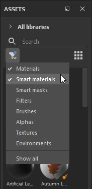
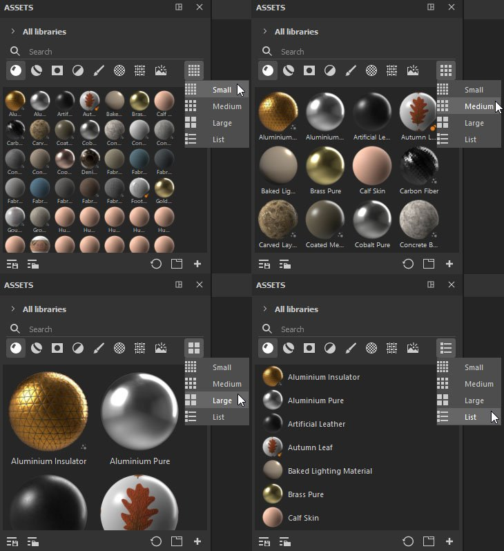

# 自定义布局

您可通过一些界面选项（如子库）、降低宽度和缩览图大小来更改“资源”面板版面，以满足您的需求。

>[!NOTE]
>
> 可以使用鼠标滚轮或操纵滚动条滚动浏览资源，在任何Painter窗口中滚动资源的替代方法是&#x200B;**按住Ctrl + Alt键并在所需的面板中拖动**。

坞站和方向

在安装后首次打开Painter时，您会发现资源窗口垂直停放在应用程序的左侧。 但是，它可以取消停靠并水平放置。 如果您使用其他[子库](sub-library-tab.md)窗口，也可以随意停放和取消停放。

{width="600px"}

## 宽度减小

可以减小它的大小，在这种情况下，资源类型折叠到单个菜单中，可以在其中选择一个或多个选项。

## 缩览图大小

可使用最左侧的图标调整资源缩览图大小，该图标提供“小”、“中”（默认）、“大”和“列表”选项。

{width="600px"}
