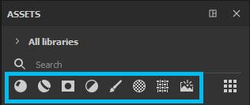

# 导航

“资源”窗口中有多种导航方法 — 痕迹、搜索字段和资源类型图标。 所有导航类型都是相互依赖的，因此您可以将这些搜索组合在一起，以发挥自己的优势。\
例如，如果在您的资源类型图标中选择了材质，但您使用面包屑导航至智能蒙版文件夹，则“资源”面板不会显示任何结果；如果要显示材质，则必须返回到“所有库”；如果要浏览智能蒙版，则必须取消选择材质。

## 面包屑

面包屑可让您快速浏览整个库。 单击箭头可显示资源在磁盘上的存储方式，并允许您选择任何显示的位置。 如果呈灰显状态，则表示该文件夹中没有选定类型的资源，但您仍然可以导航到该位置。

## 搜索字段

搜索字段可用于筛选包含键入查询的资源。 请注意，它不仅按资源的标题进行搜索，而且按资源的位置以及资源中包含的任何标记进行搜索。\
键入搜索也可以比仅使用关键字更高级。 请参阅[高级搜索查询](advanced-search-queries.md)。

## 资源类型

>[!NOTE]
>
> 单击时保持&#x200B;**Ctrl**，即可选择多个资源类型图标。

默认选择是材质，但单击其他资源类型图标会显示其他类型的资源。

| 资源类型 | 描述 |
| --- | --- |
| 材质 

 | 包含作为&#x200B;*基本素材*&#x200B;导入的.sbsar以及从填充图层创建的素材（您可以在[此处](https://helpx.adobe.com/substance-3d/unlisted/documentation/spdoc/creating-and-saving-a-preset-180191514.html)了解有关预设创建的更多信息）。这些素材是可以在填充图层中使用的基本素材，并将应用于网格或纹理集的整个表面。 |
| 智能材质 

 | 包含由保存在文件夹中的多个图层组成的更复杂的素材（智能素材也是您可以自己创建的预设）。与基础材质一样，智能素材将应用于整个网格/纹理集，但它们也会考虑网格的单个信息，例如曲率、遮蔽或任何其他表面细节。 要获取这些表面细节并正确使用智能素材，首先需要[烘焙](../../baking/baking.md)。 |
| 智能蒙版 

 | 包含使用多个图层效果和/或生成器的更复杂蒙版。 您可以[自行创建](https://helpx.adobe.com/substance-3d/unlisted/documentation/spdoc/managing-assets-217187091.html)智能蒙版预设。与智能素材类似，智能蒙版需要网格中的烘焙信息才能正常工作。 |
| 滤镜 

 | 包含导入为&#x200B;*筛选器*&#x200B;的.sbsar文件。滤镜是一种效果，可获取已有的纹理并以某种方式对其进行变换。 某些滤镜将仅处理黑白信息，而某些滤镜仅处理素材输入，这意味着并非所有滤镜都可以在蒙版中使用。 |
| 笔刷 

 | 包含画笔、粒子和工具。 这些是可以在Painter中[创建](https://helpx.adobe.com/substance-3d/unlisted/documentation/spdoc/managing-assets-217187091.html)的所有预设。**画笔**&#x200B;是使用Alpha的基本黑白预设。 您可以使用画笔在任何或所有通道中或在蒙版中绘画。**粒子**&#x200B;具有类似于画笔的特征，但它们也具有模拟与网格物理交互的附加参数集。 它们会产生液体泼溅、水滴、雨水或其他任何需要物理模拟的影响。**工具**&#x200B;可以包含画笔和/或粒子行为，但此外，此预设也会随材质通道信息一起保存。 |
| Alpha 

 | 包含各种阿尔法笔刷以及几个画笔制作器，它们允许[创建](https://helpx.adobe.com/substance-3d/unlisted/documentation/spdoc/managing-assets-217187091.html)具有更复杂效果的画笔（如Photoshop、动态笔触、绘画辊）。Alpha是灰度图像，其中黑色部分在使用时显示为透明。 |
| 纹理 

 | 包含灰度、过程、已烘焙贴图、硬表面法线和LUT。**灰度**&#x200B;是包含有趣噪声和纹理的灰度图像。 可通过蒙版或将其直接插入通道中，使用它们向网格表面添加变化。**过程**&#x200B;也是包含噪点甚至规则图案的灰度纹理。 但是，与某些静态污点不同，过程是动态位图，可以缩放而不重复，并具有无限变化（通过随机植入）。**已烘焙贴图**&#x200B;表示从网格中提取的表面和形状信息。 要了解有关烘焙的更多信息，请参阅此处。**硬表面法线**&#x200B;是您可以使用法线通道直接在网格上盖印的详细信息。**LUT**（查找表）是颜色配置文件纹理，可在“显示设置”中使用它来模拟视口中的颜色配置文件行为。 您可以在[此处](../../features/post-processing/color-profile.md)了解有关颜色配置文件的更多信息。 |
| 环境地图 

 | 包含导入为&#x200B;*环境*（最常见的是.hdr或.exr）的图像。环境映射是自动生成光照设置的背景图像。 通过将环境图直接拖入视区或浏览“显示设置”，可以使用环境图。 |
