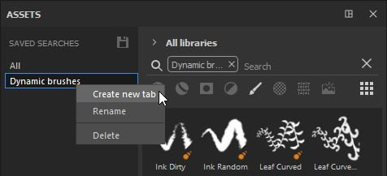

# 子库选项卡

子库是Substance 3D Painter中专用于特定搜索的新选项卡或窗口。\
默认情况下，没有打开子库选项卡，只有主资源窗口。 可使用以下两种方法从主“资源”窗口创建子库选项卡：

* 通过&#x200B;**右键单击**&#x200B;其中一个保存的搜索，然后选择&#x200B;**创建新选项卡**。

* 通过&#x200B;**选择或输入搜索查询**（通过资源类型、面包屑、文本查询或按路径筛选），然后使用“资源”窗口底部的专用&#x200B;**按钮**。

创建子库将会自动创建一个新选项卡，并将其&#x200B;**停靠在与主资源窗口相同的空间中的界面中**。

在此处，子库窗口可以停放在其它任何位置，或自由浮动地保留在界面或其它屏幕上的任意位置。

>[!NOTE]
>
> * 子库具有与主“资源”窗口相同的功能，但在重置时，它将恢复为其原始搜索查询。
> * 与主资源窗口不同，如果关闭子库，则需要重新创建子库。
> * 如果删除已保存的搜索，子库窗口将继续存在，直到关闭。
