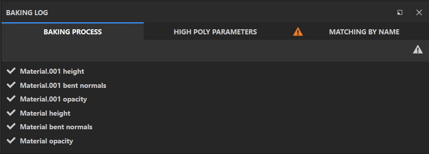

# 烘焙木

**烘焙日志面板**&#x200B;显示与烘焙相关的技术输出。 该面板包含三个选项卡：

* **烘焙过程**：查看正在进行的烘焙任务或最近的烘焙运行的状态。
* **高多边形参数**：查找有关项目中使用的高多边形文件的详细信息。
* **按名称匹配**：当&#x200B;**高多边形参数>匹配**&#x200B;设置为&#x200B;**按网格名称**&#x200B;时，此选项卡显示关于如何匹配资源的信息。

>[!TIP]
>
> 有关如何按名称匹配资源的信息，请参见[Bakers文档](https://experienceleague.adobe.com/en/docs/substance-3d/bakers/features/matching-by-name)。

