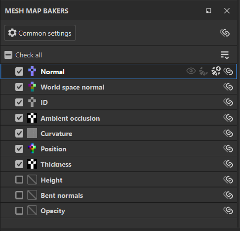
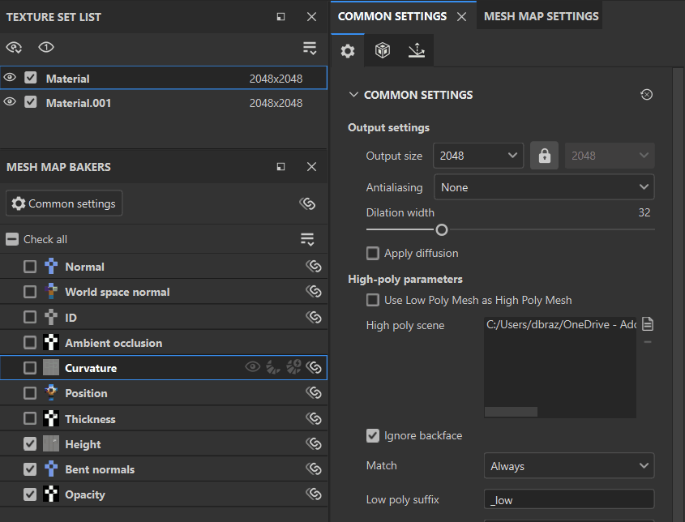

# Baker面板

<table>
  <tr style="border: 0;">
    <td style="border: 0;" valign="top"></td>
    <td style="border: 0;" valign="top"><strong>Baker面板</strong>允许您选择要烘焙和访问每个地图类型的设置的地图。</td>
  </tr>
</table>

## 每个映射的控件

网格图列表中的每个映射都有一系列可用的控件：

1. **检查**&#x200B;或&#x200B;**取消检查**&#x200B;地图的烘焙。
1. **可视化**&#x200B;视口中的映射。
1. **只快速烘焙**&#x200B;此地图。
1. 为所选网格图打开&#x200B;**自动重新生成**。 对烘焙参数或倾斜校正进行更改时，**自动重新生成**&#x200B;地图将自动重新生成。
1. 跨纹理集&#x200B;**同步**&#x200B;此映射类型的设置。 关闭此选项可自定义单个地图的烘焙设置。

## 管理网格图设置

可通过多种方式管理您的项目，以便在网格图或纹理集之间共享烘焙设置。 对于复杂项目，了解如何共享设置有助于简化烘焙过程。

您可以跨纹理集共享两种类型的设置：

* 烘焙设置：这些是可在&#x200B;**常用设置**&#x200B;和&#x200B;**网格图设置面板**&#x200B;中更改的参数。
* 检查状态：使用这些选项可打开或关闭特定网格图的烘焙。

### 跨纹理集同步烘焙设置

如果项目包含多个纹理集，则用于跨纹理集同步的选项将显示在&#x200B;**网格图Baker面板**&#x200B;中。

选择&#x200B;**Baker面板**&#x200B;顶部的&#x200B;**同步设置按钮**&#x200B;可打开&#x200B;**公共设置同步窗口**。

在此窗口中，您可以选择要同步公共设置的纹理集。 选择所有纹理集后，在任何纹理集中更改通用设置将会更改所有其他纹理集的通用设置。

同样，如果使用单个网格图旁边的&#x200B;**同步设置按钮**，则可以选择纹理集以共享特定于该网格图的设置。

#### 在不同步的纹理集之间共享设置

有时，您可能希望在纹理集间保持网格图不同步，但仍希望将烘焙设置从一个纹理集复制到另一个文档。

要将常用设置复制到特定纹理集而不同步，请从&#x200B;**网格图Baker下拉菜单**&#x200B;中选择&#x200B;**将所有设置同步到更多纹理集...**。

还可使用&#x200B;**将所有设置同步到所有纹理集**&#x200B;将设置复制到项目中的所有纹理集。

或者，如果要将单个网格图的设置复制到特定纹理集：

1. 右键单击网格图。
1. 选择&#x200B;**将&lt;网格图>设置应用于更多纹理集...**

*在上面的示例中，每个纹理集都以AO的不同设置开始。 在不将AO网格图设置为同步的情况下，我们使用&#x200B;**将环境遮挡设置应用于更多纹理集...**，这样我们就可以从同一基线开始修改新纹理集的AO设置。*

### 管理网格图的检查状态

检查状态确定在网格图时是否包括给定映射。 有多种方式可管理当前纹理集的检查状态：

* 选中或取消选中单个映射。
* 使用&#x200B;**全部选中**&#x200B;或&#x200B;**全部取消选中**&#x200B;以选中或取消选中所有网格图。
* 使用&#x200B;**Baker下拉列表**&#x200B;中的&#x200B;**反转已检查的网格图**&#x200B;来切换所有映射的检查状态。

>[!TIP]
>
> 您可以从复选框单击并拖动，以快速选中或取消选中多个地图（请参阅上面的动画）。

*在上面的示例中，我们使用&#x200B;**反转选中的网格图**快速切换选区，然后烘焙尚未烘焙的网格图。*

使用多个纹理集时，还可以通过选择将选中的状态应用于更多纹理集&#x200B;**...**&#x200B;将选中的状态复制到其他纹理集，或将选中的状态复制到所有纹理集（其中&#x200B;**将选中的状态应用于所有纹理集**）。

*在上例中，我们尚未烘焙&#x200B;**Height.001**纹理集中的材料、bent normals或不透明度。 我们已经在&#x200B;**材料**纹理集中选择了这些网格图，因此我们使用&#x200B;**将已选中的项目应用于更多纹理集...**并选择&#x200B;**材料.001**来复制已选中的状态。 然后，我们烘焙地图 — 请注意，可视化会在地图烘焙时在网格图中循环两次 — 这是因为它们是为两个纹理集烘焙的。*