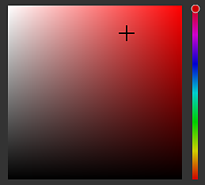

# 拾色器

拾色器允许将颜色设置为在网格上绘制或投影。 此工具可用于从外部图像中选择颜色，或调整应用程序中的现有图像。

在Painter中单击任何色域(可在“属性”或任何其他设置或菜单（如“显示”或“着色器”参数）中找到)时，会显示拾色器窗口。

## 拾色器概述

一旦打开，拾色器将处于半持续状态，这意味着它将在上下文发生变化之前保持打开状态 — 例如，从绘画图层切换到填充图层时。 可以移动窗口并将其放在任何可用屏幕上的任意位置。 但是，与其他窗口不同，拾色器无法停靠。

该窗口采用垂直布局，由三个部分组成：

* 渐变拾色器（或光谱）
* 滑块(RGB/HSV)
* 色板

{width="200px"}

### 渐变拾色器（色谱）

| 名称和视觉对象 | 描述 |
| --- | --- |
| **显示选择器** 

 | 允许选择要用于编辑颜色的显示（色谱和滑块）。 默认值与主视区使用的“显示”相匹配。  **注意：**&#x200B;此设置仅在启用[色彩管理](../features/color-management/color-management.md)时可用。 |
| **光谱** 

 | 垂直滑块为常规色相。 它允许选择在渐变字段中显示的颜色的阴影。选择常规阴影后，可以按住并拖动渐变字段中的十字线光标以选择所需的颜色。  **注意：**&#x200B;启用[色彩管理](../features/color-management/color-management.md)后，当前显示器中的HDR颜色将被固定（在工作色彩空间中）。 这是为了避免在色彩管理的通道中输出HDR值。 |
| **当前和以前的颜色** 

 | 左矩形指示将从拾色器输出的最终颜色。右边的矩形显示上一次使用的颜色（打开拾色器时）。 可以单击它以恢复以前的颜色，并使其成为当前的颜色。 |
| **十六进制字段** 

 | 十六进制字段以十六进制值表示当前颜色。 RGB组件用一对字母表示。例如，#FF0000表示红色。  **注意：**&#x200B;启用[色彩管理](../features/color-management/color-management.md)后，无论项目使用的当前显示空间或工作空间如何，十六进制字段始终在标准sRGB色彩空间中工作，以便更轻松地跨软件复制/粘贴值。 |
| **滴管** 

 | 可使用滴管从外部源中选取颜色。 要使用它，请&#x200B;**单击图标上的**，然后移动鼠标并再次复制。  **注意：**&#x200B;在视区中选择颜色时，可以使用&#x200B;**Shift**&#x200B;修饰键来选择直接编辑的当前通道。 这样可以避免在原始纹理和屏幕上显示的颜色之间进行有损颜色转换。 在无需从&#x200B;**材质**&#x200B;显示模式切换的情况下选取颜色时，此功能也非常有用。 

  **注意：**&#x200B;颜色字段的旁边还会显示一个吸管，可用于快速选取颜色，而无需打开拾色器。 

  **注意：**&#x200B;在Mac OS上，由于隐私设置，吸管可能无法在应用程序界面之外选取颜色。 要解决此问题，请为`System Preferences > Security & Privacy > Privacy > Screen Recording`中的应用程序分配正确的权限 |

### 颜色设置

| 设置 | 描述 |
| --- | --- |
| **滴管色彩空间** | 指定在视区外部为所选颜色指定的色彩空间。**自动**&#x200B;设置使用项目设置中的标准sRGB色彩空间。 

 **注意：**&#x200B;此设置也适用于颜色按钮旁边的吸管。  **注意：**&#x200B;在未使用Shift修改键时，在视区内选定的颜色也会使用此配置文件。 |

### 滑块

颜色滑块允许手动调整单个值。

可以设置两种不同的模式：**HSV**&#x200B;或&#x200B;**RGB**。 要更改模式，请使用专用下拉菜单。

#### HSV

**HSV**&#x200B;表示&#x200B;**H**&#x200B;值、**S**&#x200B;饱和度和&#x200B;**V**&#x200B;值。

**色相**&#x200B;允许循环切换全局颜色系列，非常类似于垂直渐变滑块。

**饱和度**&#x200B;控制所选颜色的丰富度，并从灰度变为完全饱和。

**值**&#x200B;确定颜色的深浅程度，范围从全黑到全白。

#### RGB

**RGB**&#x200B;表示&#x200B;**R** ed、**G** reen和&#x200B;**B** lue。

这些是用来在计算机图形中以数字方式存储颜色的主要组件。 每个滑块表示组件在最终颜色中的呈现量。

示例：下图中的颜色包含100%的红色，但50%的蓝色和绿色。

RGB滑块通常通过0-255值进行测量。 可通过禁用&#x200B;**浮点值**&#x200B;选项来完成此操作。

### 滑块设置

通过“设置”菜单，可配置一些其他行为：

| 设置 | 描述 |
| --- | --- |
| **动态滑块** | 如果启用，滑块的背景颜色将根据当前颜色进行调整。 |
| **浮点值** | 如果启用，则显示从0.0到1.0的滑块值。如果禁用：<ul data-preserve-html="true"> <li data-preserve-html="true"><strong>HSV</strong>：色相滑块以度为单位（类似于色轮）。 “饱和度”和“值”使用百分比。 </li> <li data-preserve-html="true"><strong>RGB</strong>：将组件表示为介于0到255之间的值。</li> </ul> |

## 工作色彩空间

此部分显示给定当前工作色彩空间的最终颜色值。

使用鼠标悬停&#x200B;**工作色彩空间**&#x200B;标题允许显示当前色彩空间的名称。

>[!NOTE]
>
> 仅当启用[色彩管理](../features/color-management/color-management.md)时，此部分才可用。

## 色板

颜色色板提供了一种保存颜色的方法，以便以后重复使用。 色板在投影和会话中均可用。

### 添加色板

单击此按钮将在当前集中创建新色板颜色。

仅当最后一个颜色（按钮旁边的颜色）与当前编辑的颜色不同时，才创建色板颜色。

>[!NOTE]
>
> 无论当前[色彩管理](../features/color-management/color-management.md)配置设置为什么，都可以将色板颜色管理和存储为sRGB颜色。

### 色板颜色

单击色板颜色以将其载入。

将鼠标悬停在色板上，将显示其十六进制值。

>[!NOTE]
>
> 启用[色彩管理](../features/color-management/color-management.md)后，将根据当前选定的显示调整颜色显示。

### 色板设置

右键单击色板颜色可打开菜单并将其删除。

### “设置”菜单

使用“设置”菜单可删除所有色板。

>[!NOTE]
>
> 色板保存在用户文档文件夹中可用的配置文件内。 有关详细信息，请参阅[盘架和资源位置](../pipeline-and-integration/resource-management/shelf-and-assets-location.md)页面。
