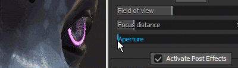

# Camera settings

**显示设置**&#x200B;的此部分控制摄像机的行为以及视区的最终外观。

## 相机

| *设置* | *描述* |
| --- | --- |
| **视域** | 允许控制摄像机的视场（以度为单位） |
| **焦距** | 定义焦点所在的距离。  此点由场效应深度使用。 

 **注意：**&#x200B;可使用快捷键&#x200B;**CTRL +鼠标中键**&#x200B;单击网格的点，从而自动设置焦距 |
| **光圈** | 定义字段深度的宽度。 

 **注意：**&#x200B;如果Iray正在控制此参数，则更改它将重新触发计算。 |

## 后期效果

有关详细信息，请参阅[后效果页面](../../features/post-processing/post-processing.md)。

## 随机采样抗锯齿

启用后，**随机采样抗锯齿** (**TAA**)将删除视区中的锯齿边缘。\
**TAA**&#x200B;的工作方式是在渲染的多个帧之间累积信息，这意味着在相机停止移动或执行其他操作之前，将禁用该效果。

| *设置* | *描述* |
| --- | --- |
| **累计** | 定义将累计多少帧以减少锯齿。<ul data-preserve-html="true"> <li data-preserve-html="true">16：建议在大多数情况下使用价值</li> <li data-preserve-html="true">64：适用于清除高对比度值（例如，结合使用Alpha着色器和抖动）</li> </ul>  **注意：**&#x200B;此设置对性能没有任何影响；但是，较高值可能需要更长的时间才能生成良好的结果。 |

{width="500px"}

如果启用了设置“**Alpha**”，也可以使用消除锯齿功能来过滤&#x200B;**Alpha 仿色 — 测试**&#x200B;着色器：

{width="500px"}

## 次表面散射

有关详细信息，请参阅[次表面散射](../../features/subsurface-scattering/subsurface-scattering.md)页面。

## 颜色配置文件

有关详细信息，请参阅[颜色配置文件页面](../../features/post-processing/color-profile.md)。

## 色调映射

| 设置 | 描述 |
| --- | --- |
| **函数** | 指定用于适合超出显示器显示功能的颜色值（将HDR值重新映射到LDR范围）的函数。可能的值包括：<ul data-preserve-html="true"><li data-preserve-html="true"><strong>线性</strong>（默认）：无变换，对高于1.0的值进行限制。</li><li data-preserve-html="true"><strong>ACES</strong>：使用ACES电影色调映射曲线。</li></ul> 

 **注意：**&#x200B;某些游戏引擎和渲染软件使用ACES色调映射器。 启用此功能将有助于在应用程序之间匹配颜色并避免差异。 |
