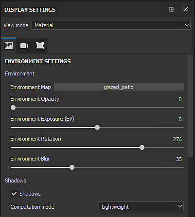

# 显示设置

{width="320px"}

**显示设置**&#x200B;窗口将环境、相机和视口设置重新分组。 这些设置是项目的全局设置，可能会影响视区的外观。

## 视图模式

视图模式控制视区的外观。 该下拉菜单分为三个部分：

| 章节 | 描述 |
| --- | --- |
| **光照** | 启用全光照（包括阴影）后，在视口中显示3D模型。 |
| **单通道** | 也称为独奏模式。 仅使用特定通道或纹理显示视口中的网格，而不使用光照。 |
| **网格图** | 仅使用不含光照的特定烘焙纹理在视区中显示网格。 |

>[!NOTE]
>
> 还可以使用[视区](../../interface/viewport/viewport.md)角落提供的<b>下拉菜单</b>更改视图模式。 还有[快捷键](../settings/shortcuts.md)可用于在通道、网格地图之间快速循环，甚至可以返回到素材模式。

## “显示设置”部分

有关每个部分的更多详细信息，请参阅专用页面：

* [环境设置](environment-settings.md)
* [Camera settings](camera-settings.md)
* [Viewport settings](viewport-settings.md)
