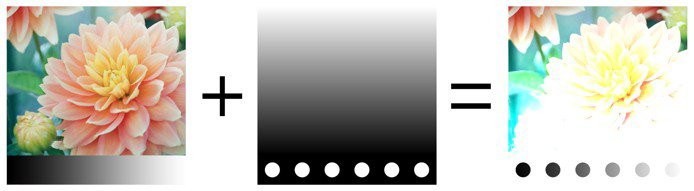
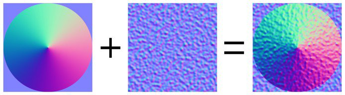

# 混合模式

图层和效果可以访问许多&#x200B;**混合模式**。 它们允许以不同方式将图层结果与下方的其他图层混合。

并非所有混合模式都适用于所有用例。 例如，**法线映射**&#x200B;混合模式仅对纹理集中的&#x200B;**法线通道**&#x200B;有用。

## 混合模式顺序

要了解如何以及何时应用混合模式，请务必了解在&#x200B;**图层栈栈**&#x200B;中执行操作的顺序：

1. 将计算底部的图层。
1. 根据“混合模式”计算顶部的图层，并将其与下面的图层混合（示例：正片叠底）。
1. 应用蒙版以最后查看顶部图层。

## 更改混合模式

可以为图层中的&#x200B;**每个通道**&#x200B;更改混合模式。 要在通道之间切换，请使用图层栈栈窗口中提供的左上角下拉菜单。

要更改混合模式，只需单击特定图层上的混合模式下拉菜单：

>[!NOTE]
>
> 如果下拉菜单具有焦点，则可以使用以下快捷键在混合模式之间快速切换：
> 
> * 向上或向下箭头键盘快捷键
> * 鼠标滚轮向上或向下

## 混合模式列表

下面列出了Substance 3D Painter图层和效果中可用的所有混合模式。 大多数混合模式都是通过RGB（或灰度）操作来工作的，但某些操作也通过另一种模式来执行，即[HSV（色相、饱和度、值）](https://en.wikipedia.org/wiki/HSL_and_HSV)。 所有混合模式都在内部&#x200B;**线性灰度系数空间**&#x200B;中执行。

| *名称* | *描述* |
| --- | --- |
| 法线 | 将顶部图层显示在底部图层上方，而不进行变换（复制模式）。 如果顶部图层具有透明度(alpha)，则它将通过透明像素显示底部图层。 

 |
| Passthrough | 将底部图层拼合为顶部图层。 主要适用于以下情况：<ul data-preserve-html="true"> <li data-preserve-html="true">对顶部图层下方的所有图层应用效果</li> <li data-preserve-html="true">涂抹或仿制顶部图层下方的图层</li> </ul> 

 **注意：**&#x200B;**效果**&#x200B;可以&#x200B;**直接拖放到图层栈栈中**，这样将创建其所有通道的“混合模式”均设置为“穿透”的图层。 |
| Disable | 放弃图层的混合，仅显示前面的图层。 它可以通过在顶层中忽略通道来优化通道计算。 

 |
| 替换 | 覆盖底层。 例如，这对于避免将信息与下面的图层混合是非常有用的。 “替换”的工作方式与“正常”混合不同，因为它还会忽略顶部图层中的Alpha，这可能会导致透明像素。 

 |
|  |  |
| 相乘 | 将顶部图层与底部图层相乘。 结果将始终是较暗的颜色。 

 |
| Divide | 用当前图层的颜色信息除以下面的图层。 结果图像大多数时间都比较亮，有时看起来像烧焦了一样。 

 |
| 反分割 | 与“分割”混合模式相同，但在混合操作中交换顶层和底层。 

 |
| 变暗（最小值） | 在顶部图层与底部图层之间保留最小颜色值。 

 |
| 变亮（最大值） | 在顶部图层与底部图层之间保持最大颜色值。 

 |
|  |  |
| 线性减淡（添加） | 将顶部图层颜色值添加到底部图层。 结果可以给出低于0或高于1的颜色，在这种情况下，如果通道不是HDR，则结果将被固定/剪切。 例如，此混合模式在累积Height信息时非常有用。 

 |
| Subtract | 从底部图层减去顶部图层的颜色。 结果可以给出低于0的颜色，在这种情况下，如果通道不是HDR，则结果将被固定/剪切。 

 |
| Inverse Subtract | 与“减去混合模式”相同，但在混合操作中交换顶层和底层。 

 |
| Difference | 从底部图层减去顶部图层的颜色，但采用结果的绝对值（负值将变为正值）。 

 |
| 差集 | 与“差值”混合模式类似，但是它所产生的图像对比度较低。 

 |
| 签名添加(AddSub) | 根据顶部图层颜色从底部图层添加和去除颜色信息。 灰度值无效，而较暗的颜色将减去信息，较亮的颜色将增加信息。 

 |
|  |  |
| Overlay | 组合屏幕和多种混合模式。 顶部图层中的灰度值将无效，但深色将颜色正片叠底，而明亮的颜色将调亮颜色。 

 |
| 滤色 | 来自顶部和底部图层的颜色信息被反相，然后彼此相乘，然后此结果再次反相。 这将产生与“正片叠底”混合模式相反的视觉效果，并使图像更加明亮。 

 |
| 线性加深 | 将顶部图层颜色信息和底部图层颜色信息添加到一起，然后从结果中减去1。 

 |
| 颜色加深 | 将底部图层除以顶部图层。 在执行该操作之前，反转底层。 此混合操作会使顶部图层变暗，并增加其对比度以显示底部图层的颜色。 底部图层越暗，使用的颜色就越多。 

 |
| 颜色减淡 | 将底部图层除以反转的顶部图层。 此操作会根据顶部图层的值使底部图层变亮。 顶部图层越亮，其颜色对底部图层的影响就越大。 

 |
|  |  |
| 柔光 | 与“Overlay Blending Mode”（叠加混合模式）类似，使用不同的曲线混合颜色信息，打造对比效果较差的图像。 

 |
| 强光 | 与“叠加”混合模式类似（将“正片叠底”和“滤色”操作结合起来）。 不同之处在于，操作的顺序被反转，从而产生颜色更暗或更亮但对比度较低的图像。 

 |
| 强烈光源 | 组合了颜色减淡和颜色加深混合模式。 对比灰色亮的颜色应用减淡，对比灰色暗的颜色应用加深。 灰度值不受影响。 结果是图像对比更强。 

 |
| 线性光 | 将线性减淡和线性加深结合在一起。 对比灰色亮的颜色应用减淡，对比灰色暗的颜色应用加深。 灰度值不受影响。 结果类似于“亮光”，但对比度较低。 

 |
| 点光 | 根据顶部图层颜色使颜色信息变亮和变暗。 如果顶部图层上的深色比底部图层上的深色，那么它们将可见，如果不是，它们将消失。 同样的原理也适用于明亮的颜色。 此混合模式可能会产生斑点或斑点（大杂色），并且会完全移除所有中间色调。 

 |
|  |  |
| 色调 | 使用HSV模型执行操作。 仅保留顶部图层的色相，并使用底部图层的饱和度和值。 黑色和深色没有任何色相，因此底部图层的颜色将保持不变。 

 |
| Saturation | 使用HSV模型执行操作。 仅保留顶部图层的饱和度，并使用底部图层的色相和值。 黑色和深色不饱和，因此底部图层的颜色将变为灰度值。 

 |
| Color | 使用HSV模型执行操作。 仅保留顶部图层的色相和饱和度，并使用底部图层的值。 黑色和深色不具有任何色相且饱和度较低，因此底部图层的颜色将变为灰度值。 

 |
| Value | 使用HSV模型执行操作。 仅保留顶部图层的值，并使用底部图层的色相和饱和度。 

 |
|  |  |
| 法线图组合 | 白化混合操作。 保留细节，同时确保平整法线仍可正常运行。 有关详细信息，请参阅[法线图绘画](../../painting/advanced-channel-painting/normal-map-painting.md)。 

 |
| 法线图细节 | 面向细节的混合操作（重新定向的法线映射），比法线映射合并更精确。 保留平面法线映射和两个源的强度。 要确保结果，顶部层法线将重新定向为跟随底部层表面。 有关详细信息，请参阅[法线图绘画](../../painting/advanced-channel-painting/normal-map-painting.md)。 

 |
| 法线图逆细节 | 与“法线映射细节”混合操作的行为相同，但只有底部图层会进行变换，以适合顶部图层的表面。 有关详细信息，请参阅[法线图绘画](../../painting/advanced-channel-painting/normal-map-painting.md)。 

 |

&#x200B;>>
