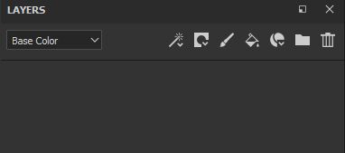
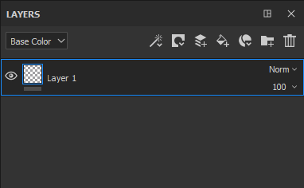

# 创建图层

有多种方式可以在图层栈栈中添加/创建图层：

| *操作* | *演示* |
| --- | --- |
| 通过单击专用的按钮创建&#x200B;**绘画图层** 

 | 

 |
| 通过单击专用的按钮创建&#x200B;**填充图层** 

 | 

 |
| 通过单击专用的按钮创建&#x200B;**文件夹** 

 | 

 |
| 使用以下方法之一&#x200B;**复制**&#x200B;图层：<ul data-preserve-html="true"><li data-preserve-html="true">右键单击>复制</li><li data-preserve-html="true">快捷键CTRL+D或COMMAND+D</li><li data-preserve-html="true">按住CTRL或COMMAND键并拖放图层</li></ul> | 

 |
| 单击专用按钮以删除图层 

 | 

 |

>[!NOTE]
>
> 其中一些操作具有关联的键盘快捷键，可在[专用页面](../settings/shortcuts.md)上查看。

从层架中拖放资源也可以作为创建图层的方式：

| *操作* | *演示* |
| --- | --- |
| 将&#x200B;**素材**&#x200B;从[资源](../assets/assets.md)拖放到图层栈叠中 | 

 |
| 将&#x200B;**智能素材**&#x200B;从[资源](../assets/assets.md)拖放到图层栈叠中 | 

 |
| 将&#x200B;**效果**&#x200B;从[资源](../assets/assets.md)拖放到图层栈叠中 | 

 |
