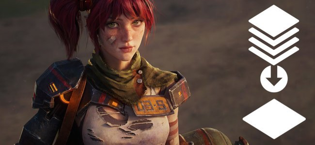

# 拼合图层

## 拼合图层

拼合图层允许您将选定组的可见纹理数据收缩到单个图层中。 这有助于简化图层栈栈、提高性能并使您的项目更易于管理。

>[!NOTE]
>
> 使用“拼合”功能时，会创建新图层，但不会删除原始图层组。 相反，源组会被禁用，您只能选择将其删除，或者将其另存为智能素材以供日后编辑。

## 如何拼合图层

要拼合一系列图层，请执行以下操作：

1. 选择所需的图层。
1. 使用<b>CTRL + G (CMD + G) </b>对选区进行分组。
1. 使用<b>CTRL + M (CMD + M)</b>合并选区。

您也可以从右键单击菜单访问这些选项，而不是使用键盘快捷键。

拼合图层后，将创建具有拼合纹理的新填充图层，并禁用源组。

## 拼合特定通道

* 在填充图层上，使用“属性”面板禁用您不希望拼合的通道。 禁用通道时，信息不会丢失。 拼合图层后，您可以重新启用通道，数据仍将保留在原处
* 对于组或绘画图层，您可以使用混合模式来禁用通道：
  * 在图层栈栈的顶部，选择要禁用的通道。
  * 将所需图层的混合模式更改为“禁用”。
  * 通过右键单击混合模式并选择“应用于所有通道”，可以将相同的混合模式应用于图层的所有通道。

## 从图层堆叠导出拼合贴图

使用图层栈栈中右键单击菜单的<b>将拼合的组导出到文件</b>可快速导出纹理。 选中图层或组时，此选项可用。 选择多个图层或组后，它们将作为批处理处理 — 就像逐个导出每个图层或组一样。

>[!NOTE]
>
> 与<b>拼合组</b>功能一样，不会导出空的或禁用的通道和图层。 如果使用几何图形蒙版，则仅导出在几何图形蒙版中启用的UV磁贴。

### 文件管理

选择<b>将拼合组导出到文件</b>时，您将有机会为导出的文件选择文件夹位置。

导出的文件根据文件名字段中的模式命名。 默认模式为：

* <b>$textureSet\_$layerName\_$srcMap(.$udim)</b>

使用此图案时，映射将具有纹理集名称、图层名称、通道名称，如果是UV拼贴项目，还将具有UDIM编号。

如果修改图案，下次打开窗口时它再次可用。

### 导出的文件属性

导出时导出文件的属性基于以下值：

* 分辨率基于纹理集分辨率。
* 位深度基于纹理集设置中的通道位深度。

以下属性是硬编码的，无法更改：

* 内边距锁定为1px。
* 文件格式取决于要导出的通道。 Height和普通等映射通常需要更多的位深，因此导出为EXR，而其他通道导出为PNG。
* 如果仅导出蒙版，则可以选择导出格式。

## 如何生成拼合的图层？

拼合函数将在新填充图层内为每个启用的通道创建位图。 分辨率基于纹理集分辨率，位深度由纹理集设置确定。

当给定通道中存在纹理数据时，拼合有效。 拼合无法用于空的绘画图层，并且如果所选内容中没有数据，则将向日志发布错误消息。

只能拼合可见图层和效果。 如果在拼合组时禁用了该组中的某些图层，则这些图层的效果将不会包含在拼合结果中。

### 禁用的图层

只能拼合可见图层和效果。 如果在拼合组时禁用了该组中的某些图层，则这些图层的效果将不会包含在拼合结果中。

### 图层蒙版和几何蒙版

蒙版与纹理数据分开拼合。 这意味着，如果用蒙版拼合组，将生成拼合的填充和拼合的蒙版。

使用几何图形蒙版时，如果在几何图形蒙版内仅选择某些UV拼贴，则拼合的图层将保留此选区。 未在几何图形蒙版中选择的UV拼贴视为空白，因此其纹理将不会保留在拼合结果中。

## 管理拼合内容

>[!NOTE]
>
> 拼合的图像存储在项目文件(.SPP)中。 这意味着它们将对项目文件的大小产生影响。

拼合的图像会自动标记为“拼合”，以便您可以在“资源”面板中轻松搜索它们。 它们还会自动存储在已保存的搜索类别“拼合的图层”中。

### 清理未使用的图像

从项目文件中删除未使用的图像有助于减小项目大小。 在“资源”面板中，可以从右键单击菜单中删除图像。 或者，要删除所有未使用的图像，请使用<b>文件>删除未使用的资源</b>。 请注意，此操作不仅会删除拼合的图像，还会删除图层栈栈、备份映射槽或UI中其他位置未使用的任何资源。
