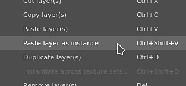
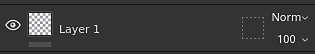

# 图层实例化

**图层实例化**&#x200B;允许跨多个图层和[纹理集](../texture-set/texture-set.md)同步图层参数，同时仍然可以生成网格相关结果。

创建图层实例时，将使用原始图层（或源图层）在所有现有实例间复制参数。 **只能修改源图层**。

>[!WARNING]
>
> 任何绘画操作（画笔描边、多边形填充等） 仅适用于源图层所在的纹理集。 具有此图层实例的其他纹理集将直接放弃绘画操作。

## 创建图层实例

要创建图层实例，请执行以下操作：

1. 选择任何现有图层
1. 复制图层(**CTRL+C**)
1. 将其粘贴为实例（使用&#x200B;**CTRL+SHIFT+V**&#x200B;或右键单击以打开上下文菜单并选择&#x200B;**粘贴为实例**）

>[!NOTE]
>
> 可以从包括&#x200B;**组**&#x200B;在内的任何图层创建实例。 实例化文件夹可以是一种跨各种纹理集复制多个图层的简单方法。 在实例文件夹中添加图层也会将它们复制到现有实例中。

创建实例后，源图层和目标图层将显示一个新图标。 此图标是一个按钮，可用于更轻松地在源图层及其实例之间导航，而无需在纹理集之间手动切换（请参阅下文）。

| 名称 | 图标 |
| --- | --- |
| **未实例化的图层** | 

 |
| **实例源** | 

 |
| **实例目标** | 

 |

## 跨纹理集创建实例

一次操作可以在多个纹理集上创建图层实例，从而避免手动复制/粘贴它。

要跨多个纹理集创建实例，请执行以下操作：

1. 选择任何现有图层
1. 右键单击图层以打开上下文菜单
1. 选择&#x200B;**跨纹理集实例化**
1. 在新窗口中，检查哪些纹理集需要接收实例。
1. 单击“确定”以验证并创建实例。

<table>
<tr style="border: 0;">
<td style="border: 0;" valign="top">

</td>
<td style="border: 0;" valign="top">

</td>
</tr>
</table>

>[!NOTE]
>
> 纹理集名称旁边的感叹号表示通道&#x200B;**不匹配**。 这意味着，如果在此纹理集中创建实例，它将无法正确渲染，因为缺少通道。

## 在实例及其源之间切换

由于实例&#x200B;**只能**&#x200B;通过&#x200B;**编辑源**&#x200B;进行更新（由于技术原因），因此必须选择源图层以编辑其属性。\
这可以通过单击图层栈栈中的图层上的&#x200B;**实例属性按钮**&#x200B;来完成。

单击实例属性按钮时，它会将&#x200B;**属性窗口**&#x200B;从当前工具/图层切换到&#x200B;**显示源图层及其实例的列表**。\
单击列表的&#x200B;**任意元素**&#x200B;以自动&#x200B;**跳转到此图层** 。 这将自动&#x200B;**将**&#x200B;当前选定的&#x200B;**纹理集**&#x200B;也更改为正确的纹理集。

使用&#x200B;**实例树**&#x200B;列表是&#x200B;**快速**&#x200B;从实例转到其源并同时查看&#x200B;**依赖关系**&#x200B;的最佳方式。

## 实例循环（以及如何解决它们）

循环是直接或间接用于源图层本身的实例。 Substance 3D Painter引擎无法计算循环&#x200B;**&#x200B;**，因此需要&#x200B;**禁用**，直到修复或删除为止。

示例：\

在本例中，源图层的实例移动到它内部（因为它是一个文件夹）。 实例被破坏，因为为了生成其参数，我们需要从源查询参数，而源依赖于实例中的参数。 这就形成了一个无法自动解决的循环。 实例变为禁用状态。

修复循环的唯一方法是&#x200B;**移动**&#x200B;文件夹之外的实例，或&#x200B;**删除**&#x200B;它。

只要实例本身引用其他源图层，则可以在源图层中使用图层实例。
