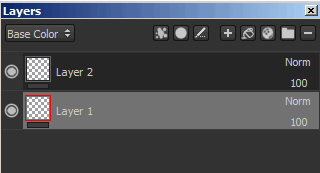
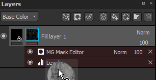

# 蒙版和效果

## 蒙版

可以对图层进行蒙版处理，以便只将图层的内容显示/应用于纹理的特定部分。 蒙版用作图层内容的强度参数。 图层上的蒙版始终是灰度的，无论您在其上使用哪种内容绘画（因此，任何颜色都将在绘制之前转换为灰度值）。

可通过使用右键单击菜单或使用专用按钮来添加蒙版：

可能对蒙版执行的操作：

* 您可以通过&#x200B;**ALT +鼠标左键单击**&#x200B;蒙版缩览图来可视化蒙版本身。 它会将视区切换到此图层中蒙版的隔离视图。 此操作也可通过查看器设置执行。
* 您可以暂时禁用在蒙版缩览图上执行&#x200B;**SHIFT +鼠标左键**&#x200B;单击的蒙版。 重做相同的操作以再次启用它。 此操作也可以通过右键单击菜单（“切换蒙版”）执行。
* 您可以通过在缩览图上执行&#x200B;**右键单击>复制蒙版内容**，然后在第二个蒙版的缩览图上执行&#x200B;**右键单击>粘贴到蒙版中**，将蒙版的内容复制到另一个蒙版中。
* 您可以通过执行&#x200B;**右键单击>反转蒙版背景**&#x200B;来反转蒙版背景。 如果想要避免破坏附加到蒙版的效果，此功能非常有用。

>[!WARNING]
>
> 再次添加或移除蒙版将会破坏蒙版以及与其相连的所有效果。

如果按下&#x200B;**CTRL**&#x200B;键，则可以在创建填充图层时（通过拖放）立即创建蒙版：

## 效果

效果是可以随时编辑的特殊操作。 可以将效果放置在图层内容的蒙版上。\
然而，对另一种来说，效果更合适。 例如，“生成器”适用于蒙版。

图层上每个缩略图下方的线条指示是否存在效果。 灰色等于无效果，红色至少等于一个效果 每个蒙版和每个内容都有一个效果栈栈。

有关详细信息，[请参阅专用页面](../../features/effects/effects.md)。

## 智能蒙版

智能蒙版是一种存储蒙版及其效果的方法，可轻松地在其他图层或其他项目上重复使用它们。 要创建智能蒙版，只需右键单击蒙版，然后选择“**创建智能蒙版**”即可。\
将智能蒙版拖放到图层上时，如果不存在黑色蒙版，则会创建黑色蒙版，否则效果列表将与现有效果列表合并。 删除智能蒙版时按住“**CTRL**”可完全覆盖效果列表。

<table>
<tr style="border: 0;">
<td style="border: 0;" valign="top">

</td>
<td style="border: 0;" valign="top">

</td>
</tr>
</table>
