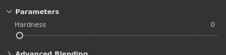

# 滑块

此页显示如何在应用程序界面中使用滑块。

| 操作 | 示例 | 描述 |
| --- | --- | --- |
| **拖动** | 

 | 将鼠标悬停在滑块上时，单击并拖动可更改滑块值。 |
| **精确度拖动** | 

 | 按住键盘上的Shift键，同时单击可增加滑块的拖动距离。 使用此快捷键可以在拖动滑块时更精确地调整滑块。 |
| **跳转** | 

 | 单击滑块上的任意位置，可跳转到鼠标位置下的值。 |
| **向上/向下** | 

 | 通过单击某个滑块获得焦点后，使用键盘上的向上箭头键和向下箭头键逐步增大或减小该值。 |
| **值版本** | 

 | 单击滑块正上方的文本字段，可通过键盘手动编辑其值。 |
