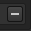

# 库配置

此部分允许指定到其他资源文件夹的自定义路径，并默认将资源保存在哪个位置。

## 默认路径

默认情况下，会预定义两条路径：

| 名称 | 位置 |
| --- | --- |
| **您的\_assets** | 此路径位于当前用户配置文件的Documents文件夹中。 这是默认情况下从应用程序内创建资源（在旧版本中名为“shelf”）的位置。 |
| **starter\_assets** | 此路径位于应用程序的安装文件夹中。 它包含默认资源。 （在旧版本中名为“allegorithmic”或“substance”。） |

**默认**&#x200B;单选按钮用于定义新内容（如画笔预设、素材预设或智能素材）将存储在哪个路径。

## 添加新路径

>[!NOTE]
>
> 仅当当前没有打开任何项目时，才能创建/修改路径。

| 设置 | 描述 |
| --- | --- |
| **名称** | 用于引用接口中的路径的已命名（例如，右键单击资源时）。 此名称还定义要跟踪资源的内部位置名称（无论它们是否为最新），因此建议在定义此名称后不要对其进行更改。 |
| **路径** | 资源在磁盘上的实际位置（或将在该位置）。 |
| **加号按钮**  

 | 单击此按钮会将名称和路径设置定义的路径添加到下面的列表中。添加新路径将自动创建组织数据和资源所需的子文件夹结构。 要了解放置资源的位置，请参阅： [将内容添加到托架](https://helpx.adobe.com/substance-3d/unlisted/documentation/spdoc/adding-content-to-the-shelf-142213317.html)。 |
| **减号按钮**   

 | 单击路径前面的此按钮会将其从列表中删除。 资源将不再列在[资源](../assets/assets.md)界面中。  **注意：**&#x200B;无法删除默认路径，但这些路径将被禁用，其资源将被隐藏。 |
