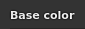

# 纹理集设置

{width="300px"}

**纹理集设置**&#x200B;控制当前所选纹理集的参数。 这是可以管理分辨率、通道和相关网格映射的位置。

## 常规属性

| 设置 | 描述 |
| --- | --- |
| **名称** | 纹理集的名称。 为3D模型上指定的材料名称继承。 |
| **描述** | 用于添加有关纹理集信息的文本字段。 此文本显示在[纹理集列表](texture-set-list.md)和[烘焙](../../baking/baking.md)窗口中。 |
| **大小** | 控制纹理集中的通道分辨率（以像素为单位）。 若要使用&#x200B;**非方形**&#x200B;分辨率（例如2048x1024），请禁用两个下拉菜单之间的&#x200B;**锁定按钮**。由于&#x200B;**非破坏性工作流程**，纹理集分辨率&#x200B;**动态**。 这意味着可以在低分辨率下工作，以获得较好的性能，然后使用更高的分辨率来获得更好的质量。 在应用程序内，通道的最大分辨率为4096x4096像素，而导出时的最大分辨率为8192x8192（如果GPU支持）。 改变分辨率可能会触发引擎长时间计算。 |
| **着色器实例** | 定义要使用哪个[着色器](../shader-settings/shader-settings.md)渲染[视口](../viewport/viewport.md)中的给定纹理集。 |

## 渠道

### 通道列表

可以随时通过添加或删除通道来修改列表（除非被[材质图层](../../features/dynamic-material-layering.md)工作流程覆盖）。

| 按钮/图标 | 描述 |
| --- | --- |
| <b>添加频道</b>  

 | 单击此按钮可将新频道添加到列表中。打开的弹出菜单分为三类：<ul data-preserve-html="true"><li data-preserve-html="true"><strong>支持的通道</strong>：这些通道可由视区中的当前着色器使用。</li><li data-preserve-html="true"><strong>不支持的通道</strong>：这些通道被视区中的当前着色器忽略。</li><li data-preserve-html="true"><strong>用户通道</strong>：用于绘制更多信息的其他通道，通常不受着色器支持。</li></ul>  **注意：**&#x200B;可以添加的通道数量没有限制，但通道过多会严重影响性能，并且需要更多内存。 |
| <b>移除频道</b>  

 | 从列表中删除频道。  **注意：**&#x200B;项目内的绘画信息不会随通道一起删除，因此如果需要（重新计算后）恢复纹理，可以稍后重新添加通道。 |
| <b>频道名称</b>  

 | 给定通道的名称。通过双击当前名称，可以重命名用户通道： 

 |
| <b>频道设置</b>  

 | 此按钮可打开频道的“设置”菜单，其中含有多个操作。第一个动作列表控制通道的存储类型和精度：<ul data-preserve-html="true"><li data-preserve-html="true"><strong>sRGB8</strong>：RGB颜色、灰度系数校正值，存储在8位上。</li><li data-preserve-html="true"><strong>L8</strong>：灰度值，存储在8位上。</li><li data-preserve-html="true"><strong>RGB8</strong>：RGB颜色，存储在8位上。</li><li data-preserve-html="true"><strong>L16</strong>：灰度值，存储在16位。</li><li data-preserve-html="true"><strong>RGB16</strong>：RGB颜色，存储在16位。</li><li data-preserve-html="true"><strong>L16F</strong>：灰度值 — 正负值，存储在16位浮动空间中。</li><li data-preserve-html="true"><strong>RGB16F</strong>：RGB颜色 — 正负色，存储在16位浮动空间中。</li><li data-preserve-html="true"><strong>L32F</strong>：灰度值 — 正负值，存储在32位浮动空间中。</li><li data-preserve-html="true"><strong>RGB32F</strong>：RGB颜色 — 正负色，存储在32位浮动空间中。</li></ul>  **注意：**&#x200B;存储类型&#x200B;**不是**&#x200B;色彩空间/灰度系数控件。 用于存储通道信息（例如sRGB8或L32F）的数据对应用程序读取它们的方式没有影响。 例如，“粗糙度”通道仍将被视为“数据/原始”，而“基色”仍将被视为“灰度系数校正”。  菜单的最后一个操作可用于启用或禁用通道上的[色彩管理](../../features/color-management/color-management.md)：<ul data-preserve-html="true"><li data-preserve-html="true"><strong>颜色通道</strong>：如果启用，则对通道进行颜色管理。 此选项只能对用户频道手动修改。</li></ul> |
| <b>色彩管理</b>  

 | 如果存在，则指示通道是受色彩管理的。 仅用户通道可标记为色彩管理或非色彩管理，其他通道的行为已修复。有关对哪些通道进行色彩管理的详细列表，请参阅： [色彩管理](../../features/color-management/color-management.md)。 |

### 混合设置

这些设置控制有关通道生成方式的各种行为，特别是通道与烘焙纹理（网格图）组合的方式。

| 设置 | 描述 |
| --- | --- |
| **正常混合** | 控制应如何将“生成的法线图”与“法线”通道组合在一起。 可能的值为：<ul data-preserve-html="true"><li data-preserve-html="true"><strong>替换</strong> ：忽略“烘焙法线图”并将仅对此纹理集使用“法线”通道。 可用于在烘焙的法线图上绘制。 有关详细信息，请参阅[高级通道绘画](../../painting/advanced-channel-painting/normal-map-painting.md)文档。 如果正常通道不存在，或者正常通道输出为空，则仍然使用生成的正常映射。</li><li data-preserve-html="true"><strong>合并</strong>（默认） ：使用面向细节的函数合并“正常”通道和“烘焙的正常映射”。</li></ul>  **注意：**&#x200B;如果频道列表中缺少该频道，此设置可能被禁用。 如果通道缺失，则使用默认混合值。 |
| **正常方法Height** | 控制使用哪种方法将Height声道转换为法线图。 可能的值为：<ul data-preserve-html="true"><li data-preserve-html="true"><strong>Sharp</strong>：生成定义更明确的法线图，但可能会引入杂色和锯齿。 适用于重复图案，如织物。</li><li data-preserve-html="true"><strong>平滑(Sobel)</strong>（默认）：使用Sobel滤镜生成更平滑的正常映射，但可能会丢失细节。 适用于大多数情况。</li></ul> |
| **环境遮蔽混合** | 控制应如何将“烘焙的环境遮蔽”与“环境遮蔽”通道相结合。 可能的值为：<ul data-preserve-html="true"><li data-preserve-html="true"><strong>替换</strong> ：忽略“烘焙环境遮蔽”，并将仅对此纹理集使用“环境遮蔽”通道。 可用于在烘焙的环境遮蔽上绘画。 有关详细信息，请参阅[高级通道绘画](../../painting/advanced-channel-painting/ambient-occlusion-painting.md)文档。  </li><li data-preserve-html="true"><strong>乘以</strong>（默认） ：使用乘法操作将“环境遮蔽”遮蔽和“烘焙的环境色通道”组合在一起。  </li></ul>  **注意：**&#x200B;如果频道列表中缺少该频道，此设置可能被禁用。 如果通道缺失，则使用默认混合值。 |
| **UV填充** | 控制如何生成UV 岛外部的填充。 可能的值为：  <ul class="steps" data-preserve-html="true"> <li class="step" data-preserve-html="true">    <strong>3D空间邻近像素</strong>（默认）：查看UV接缝的另一侧以查找邻近像素颜色，并将其用于UV边界。 建议在使用连续图案在UV接缝上绘画时使用此设置。 左侧为常规填充，右侧为3D邻居示例：            </li> <li class="step" data-preserve-html="true">    <strong>2D空间邻居</strong>：生成内边距之前，将UV 岛内的像素复制到UV 岛外的边框。 当UV 岛的信息非常对立并且不会重叠时，建议使用此设置。 例如，在球体中，每个色带的颜色在UV 岛上是唯一的，左边是2D邻居，右边是3D邻居（注意渗色）：           </li> </ul>  **注意：**&#x200B;此内边距设置是按纹理集保存的，并在将纹理导出和可视化到视口时加以考虑。由于3D空间邻居的工作方式，它不能与普通通道一起使用，而将使用2D版本。 |

## 网格图

网格图是特定于网格和纹理集的烘焙纹理，用于借助滤镜、智能素材和智能蒙版增强纹理质量。 有关更多详细信息，请参阅[烘焙](../../baking/baking.md)文档。
