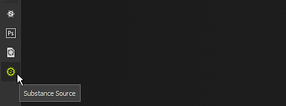

# 工具栏

此页面简要概述了所有可用的工具栏。 每个控件都包含不同的操作和设置。

下面是所有可用工具栏的列表。

## Tools

{width="450px"}

默认情况下，**工具工具栏**&#x200B;在主界面的左上角可用。 其中列出了[绘画工具](../painting/painting.md)的所有内容，这些工具可用于对当前打开的项目的3D网格进行纹理化处理。 只有在选择了绘画图层时，才能访问这些工具。

某些工具具有名为“物理”的第二种模式，此模式支持粒子绘画。 还可以通过单击[资源](assets/assets.md)窗口中的粒子画笔预设来访问粒子绘画。

此工具栏只能在主界面的左侧或右侧垂直停放。

## Docks

{width="450px"}

默认情况下，<b>停靠工具栏</b>在主界面的右上角可用。 其目的是提供对停靠窗口的快速访问，以快速打开和关闭这些窗口。

单击工具栏中的某个按钮将在按钮旁显示停靠区，并浮动在界面其余部分上方，再次单击按钮将关闭停靠区。 如果停放区从其按钮移开，它将变成一个可在界面中停放的常规浮动窗口。 如果关闭，该按钮将再次可在停靠工具栏中使用。

{width="450px"}

此工具栏只能在主界面的左侧或右侧垂直停放。

## 插件

{width="450px"}

**插件工具栏**&#x200B;列出已安装（且当前已启用）的Substance 3D Painter脚本插件。 要了解有关增效工具及其使用的更多信息，请参阅[增效工具](../features/plugins/plugins.md)。

## 上下文

{width="450px"}

上下文工具栏是一个工具栏，其内容的某些部分会根据当前选定的工具或修改的其他属性而发生更改。 工具栏的左侧可以更改，但右侧是固定的，并列出快捷键以修改[视区](viewport/viewport.md)的显示。

此工具栏可列出以下元素的属性：

* [绘画](../painting/painting.md)
* [填充层投影操纵器](../painting/fill-projections/fill-projections.md)

此工具栏无法移动，并始终位于视区的顶部。
