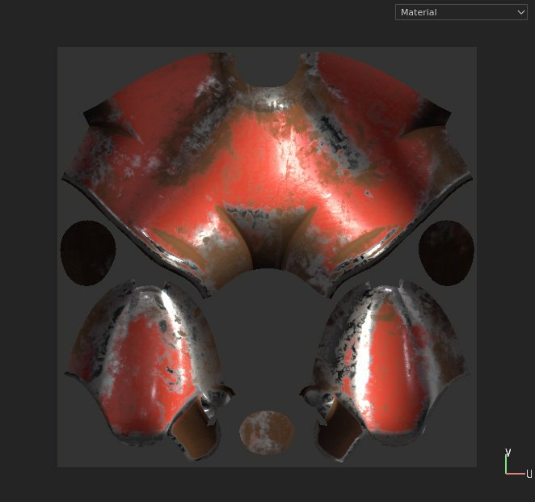
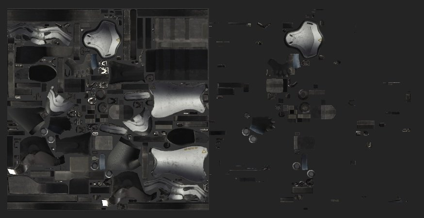

# 2D 视图

{width="450px"}

2D视图显示当前所选[UV 岛集](../texture-set/texture-set.md)中的网格纹理。 它不仅可以显示图层栈栈中的纹理，还可以在网格UV 岛上绘画。

## 显示模式

视区的右上角是显示模式下拉菜单。 此控件允许更改在视区中应显示的信息。 它允许显示单个通道、网格图或带光照的最终素材结果。

## 轴信息

视区的右下角是&#x200B;**轴信息**，它指示二维轴的方向。 如果2D视图是U和V。

## UV拼贴信息

**显示模式**&#x200B;旁边是&#x200B;**UV磁贴信息**&#x200B;按钮，用于显示/隐藏与UV磁贴相关的信息。 此按钮在常规项目中不可见。

## 项目工作流

根据创建项目时定义的工作流程，2D视图的外观和行为可能会有所不同：

| *项目工作流* | *行为* |
| --- | --- |
| **常规项目** | 使用常规项目时，只能绘制使用UV范围[0-1]的UV。 此范围之外的任何内容都可见，但不会交互。在此示例中，只能绘制左侧的UV 岛（后面带有浅灰色背景）。 

 |
| **UV磁贴项目** | 利用UV拼贴项目，每个UV范围都是一组可以绘制的新纹理。 2D视图会显示网格，以更好地查看每个拼贴是如何组织的。 每个磁贴都将分配有一个UDIM编号。 

 |
