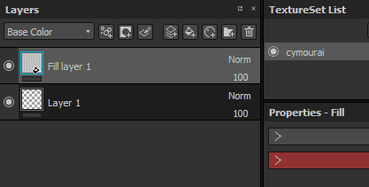
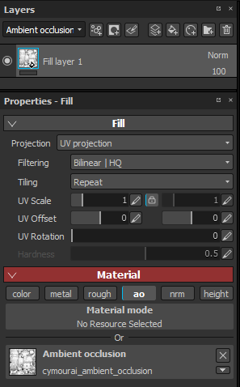

# 环境遮蔽绘画

环境遮蔽通道允许在对象的环境阴影中绘制细节。 它可用于添加来自素材的AO细节，或在需要时直接手动修复烘焙错误。

&#x200B;>> 

在计算机图形学中，环境遮蔽是一种着色和渲染技术，用于计算场景中的每个点对环境光照的曝光度。 与外露的外表面相比，光管的内部通常更被遮盖（因此更暗），并且光管内部越深，光线变得越被遮盖（且更暗）。 环境遮蔽可视为为每个表面点计算的辅助功能值。\
资料来源：&lt;https://en.wikipedia.org/wiki/Ambient_occlusion>

此计算的&#x200B;**结果**&#x200B;存储在名为“环境遮蔽”映射的位图中。 可以在应用程序中直接烘焙此映射，请参阅： [烘焙](../../baking/baking.md)。

## 绘制环境遮蔽

若要绘制自定义遮蔽细节，需要使用“环境遮蔽”通道。 可以通过[纹理集设置](../../interface/texture-set/texture-set-settings.md)添加它：

将通道添加到纹理集后，任何图层都可用于绘制新信息。 由于AO通道仅包含灰度信息，因此推荐的混合模式为&#x200B;**正常**（上色）和&#x200B;**正片叠底**（合并）。

要详细了解这些混合模式以及如何按通道更改它们，请参阅： [混合模式](../../interface/layer-stack/blending-modes.md)。

## 在环境遮蔽上绘制附加映射

在某些情况下，在烘焙的环境遮蔽上进行绘制可能会有助于隐藏细节或甚至修复烘焙问题。

Substance 3D Painter中项目的默认设置将组合环境遮蔽&#x200B;**通道**&#x200B;与&#x200B;**其他映射**&#x200B;中的环境遮蔽映射。 这意味着在烘焙的额外地图上绘画在默认情况下是不可能的，每个地图的结果（已烘焙贴图和通道）将相乘。 但是，此设置可通过以下设置进行更改：

### 1 — 添加环境遮蔽通道

在当前遮蔽集中添加环境纹理通道：\

将其混合模式设置为“**替换**”，而不是“**乘**”：\

### 2 — 使用烘焙的环境遮蔽设置填充图层

创建一个新填充图层，并通过“属性”面板将烘焙的环境遮蔽放入“环境遮蔽”插槽中。 如果填充图层尚未设置为1，请不要忘记更改默认拼贴。\

### 3 — 更改填充图层混合模式

默认情况下，任何新图层上的AO通道的混合模式设置为“**正片叠底**”。 由于最好使用填充图层作为基础图层，因此我们选择了“正常”混合模式，因为位图没有任何Alpha，它将替换下面的所有内容（包括着色器的默认颜色）。\

### 4 — 创建图层以在烘焙的环境遮蔽图上绘画

创建一个新图层（常规或填充），并将其混合模式更改为“正常”（对于AO通道）。 完成此设置后，AO通道上绘制的任何内容都将取代下方图层上经过烘焙的AO地图。\

