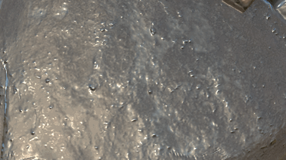
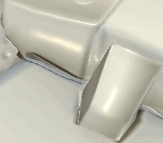

# 法线图绘画

绘制细节可以通过直接在网格上绘制“法线图”数据来完成。 此页面将用不同的方法来管理正常地图绘画。

## 绘画法线图细节

绘制法线图细节：

1. 在当前纹理集中添加常规通道（如果尚未存在）
1. 在当前绘画工具中启用正常通道
1. 在当前绘画工具的“材质”部分的“正常”槽中加载“正常”资源。

从此以后，使用法线映射绘画非常类似于[Height映射绘画](height-map-painting.md) ，并且增加了烘焙法线的精度。

## 正常混合模式

正常映射在图层栈栈中有自己的混合模式：

* **法线映射详细信息**（默认）
* **法线图反细节**
* **正常映射合并**

要了解这些模式，请参阅[混合模式](../../interface/layer-stack/blending-modes.md)页面。

## 标准色彩空间

将法线映射载入素材槽（工具属性或填充图层）时，可以更改默认色彩空间。

此设置可用于指定法线贴图格式，因为默认情况下应使用DirectX(Y-)法线映射（不受项目设置的影响）。 因此，使用OpenGL (Y+)法线映射时，需要单击小箭头以打开色彩空间菜单，然后更改位图的色彩空间。

## 在烘焙的法线图上绘画

在某些情况下，能够在烘焙的正常地图上进行绘制来隐藏细节（甚至修复烘焙问题）会很有用。\
Substance 3D Painter中项目的默认设置不允许执行此操作，因为它单独计算普通声道和生成的普通声道。 此行为可以通过[纹理集设置](../../interface/texture-set/texture-set-settings.md)进行更改。

### 1 — 更改纹理集混合模式

默认情况下，将使用设置为&#x200B;**合并**&#x200B;的&#x200B;**正常混合**&#x200B;设置创建纹理集。

若要覆盖/绘制法线图，请务必将此设置设置为&#x200B;**替换**。 正常地图将从视区中消失，但这是意料之中的。 将此模式更改为&#x200B;**replace**&#x200B;指示Substance 3D Painter在生成最终正常映射时仅考虑正常声道和Height声道。

### 2 — 使用生成的法线图设置填充图层

创建新的填充图层，并通过“属性”面板将烘焙的常规颜色放入“常规”插槽中。 如果填充图层未设置为1，请不要忘记更改默认拼贴。

### 3 — 更改填充图层混合模式

默认情况下，任何新图层上正常通道的混合模式都设置为“正常映射细节”。 由于最好使用填充图层作为基础图层，因此我们选择了“正常”混合模式，因为位图没有任何Alpha，它将替换下面的所有内容（包括着色器的默认颜色）。

### 4 — 创建图层以在烘焙的法线图上绘画

创建一个新图层（常规或填充），并将其混合模式更改为常规通道的“正常”。 完成此设置后，在正常通道上绘制的任何内容都将取代下方图层上烘焙的正常映射。

