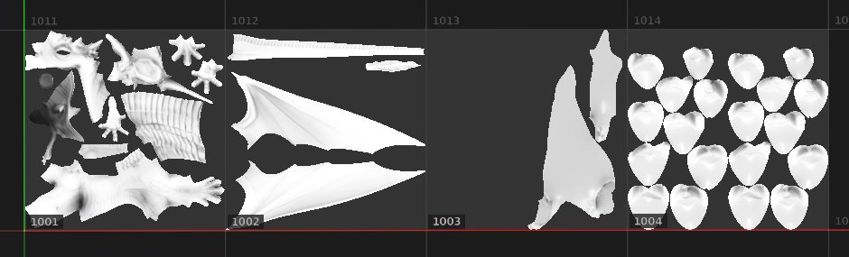

# 填充（每个UV图块匹配）

**填充（每个UV图块匹配）**&#x200B;是一个特殊的2D投影，对[UV图块](../../features/uv-tiles/uv-tiles.md)项目很有用。 它允许从序列中为每个UV拼贴指定UDIM纹理。

此投影没有任何专用设置，因为会为每个UV图块分配单个或多个图像填色。 由于没有设置，因此此模式也比较适合性能。

| 模式 | 描述 |
| --- | --- |
| **UV 投影** | 单个图像或序列中的第一个图像将应用于所有UV拼贴。 这还可以提供变形控制，请参阅[UV 投影](uv-projection.md)了解更多详细信息。 

 |
| **填充（每个UV图块匹配）** | 序列中的每个图像都分配给专用的UV图块。 没有变形控件。 

 |
