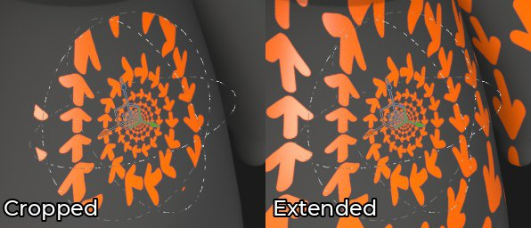

# Spherical projection

填充球面投影允许围绕对象投影图像和图案。 在圆形对象上投影或将纹理扭曲为圆形图案很有用。

## 属性

| 设置 | 描述 |
| --- | --- |
| **筛选** | 控制如何过滤纹理或材料。 此设置可能会影响纹理在多次重复时的外观。 如果高缩放值使用的筛选与默认设置不同，可能会产生更好的外观效果。 当前可用设置：<ul data-preserve-html="true"><li data-preserve-html="true"><strong>双线性`\|` HQ</strong>（默认）：高级双线性筛选，尝试在拼贴值较高时提高纹理的质量。</li><li data-preserve-html="true"><strong>双线性`\|`锐化</strong>：简单的双线性筛选，会略微平滑纹理，但会尝试保留细节。</li><li data-preserve-html="true"><strong>最接近</strong>：无过滤，如果双线性过滤产生模糊结果并破坏细微细节，则非常有用。 可以在纹理中引入锯齿。</li></ul> |
| **UV 展开** | 控制纹理在投影中的重复方式。 可能的值为：<ul data-preserve-html="true"><li data-preserve-html="true"><strong>无</strong>：纹理不重复。 纹理之外的任何内容都是黑色/透明的。</li><li data-preserve-html="true"><strong>水平重复</strong>：纹理仅水平重复。</li><li data-preserve-html="true"><strong>垂直重复</strong>：纹理仅垂直重复。</li><li data-preserve-html="true"><strong>重复</strong>（默认）：纹理在这两个轴上重复。</li></ul> 

 |
| **形状裁剪** | 定义投影纹理是否应该在投影区域之外可见。 可能的值为：<ul data-preserve-html="true"><li data-preserve-html="true"><strong>项目已裁剪为形状</strong>：投影限制在投影区域内。</li><li data-preserve-html="true"><strong>投影延伸至形状</strong>之外（默认）：投影延伸至投影区域之外。</li></ul> 

 |

### UV转换

UV变换设置控制投影中的纹理。

| *设置* | *描述* |
| --- | --- |
| **缩放** | 定义纹理在投影内将重复的次数。 |
| **旋转** | 控制应用于投影的纹理的角度。 |
| **偏移** | 控制投影纹理的原点。 默认值表示纹理位于投影的中间。 |

### 3D projection settings

3D投影设置控制投影在3D空间中的变换。

| 设置 | 描述 |
| --- | --- |
| **偏移** | 3D空间中投影的原点位置。 单位基于整个场景的定界框。 0是这个盒子的中心。 |
| **旋转** | 每个轴上旋转整个投影的角度（以度为单位）。 |
| **缩放** | 每个轴上整个投影的大小。 |

## 上下文工具栏

位于视口顶部的[上下文工具栏](../../interface/toolbars.md)提供了多种设置和工具，可用于控制操纵器和投影：

| 图标 | 名称 | 描述 |
| --- | --- | --- |
| 

 | 显示/隐藏操纵器 | 如果启用，则操纵器在视口中可见并可控制。 |
| 

 | 操纵器设置 | 此菜单包含三个设置：<ul data-preserve-html="true"><li data-preserve-html="true"><strong>操纵器大小</strong>：控制操纵器在视口中的大小。</li><li data-preserve-html="true"><strong>步骤</strong>网格：定义使用约束平移时的步骤大小。</li><li data-preserve-html="true"><strong>角度步长</strong>：定义带约束旋转时步长的角度。</li></ul> |
| 

 | 翻译操纵器 | 允许在场景中沿主轴(X、Y、Z)移动投影。 |
| 

 | 旋转操纵器 | 允许沿主轴(X、Y、Z)旋转场景中的投影。 |
| 

 | 缩放操纵器 | 允许沿主轴(X、Y、Z)缩放场景中的投影。 |
| 

 | 表面操纵器 | 允许通过在3D模型表面上投影来移动路径。  **注意：**&#x200B;此操纵器仅适用于平面和变形投影类型。 |
| 

 | 操纵器空间 | 定义要在哪个空间执行变换。 可能的值为：<ul data-preserve-html="true"><li data-preserve-html="true"><strong>本地空间</strong>：轴与当前转换对齐。</li><li data-preserve-html="true"><strong>世界空间</strong>：轴与场景对齐。</li></ul> |
| 

 | X轴镜像 | 在X轴上翻转变换。 |
| 

 | Y轴镜像 | 在Y轴上翻转变换。 |
| 

 | Z轴镜像 | 在Z轴上翻转变换。 |
| 

 | 重置变换 | 将投影转换恢复为默认状态。 |

## 操纵器

此操纵器仅在[3D视口](../../interface/viewport/3d-view.md)中可用。

| 操作 | 快捷键 | 描述 |
| --- | --- | --- |
| **翻译** | 鼠标单击 | 使用翻译操纵器，单击轴可移动投影：<ul data-preserve-html="true"><li data-preserve-html="true"><strong>一个轴</strong>：仅向投影的一个方向移动。</li><li data-preserve-html="true"><strong>两个轴</strong>：移动与轴对齐的计划上的投影。</li><li data-preserve-html="true"><strong>三个轴</strong>：在相机的空间中移动投影（面向它的计划）。</li></ul>   <table> <tr style="border: 0;"> <td style="border: 0;" valign="top">  

  </td> <td style="border: 0;" valign="top">  

  </td> <td style="border: 0;" valign="top">  

  </td> </tr> </table> |
| **转换受限** | 按住SHIFT键并单击鼠标 | 使用平移操纵器，沿所选轴移动投影，但只能按特定的时间间隔（步进）。 间隔的大小通过操纵器设置来定义。 

 |
| **旋转** | 鼠标单击 | 使用旋转操纵器，单击一个轴可旋转投影。 在轴之间单击允许同时旋转所有轴。   <table> <tr style="border: 0;"> <td style="border: 0;" valign="top">  

  </td> <td style="border: 0;" valign="top">  

  </td> </tr> </table> |
| **旋转受限** | 按住SHIFT键并单击鼠标 | 使用旋转操纵器时，单击一个轴以旋转投影将仅以特定间隔发生。 步骤通过操纵器设置由角度定义。 

 |
| **缩放** | 鼠标单击 | 使用“缩放”操纵器，单击一个轴手柄可沿给定轴调整投影的大小。   <table> <tr style="border: 0;"> <td style="border: 0;" valign="top">  

  </td> <td style="border: 0;" valign="top">  

  </td> <td style="border: 0;" valign="top">  

  </td> </tr> </table> |
| **缩放受限** | 按住SHIFT键并单击鼠标 | 使用“缩放”操纵器，在保持快捷键不变的情况下单击一个轴手柄将分步调整投影的大小。 步长与平移操纵器的步长相同。 

 |
| **表面** | 鼠标单击 | 使用“曲面”操纵器，单击并将其拖动到3D模型上可在曲面上捕捉它。 

 **注意：**&#x200B;此操纵器仅适用于&#x200B;**平面**&#x200B;和&#x200B;**变形**&#x200B;投影类型。 |
