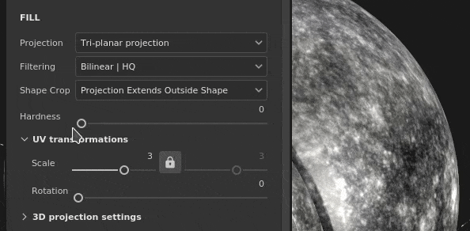

# 三投影

填充的三投影是一个3D投影，它将多个平面的投影组合在一起，并将它们混合以覆盖整个3D 网格。 在不创建任何可见接缝的情况下投影噪声和图案非常有用。

## 属性

| *设置* | *描述* |
| --- | --- |
| **筛选** | 控制如何过滤纹理或材料。 此设置可能会影响纹理在多次重复时的外观。 如果高缩放值使用的筛选与默认设置不同，可能会产生更好的外观效果。 当前可用设置：<ul data-preserve-html="true"> <li data-preserve-html="true"><b>双线性- HQ</b>（默认）：高级双线性筛选，尝试在拼贴值较高时提高纹理的质量。</li> <li data-preserve-html="true"><b>双线性 — 锐化</b>：简单的双线性筛选，略微平滑纹理，但尝试保留细节。</li> <li data-preserve-html="true"><b>最接近</b>：无过滤，如果双线性过滤产生模糊结果并破坏细微细节，则非常有用。 可以在纹理中引入锯齿。</li> </ul> |
| **形状裁剪** | 定义投影纹理是否应该在投影区域之外可见。 可能的值为：<ul data-preserve-html="true"><li data-preserve-html="true"><strong>项目已裁剪为形状</strong>：投影限制在投影区域内。</li><li data-preserve-html="true"><strong>投影延伸至形状</strong>之外（默认）：投影延伸至投影区域之外。</li></ul>   <table> <tr style="border: 0;"> <td style="border: 0;" valign="top">  

  </td> <td style="border: 0;" valign="top">  

  </td> </tr> </table> |
| **硬度** | 控制投影平面之间的过渡是强硬还是柔和。 值或1.0表示每个平面之间都有一个清晰的切口。 

 **注意：**&#x200B;每个平面的过渡都由顶点法线定义（不考虑法线网格图）。 这意味着当平面混合在一起时，突兀或破坏的顶点法线会导致意外结果。 |

### UV变换

UV转换设置控制投影中的纹理/材料。

<table data-preserve-html="true" style="width: 100.0%;"><colgroup> <col style="width: 40.0%;"/> <col style="width: 20.0%;"/> <col style="width: 40.0%;"/> </colgroup><tbody><tr><th>缩放模式</th><th>设置</th><th>描述</th></tr><tr><td>
<strong>拼贴</strong>（默认）<strong>  </strong>

允许手动设置当前纹理的重复数量。
</td><td><strong>平铺</strong></td><td>控制纹理的重复次数。</td></tr><tr><td rowspan="2">  </td><td colspan="1"><strong>旋转</strong></td><td colspan="1">控制纹理投影到网格上的角度。</td></tr><tr><td colspan="1"><strong>位移</strong></td><td colspan="1">控制投影纹理的起始位置。 默认值表示纹理中心位于网格UV的中心。</td></tr><tr><th colspan="1"> </th><th colspan="1"> </th><th colspan="1"> </th></tr><tr><td rowspan="4">
<strong>物理大小</strong>

根据网格大小和嵌入的物理尺寸自动调整纹理。 它使用宽度和长度（X和Y度量）来计算正确的物理尺寸。 不考虑Z测量。

(有关详细信息，请参阅专用的[文档页面](https://experienceleague.adobe.com/en/docs/substance-3d-painter/using/features/physical-size))
</td><td><strong>自定大小</strong></td><td>
如果启用，则允许手动输入物理尺寸并覆盖资源提供的订阅。

如果未检测到物理尺寸，或者如果在同一图层/效果中使用了多个物理尺寸不同的资源，则会自动选择该选项。
</td></tr><tr><td colspan="1"><strong>大小（厘米）</strong></td><td colspan="1">嵌入式物理尺寸以厘米为单位。 可以使用使用不同度量单位创建的网格文件 — 它将保持正确比例。 但是，资源大小当前仅以厘米显示。</td></tr><tr><td colspan="1"><strong>旋转</strong></td><td colspan="1">控制纹理投影到网格上的角度。</td></tr><tr><td colspan="1"><strong>位移</strong></td><td colspan="1">
控制投影纹理的起始位置。 默认值表示纹理中心位于网格UV的中心。
</td></tr></tbody></table>

>[!NOTE]
>
> **偏移**&#x200B;设置不适用于三投影。

### 3D projection settings

3D投影设置控制投影在3D空间中的变换。

| 设置 | 描述 |
| --- | --- |
| **偏移** | 3D空间中投影的原点位置。 单位基于整个场景的定界框。 0是这个盒子的中心。 |
| **旋转** | 每个轴上旋转整个投影的角度（以度为单位）。 |
| **缩放** | 每个轴上整个投影的大小。 |

## 上下文工具栏

位于视口顶部的[上下文工具栏](../../interface/toolbars.md)提供了多种设置和工具，可用于控制操纵器和投影：

| 图标 | 名称 | 描述 |
| --- | --- | --- |
| 

 | 显示/隐藏操纵器 | 如果启用，则操纵器在视口中可见并可控制。 |
| 

 | 操纵器设置 | 此菜单包含三个设置：<ul data-preserve-html="true"><li data-preserve-html="true"><strong>操纵器大小</strong>：控制操纵器在视口中的大小。</li><li data-preserve-html="true"><strong>网格步骤</strong>：定义使用约束进行转换时步骤的大小。</li><li data-preserve-html="true"><strong>角度步长</strong>：定义带约束旋转时步长的角度。</li></ul> |
| 

 | 翻译操纵器 | 允许在场景中沿主轴(X、Y、Z)移动投影。 |
| 

 | 旋转操纵器 | 允许沿主轴(X、Y、Z)旋转场景中的投影。 |
| 

 | 缩放机械手 | 允许沿主轴(X、Y、Z)缩放场景中的投影。 |
| 

 | 表面操纵器 | 允许通过在3D模型表面上投影来移动路径。  **注意：**&#x200B;此操纵器仅适用于平面和变形投影类型。 |
| 

 | 操纵器空间 | 定义要在哪个空间执行变换。 可能的值为：<ul data-preserve-html="true"><li data-preserve-html="true"><strong>本地空间</strong>：轴与当前转换对齐。</li><li data-preserve-html="true"><strong>世界空间</strong>：轴与场景对齐。</li></ul> |
| 

 | X轴镜像 | 在X轴上翻转变换。 |
| 

 | Y轴镜像 | 在Y轴上翻转变换。 |
| 

 | Z轴镜像 | 在Z轴上翻转变换。 |
| 

 | 重置变换 | 将投影转换恢复为默认状态。 |

## 操纵器

此操纵器仅在[3D视口](../../interface/viewport/3d-view.md)中可用。

| 操作 | 快捷键 | 描述 |
| --- | --- | --- |
| **翻译** | 鼠标单击 | 使用翻译操纵器，单击轴可移动投影：<ul data-preserve-html="true"><li data-preserve-html="true"><strong>一个轴</strong>：仅向投影的一个方向移动。</li><li data-preserve-html="true"><strong>两个轴</strong>：移动与轴对齐的计划上的投影。</li><li data-preserve-html="true"><strong>三个轴</strong>：在相机的空间中移动投影（面向它的计划）。</li></ul>   <table> <tr style="border: 0;"> <td style="border: 0;" valign="top">  

  </td> <td style="border: 0;" valign="top">  

  </td> <td style="border: 0;" valign="top">  

  </td> </tr> </table> |
| **转换受限** | 按住SHIFT键并单击鼠标 | 使用平移操纵器，沿所选轴移动投影，但只能按特定的时间间隔（步进）。 间隔的大小通过操纵器设置来定义。 

 |
| **旋转** | 鼠标单击 | 使用旋转操纵器，单击一个轴可旋转投影。 在轴之间单击允许同时旋转所有轴。   <table> <tr style="border: 0;"> <td style="border: 0;" valign="top">  

  </td> <td style="border: 0;" valign="top">  

  </td> </tr> </table> |
| **旋转受限** | 按住SHIFT键并单击鼠标 | 使用旋转机械手时，单击一个轴来旋转投影将仅在特定的间隔发生。 步骤通过操纵器设置由角度定义。 

 |
| **缩放** | 鼠标单击 | 使用“缩放”操纵器单击一个轴手柄可沿给定轴调整投影的大小。   <table> <tr style="border: 0;"> <td style="border: 0;" valign="top">  

  </td> <td style="border: 0;" valign="top">  

  </td> <td style="border: 0;" valign="top">  

  </td> </tr> </table> |
| **缩放受限** | 按住SHIFT键并单击鼠标 | 使用“缩放”操纵器，在保持快捷键不变的情况下单击一个轴手柄将分步调整投影的大小。 步长与平移操纵器的步长相同。 

 |
| **表面** | 鼠标单击 | 使用“曲面”操纵器时，单击并将其拖动到3D模型上会将其捕捉到曲面上。 

 **注意：**&#x200B;此机械臂仅适用于&#x200B;**平面**&#x200B;和&#x200B;**变形**&#x200B;投影类型。 |
