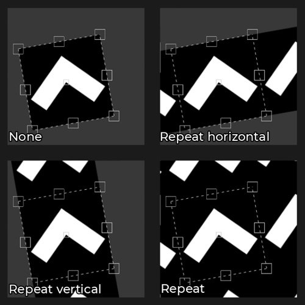
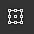
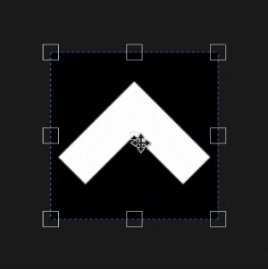
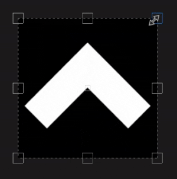

# UV 投影

填充的UV 投影是2D投影，仅在2D纹理空间中工作。 它提供了移动、旋转和缩放图像的控件。

## 属性

| *设置* | *描述* |
| --- | --- |
| **筛选** | 控制如何过滤纹理或素材。 此设置可能会影响多次重复时纹理的外观。 对于高缩放值，使用不同于默认值的滤波方法可能会获得更好的视觉效果。 当前可用设置：<ul data-preserve-html="true"><li data-preserve-html="true"><strong>两次线性 | HQ </strong>：（默认）高级双线性过滤，尝试在拼贴值较高时改进纹理的品质。</li><li data-preserve-html="true"><strong>两次线性 |锐化</strong>：简单的双线性过滤，略微平滑纹理，但尝试保留细节。</li><li data-preserve-html="true"><strong>最接近的</strong>：无过滤，如果双线性过滤产生模糊结果并破坏细微细节，则非常有用。 可以在纹理中引入锯齿。</li></ul> |
| **UV 展开** | 控制投影的素材/图像在投影形状内重复的方式。 可能的值为：<ul data-preserve-html="true"><li data-preserve-html="true"><strong>无</strong> ：投影不重复。</li><li data-preserve-html="true"><strong>水平重复</strong> ：仅水平重复。</li><li data-preserve-html="true"><strong>垂直重复</strong> ：仅垂直重复。</li><li data-preserve-html="true"><strong>重复</strong>（默认） ：水平和垂直重复。</li></ul> 

 |

### UV转换

UV变换设置控制投影中的纹理/素材。

<table data-preserve-html="true" style="width: 100.0%;"><colgroup> <col style="width: 40.0%;"/> <col style="width: 20.0%;"/> <col style="width: 40.0%;"/> </colgroup><tbody><tr><th>缩放模式</th><th>设置</th><th>描述</th></tr><tr><td>
<strong>拼贴</strong>（默认）<strong>  </strong>

允许手动设置当前纹理的重复量。
</td><td><strong>平铺</strong></td><td>控制纹理的重复次数。</td></tr><tr><td rowspan="2">  </td><td colspan="1"><strong>旋转</strong></td><td colspan="1">控制纹理投影到网格上的角度。</td></tr><tr><td colspan="1"><strong>位移</strong></td><td colspan="1">控制纹理的投影位置。 默认值表示纹理中心位于网格UV的中心。</td></tr><tr><th colspan="1"> </th><th colspan="1"> </th><th colspan="1"> </th></tr><tr><td rowspan="4">
<strong>物理大小</strong>

根据网格大小和嵌入的纹理自动调整物理尺寸。 它使用宽度和长度（X和Y度量）来计算正确的物理尺寸。 不考虑Z测量。

(有关详细信息，请参阅专用的[文档页面](https://experienceleague.adobe.com/en/docs/substance-3d-painter/using/features/physical-size))
</td><td><strong>自定大小</strong></td><td>
如果启用，则允许手动输入物理尺寸并覆盖资源提供的订阅。

如果未检测到物理尺寸，或者如果在同一图层/效果中使用了多个物理尺寸不同的资源，则会自动选择该选项。
</td></tr><tr><td colspan="1"><strong>大小（厘米）</strong></td><td colspan="1">嵌入式物理尺寸以厘米为单位。 可以使用使用不同测量单位创建的网格文件 — 它将保持正确比例。 但是，资源大小当前仅以厘米显示。</td></tr><tr><td colspan="1"><strong>旋转</strong></td><td colspan="1">控制纹理投影到网格上的角度。</td></tr><tr><td colspan="1"><strong>位移</strong></td><td colspan="1">
控制纹理的投影位置。 默认值表示纹理中心位于网格UV的中心。
</td></tr></tbody></table>

## 上下文工具栏

可通过位于视窗顶部的[上下文工具栏](../../interface/toolbars.md)使用多种设置和工具，这些设置和工具可用于控制操纵器和投影：

| 图标 | 名称 | 描述 |
| --- | --- | --- |
| 

 | 显示/隐藏操纵器 | 如果启用，操作器将在视区中可见并可控制。 |
| 

 | 操纵器手柄大小 | 此菜单包含三个设置，用于定义变换手柄在视区中的大小：<ul data-preserve-html="true"><li data-preserve-html="true"><strong>小</strong></li><li data-preserve-html="true"><strong>中</strong></li><li data-preserve-html="true"><strong>大</strong></li></ul> |
| 

 | X轴镜像 | 在X轴上翻转变换。 |
| 

 | Y轴镜像 | 在Y轴上翻转变换。 |
| 

 | 重置透视点 | 将透视点恢复到转换的中间。 |
| 

 | 重置变换 | 将投影转换恢复为默认状态。 |

## 机械手

UV 投影使用的操纵器仅在[2D视图](../../interface/viewport/2d-view.md)中可用。

| 操作 | 快捷键 | 描述 |
| --- | --- | --- |
| **翻译** | 鼠标单击 | 单击并拖动变换内的任意区域以移动它。 

 |
| **转换约束** | 按住SHIFT键并单击鼠标 | 单击并拖动变换内的任意区域，同时按住快捷键以仅沿一个轴移动它。 轴可以是水平或垂直，并与相机对齐，具体取决于鼠标方向。 

 |
| **旋转** | 鼠标单击 | 在变形之外单击并拖动允许旋转它。 移动枢轴还允许更改旋转原点。   <table> <tr style="border: 0;"> <td style="border: 0;" valign="top">  

  </td> <td style="border: 0;" valign="top">  

  </td> </tr> </table> |
| **旋转受限** | 按住SHIFT键并单击鼠标 | 在按住快捷键的同时从变换外部单击并拖动，只允许其每45度旋转一次。 

 |
| **缩放** | 鼠标单击 | 单击并拖动操纵器的任何手柄都允许变形变换。   <table> <tr style="border: 0;"> <td style="border: 0;" valign="top">  

  </td> <td style="border: 0;" valign="top">  

  </td> </tr> </table> |
| **缩放受限** | 按住SHIFT键并单击鼠标 | 通过在拖动手柄时按住快捷键，会强制保持变换的比例。   <table> <tr style="border: 0;"> <td style="border: 0;" valign="top">  

  </td> <td style="border: 0;" valign="top">  

  </td> </tr> </table> |
| **缩放镜像** | 按住CTRL并单击鼠标 | 在移动任何手柄的同时按下快捷键时，其他手柄将执行类似的移动。 它允许围绕枢轴点以对称方式使变形变形。   <table> <tr style="border: 0;"> <td style="border: 0;" valign="top">  

  </td> <td style="border: 0;" valign="top">  

  </td> </tr> </table> |
| **缩放镜像和约束** | SHIFT+CTRL+鼠标单击 | 通过组合这两个快捷键，可以在保持长宽比不变的同时，使变形以对称方式进行。 

 |
