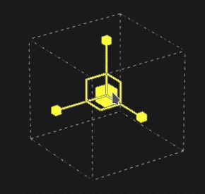
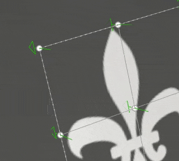

# 变形投影

填充的变形投影是一个3D投影，它允许通过编辑纹理的点使网格变形。 它可用于在非平面表面上拟合图案和徽标。

## 快速设置

可以通过将资源从[“资源”窗口](../../interface/assets/assets.md)拖放到网格上，使用变形投影快速设置图层。 松开鼠标时，将打开一个菜单，允许选择应在哪个通道中分配资源。

兼容的资源类型包括：

* **Alpha**
* **程序化**
* **纹理**
* **材料**（需要按ALT键）

## 属性

| 设置 | 描述 |
| --- | --- |
| **筛选** | 控制如何过滤纹理或材料。 此设置可能会影响纹理在多次重复时的外观。 如果高缩放值使用的筛选与默认设置不同，可能会产生更好的外观效果。 当前可用设置：<ul data-preserve-html="true"><li data-preserve-html="true"><strong>双线性`\|` HQ</strong>（默认）：高级双线性筛选，尝试在拼贴值较高时提高纹理的质量。</li><li data-preserve-html="true"><strong>双线性`\|`锐化</strong>：简单的双线性筛选，会略微平滑纹理，但会尝试保留细节。</li><li data-preserve-html="true"><strong>最接近</strong>：无过滤，如果双线性过滤产生模糊结果并破坏细微细节，则非常有用。 可以在纹理中引入锯齿。</li></ul> |
| **UV 展开** | 控制纹理在投影中的重复方式。 可能的值为：<ul data-preserve-html="true"><li data-preserve-html="true"><strong>无</strong>：纹理不重复。 纹理外的任何内容均为黑色/透明。</li><li data-preserve-html="true"><strong>水平重复</strong>：纹理仅水平重复。</li><li data-preserve-html="true"><strong>垂直重复</strong>：纹理仅垂直重复。</li><li data-preserve-html="true"><strong>重复</strong>（默认）：纹理在这两个轴上重复。</li></ul> |
| **形状裁剪** | 定义投影纹理是否应该在投影区域之外可见。 可能的值为：<ul data-preserve-html="true"><li data-preserve-html="true"><strong>项目已裁剪为形状</strong>：投影限制在投影区域内。</li><li data-preserve-html="true"><strong>投影延伸至形状</strong>之外（默认）：投影延伸至投影区域之外。</li></ul> 

 |
| **深度** | 控制投影沿Z轴移动的距离。 当网格点或网格平面太远时，此设置有助于到达投影曲面。绿色箭头表示网格中每个点的投影方向和距离。 

 **警报：**&#x200B;较高的值可能会严重影响性能。 建议尽可能降低此参数。 |
| **深度剔除** | 根据距离投影。 有一个参数可用：<ul data-preserve-html="true"><li data-preserve-html="true"><strong>硬度</strong>：控制淡入淡出的强弱程度。</li></ul> 

 |

### UV变换

UV转换设置控制投影中的纹理/材料。

<table data-preserve-html="true" style="width: 100.0%;"><colgroup> <col style="width: 40.0%;"/> <col style="width: 20.0%;"/> <col style="width: 40.0%;"/> </colgroup><tbody><tr><th>缩放模式</th><th>设置</th><th>描述</th></tr><tr><td>
<strong>拼贴</strong>（默认）<strong>  </strong>

允许手动设置当前纹理的重复数量。
</td><td><strong>平铺</strong></td><td>控制纹理的重复次数。</td></tr><tr><td rowspan="2">  </td><td colspan="1"><strong>旋转</strong></td><td colspan="1">控制纹理投影到网格上的角度。</td></tr><tr><td colspan="1"><strong>位移</strong></td><td colspan="1">控制投影纹理的起始位置。 默认值表示纹理中心位于网格UV的中心。</td></tr><tr><th colspan="1"> </th><th colspan="1"> </th><th colspan="1"> </th></tr><tr><td rowspan="4">
<strong>物理大小</strong>

根据网格大小和嵌入的物理尺寸自动调整纹理。 它使用宽度和长度（X和Y度量）来计算正确的物理尺寸。 不考虑Z测量。

(有关详细信息，请参阅专用的[文档页面](https://experienceleague.adobe.com/en/docs/substance-3d-painter/using/features/physical-size))
</td><td><strong>自定大小</strong></td><td>
如果启用，则允许手动输入物理尺寸并覆盖资源提供的订阅。

如果未检测到物理尺寸，或者如果在同一图层/效果中使用了多个物理尺寸不同的资源，则会自动选择该选项。
</td></tr><tr><td colspan="1"><strong>大小（厘米）</strong></td><td colspan="1">嵌入式物理尺寸以厘米为单位。 可以使用使用不同度量单位创建的网格文件 — 它将保持正确比例。 但是，资源大小当前仅以厘米显示。</td></tr><tr><td colspan="1"><strong>旋转</strong></td><td colspan="1">控制纹理投影到网格上的角度。</td></tr><tr><td colspan="1"><strong>位移</strong></td><td colspan="1">
控制投影纹理的起始位置。 默认值表示纹理中心位于网格UV的中心。
</td></tr></tbody></table>

### 3D projection settings

3D投影设置控制投影在3D空间中的变换。

| 设置 | 描述 |
| --- | --- |
| **偏移** | 3D空间中投影的原点位置。 单位基于整个场景的定界框。 0是这个盒子的中心。 |
| **旋转** | 每个轴上旋转整个投影的角度（以度为单位）。 |
| **缩放** | 每个轴上整个投影的大小。 |

## 上下文工具栏

位于视口顶部的[上下文工具栏](../../interface/toolbars.md)提供了多种设置和工具，可用于控制操纵器和投影：

| 图标 | 名称 | 描述 |
| --- | --- | --- |
| 

 | 显示/隐藏操纵器 | 如果启用，则操纵器在视口中可见并可控制以编辑投影变换或网格点。 如果禁用，则操纵器和网格都将隐藏。 |
| 

 | 操纵器设置 | 此菜单包含三个设置：<ul data-preserve-html="true"><li data-preserve-html="true"><strong>操纵器大小</strong>：控制操纵器在视口中的大小。</li><li data-preserve-html="true"><strong>网格步骤</strong>：定义使用约束进行转换时步骤的大小。</li><li data-preserve-html="true"><strong>角度步长</strong>：定义带约束旋转时步长的角度。</li></ul> |
| 

 | “变形版本”菜单 | 此菜单包含五个操作：<ul data-preserve-html="true"><li data-preserve-html="true"><strong>变换变形</strong>：编辑变形变换。 允许操纵全局网格位置、旋转和缩放。</li><li data-preserve-html="true"><strong>编辑顶点</strong>：单独（或成组）编辑变形网格点。</li><li data-preserve-html="true"><strong>交叉拆分变形</strong>：启动拆分变形工具以水平和垂直插入新的网格分区。</li><li data-preserve-html="true"><strong>水平拆分变形</strong>：启动拆分变形工具以水平插入新的网格分区。</li><li data-preserve-html="true"><strong>垂直拆分变形</strong>：启动拆分变形工具以垂直插入新的网格分区。</li></ul> |
| 

 | 变形投影设置 | 此菜单重组仅影响当前变形投影的设置：<ul data-preserve-html="true"><li data-preserve-html="true"><strong>行和列</strong>：指定变形网格具有的分区数。 仅当未修改网格点时，才能编辑此设置。</li><li data-preserve-html="true"><strong>手柄大小</strong>：在<strong>编辑网格</strong>模式下定义顶点点的大小。</li><li data-preserve-html="true"><strong>网格颜色</strong>：定义变形网格线条的颜色。</li></ul> |
| 

 | 自动切线 | 如果启用，则在移动点时，自动将点的切线与其相邻点对齐。 |
| 

 | 翻译操纵器 | 允许沿主轴(X、Y、Z)移动投影或网格点。 |
| 

 | 旋转操纵器 | 允许沿主轴(X、Y、Z)旋转投影或网格点。 |
| 

 | 缩放机械手 | 允许沿主轴(X、Y、Z)缩放场景中的投影。 |
| 

 | 表面操纵器 | 允许通过在3D模型曲面上投影或网格点来移动它们。 |
| 

 | 机械手空间 | 定义要在哪个空间执行变换。 可能的值：<ul data-preserve-html="true"><li data-preserve-html="true"><strong>本地空间</strong>：轴与当前转换对齐。</li><li data-preserve-html="true"><strong>世界空间</strong>：轴与场景对齐。</li></ul> |
| 

 | X轴镜像 | 在X轴上翻转变换。 |
| 

 | Y轴镜像 | 在Y轴上翻转变换。 |
| 

 | Z轴镜像 | 在Z轴上翻转变换。 |
| 

 | 重置变换 | 此菜单包含三个操作：<ul data-preserve-html="true"><li data-preserve-html="true"><strong>恢复全局变换</strong>：将投影的位置、旋转和缩放重置回初始值。 此操作不影响网格点本身。</li><li data-preserve-html="true"><strong>重置所有顶点</strong>：重置变形网格的所有网格点的位置和切线。</li><li data-preserve-html="true"><strong>重置所选顶点</strong>：仅重置变形网格的选定点的位置和正切。</li></ul> |

## 机械手

此投影操纵器仅在[3D视口](../../interface/viewport/3d-view.md)中可用。

| 操作 | 快捷键 | 描述 |
| --- | --- | --- |
| **翻译** | 鼠标单击 | 使用翻译操纵器，单击轴可移动投影：<ul data-preserve-html="true"><li data-preserve-html="true"><strong>一个轴</strong>：仅向投影的一个方向移动。</li><li data-preserve-html="true"><strong>两个轴</strong>：移动与轴对齐的计划上的投影。</li><li data-preserve-html="true"><strong>三个轴</strong>：在相机的空间中移动投影（面向它的计划）。</li></ul>   <table> <tr style="border: 0;"> <td style="border: 0;" valign="top">  

  </td> <td style="border: 0;" valign="top">  

  </td> <td style="border: 0;" valign="top">  

  </td> </tr> </table> |
| **转换受限** | 按住SHIFT键并单击鼠标 | 使用平移操纵器沿所选轴移动投影，但仅以特定间隔（步进）移动。 间隔的大小通过操纵器设置来定义。 

 |
| **旋转** | 鼠标单击 | 使用旋转操纵器，单击一个轴可旋转投影。 在轴之间单击允许同时旋转所有轴。   <table> <tr style="border: 0;"> <td style="border: 0;" valign="top">  

  </td> <td style="border: 0;" valign="top">  

  </td> </tr> </table> |
| **旋转受限** | 按住SHIFT键并单击鼠标 | 使用旋转机械手时，单击一个轴来旋转投影将仅在特定的间隔发生。 步骤通过操纵器设置由角度定义。 

 |
| **缩放** | 鼠标单击 | 使用“缩放”操纵器单击一个轴手柄可沿给定轴调整投影的大小。   <table> <tr style="border: 0;"> <td style="border: 0;" valign="top">  

  </td> <td style="border: 0;" valign="top">  

  </td> <td style="border: 0;" valign="top">  

  </td> </tr> </table> |
| **缩放受限** | 按住SHIFT键并单击鼠标 | 使用“缩放”操纵器，在保持快捷键不变的情况下单击一个轴手柄将分步调整投影的大小。 步长与平移操纵器的步长相同。 

 |
| **表面** | 鼠标单击 | 使用“曲面”操纵器时，单击并将其拖动到3D模型上会将其捕捉到曲面上。 

 **注意：**&#x200B;此机械臂仅适用于&#x200B;**平面**&#x200B;和&#x200B;**变形**&#x200B;投影类型。 |

## 编辑网格点

变形投影由平面和点网格表示。 可以对每个点进行修改，使投影更适合3D模型，也可以扭曲纹理。

要编辑网格点，请从上下文工具栏将编辑模式切换为&#x200B;**编辑顶点**：

>[!NOTE]
>
> 可以使用键盘快捷键在&#x200B;**变换变形**&#x200B;和&#x200B;**编辑顶点**&#x200B;之间快速切换。 请参阅[快捷键](../../interface/settings/shortcuts.md)页面中的&#x200B;**切换变形版本模式**。

### 选择点

| 操作 | 描述 |
| --- | --- |
| 

 | <ul data-preserve-html="true"><li data-preserve-html="true">单击一个点即可将其选中。</li><li data-preserve-html="true">在远离点或操纵器的位置单击将取消选择点。</li><li data-preserve-html="true">按<strong>SHIFT</strong>时单击点允许选择多个点。</li><li data-preserve-html="true">在按<strong>CTRL</strong>的同时单击一个点允许仅取消选择此点，而不允许取消选择另一个点。</li></ul> |
| 

 | <ul data-preserve-html="true"><li data-preserve-html="true">单击并拖动可以进行矩形选择。 松开鼠标时，矩形内的任何点都将被选中。</li><li data-preserve-html="true">按住<strong>SHIFT</strong>键的同时单击并拖动允许向当前选区添加更多点。</li><li data-preserve-html="true">按住<strong>CTRL</strong>的同时单击并拖动允许从当前选区中删除点。</li></ul> |

### 移动点

| 操作 | 描述 |
| --- | --- |
| 

 | <ul data-preserve-html="true"><li data-preserve-html="true">使用平移操纵器移动点。</li><li data-preserve-html="true">使用“曲面”机械手在3D模型曲面上的点上移动。</li></ul> |
| 

 | <ul data-preserve-html="true"><li data-preserve-html="true">单击并拖动某个点可快速移动它，而无需先将其选中。</li><li data-preserve-html="true">单击并拖动点可像移动“曲面”操纵器一样移动它。</li><li data-preserve-html="true">按<strong>CTRL</strong>的同时单击并拖动点会像平移操纵器一样移动它（在三个轴的相机空间中）。</li></ul> |

### 调整正切

变形网格是[贝塞尔曲线修补](https://en.wikipedia.org/wiki/B%C3%A9zier_surface)，这意味着每个点都有其自己的正切集来控制连接点的线条的曲线。 调整正切可以更好地控制纹理的变形方式。

| 操作 | 描述 |
| --- | --- |
| 

 | <ul data-preserve-html="true"><li data-preserve-html="true">要修改点的切线（以红色显示），只需选择给定点，然后使用“旋转”或“缩放”操纵器即可。</li></ul> |

>[!NOTE]
>
> 如果启用了上下文工具栏中的设置&#x200B;**“自动正切”**，则在移动点时，正切将会自动重置和调整。
> 
> 

### 增加或减少点数

可对变形网格进行细分，以增加点数，并更好地控制纹理的变形。

| 操作 | 描述 |
| --- | --- |
| 

 | <ul data-preserve-html="true"><li data-preserve-html="true">从“变形设置”菜单中按行和列网格。 （仅当未移动任何点时才能执行此操作）</li><li data-preserve-html="true">使用三个拆分网格之一来细分工具。</li><li data-preserve-html="true">按<strong>Esc</strong>可取消任何拆分工具。</li></ul> |
