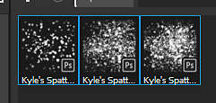

# 导入Photoshop画笔预设

本页逐步介绍了如何将ABR文件导入Substance 3D Painter。

1. <b>打开导入资源窗口。</b>

   可通过三种不同的方式打开“导入资源”窗口：

   * 将ABR文件拖放到资源面板中。
   * 使用主菜单中的<b>文件>导入资源</b>。
   * 使用“资源”面板中的<b>+ </b>按钮。
1. <b>将ABR文件添加到“导入资源”窗口。</b>

   如果未将ABR文件拖放到“资源”窗口中以打开导入窗口，则默认情况下文件将为空。

   要添加ABR文件，您可以：

   * **将** ABR文件拖放到窗口中。
   * 单击&#x200B;**添加资源**&#x200B;按钮以选择和加载ABR文件。

   >[!NOTE]
   >
   > 
   > 
   > 如果ABR文件存在一些问题，则该文件旁边可能会出现一个警告图标。 例如：
   > 
   > * 未找到兼容的预设。 有关详细信息，请参阅[Photoshop画笔参数兼容性](photoshop-brush-parameters-compatibility.md)列表。
   > * 无法读取文件（例如：文件已损坏）。
1. <b>选择如何导入ABR文件。</b>

   在“导入资源”窗口底部，选择加载ABR文件的位置：

   * <b>项目</b>：ABR文件将加载到当前打开的项目中。 仅当当前项目打开并附加到项目文件时，画笔才可用。
   * <b>会话</b>：将ABR文件加载到内存中。 在应用程序关闭之前，画笔预设将一直可用。
   * <b>库</b>：ABR文件将被复制到磁盘上的托架。 每当打开Painter时，画笔预设都可用，适用于所有项目。

   
1. <b>从盘架中访问画笔预设。</b>

   

   如果导入画笔预设时没有问题，这些画笔预设将出现在[资源](../../../interface/assets/assets.md)窗口中。

   >[!NOTE]
   >
   > 如果画笔预设基于位图，则该画笔预设所使用的图像也可用于与画笔预设同名的“Shelf”的“Alpha”部分。
