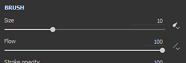
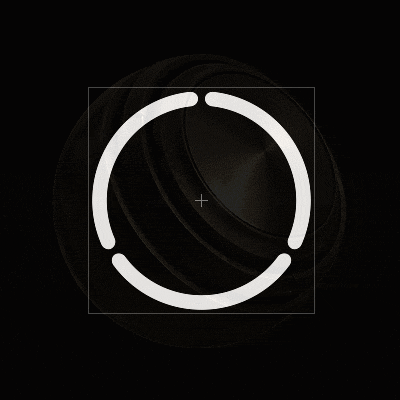

# 画笔

绘图工具是Substance 3D Painter在3D网格上应用颜色和材质属性的默认工具。 它具有可通过[属性](../../interface/properties.md)编辑的特定参数。

绘画工具通过各种行为和设置来模拟画笔描边，给人一种在3D网格上进行绘画的感觉。

## 工具栏

[工具栏](../../interface/toolbars.md)将显示以下快捷键（请参阅下一部分中的说明）：

* 尺寸
* 流量
* 笔触不透明度
* 间距

还有一些其他工具中通用的其他快捷键：

* [延迟鼠标](../lazy-mouse.md)
* [对称](../symmetry/symmetry.md)

## 预览

[属性](../../interface/properties.md)的顶部是画笔和素材预览。 它们可用于快速浏览当前工具的设置方式。

| *名称* | *描述* |
| --- | --- |
| **画笔预览** | 画笔预览显示画笔基于画笔参数的行为方式。 可以在预览中单击以绘制自定义描边。   <table> <tr style="border: 0;"> <td style="border: 0;" valign="top">  

  </td> <td style="border: 0;" valign="top">  

  </td> </tr> </table>   **注意：**&#x200B;画笔预览不支持钢笔压力。 |
| **素材预览** | 素材预览显示当前用于绘画的素材的属性。 可以在预览中单击以旋转光照，并在绘画之前更好地查看素材的效果。   <table> <tr style="border: 0;"> <td style="border: 0;" valign="top">  

  </td> <td style="border: 0;" valign="top">  

  </td> </tr> </table> |

## 笔刷

画笔参数是定义在3D网格上执行画笔描边时的外观和感觉的参数。

>[!NOTE]
>
> 使用图形输入板时，某些参数可能由钢笔压力控制。 此信息也可以保存在[预设](../presets/presets.md)中。\
> 单击专用按钮以启用或禁用压力：
> 
> 

| 名称 | 描述 |
| --- | --- |
| **大小** | 控制画笔描边内的图章将有多大。 画笔大小是相对的，可根据中定义的相对空间而变化（请参阅下面的“对齐大小空间”参数）。 *此参数可由钢笔压力控制。* |
| **流量** | 画笔描边内各个图章的强度或不透明度。 *此参数可由钢笔压力控制。* |
| **笔触不透明度** | 画笔描边的最大全局不透明度。 与“流量”参数相反，笔触不透明度不能通过“钢笔压力”来控制，因为它是在笔触绘制过程结束时应用的。流量和描边不透明度之间的差异：<ul data-preserve-html="true"><li data-preserve-html="true"><strong>左侧</strong> ：流量为50%，描边不透明度为100%</li><li data-preserve-html="true"><strong>右侧</strong> ：流量为100%，笔触不透明度为50%</li></ul> 

 **注意：**&#x200B;通过按下快捷键“A”，可以像上面的动画中一样继续上一个描边。 |
| **间距** | 画笔描边各个图章之间的距离。 使用较小的值，可以创建连续的线条，但由于总共绘制的图章要多得多，因此计算的范围更广。 较高的值允许在图章之间创建间隙，该间隙可能更适合特定图案（如木上的钉子）。 |
| **角度** | 画笔描边内图章的方向。 如果对齐不正确，旋转Alpha非常有用。 可与“跟随路径”组合使用。 |
| **跟随路径** | 定向画笔描边内的图章以遵循绘画方向。 

 **注意：**&#x200B;要计算描边方向，Substance 3D Painter会将上一个图章与当前图章进行比较，这就是启用“跟随路径”后，单击一次绘制不会产生任何结果的原因。 启用此功能后，至少需要两个图章才能绘制画笔描边。 |
| **大小抖动** | 在画笔描边内对每个图章应用随机大小值。 值为0表示无随机性，值为1表示完全随机性。 

 |
| **流抖动** | 在画笔描边内对每个图章应用随机流值。 值为0表示无随机性，值为1表示完全随机性。 

 |
| **角度抖动** | 在画笔描边内对每个图章应用随机附加旋转角度。 值为0表示无随机性，值为1表示完全随机性。 

 |
| **位置抖动** | 在画笔描边内对每个图章应用随机位置偏移。 值为0表示无随机性，值为1表示完全随机性。 

 |
| **对齐** | 确定画笔描边内的图章在3D网格曲面上的投影/定向方式。 以下值可用：<ul data-preserve-html="true"><li data-preserve-html="true"><strong>相机</strong> ：将图章朝向视口视角</li><li data-preserve-html="true"><strong>相切`\|`绕排（默认） </strong> ：调整图章方向以与3D网格表面对齐。 印章也将变形以符合表面。</li><li data-preserve-html="true"><strong>正切`\|`平面</strong> ：调整图章方向以与3D网格表面对齐。 图章的边框将渐隐到3D网格表面以外的位置。 </li><li data-preserve-html="true"><strong> UV </strong> ：根据3D网格UV调整图章方向。</li></ul> |
| **背面剔除** | 允许忽略3D网格上未与图章对齐的曲面。 为了计算3D网格的哪些部分应被忽略，绘画引擎会查看3D网格表面的法线，并将其角度与定义的值进行比较。 |
| **大小空间** | 控制计算画笔大小的相对空间。 可能的值为：<ul data-preserve-html="true"><li data-preserve-html="true"><strong>对象（默认） </strong> ：画笔大小与3D网格大小同步。 在视区中移动摄像机将影响其大小，以使其保持相对于3D网格。</li><li data-preserve-html="true"><strong>视区</strong> ：画笔大小已链接到视区。 调整界面大小将会影响画笔大小。 移动相机不会产生任何效果。</li><li data-preserve-html="true"><strong>纹理</strong> ：画笔大小链接到2D视口缩放级别。</li></ul> |

## Alpha

Alpha是应用于画笔描边内每个图章的灰度蒙版。 它可以是Substance文件或位图。

>[!NOTE]
>
> 如果Substance图形公开参数“硬度”（标识符），则可用硬度[快捷键](../../interface/settings/shortcuts.md)控制。

## 物理

物理属性用于控制绘画时投影的粒子。

默认情况下，物理属性不可用，但可以通过以下两种方式启用：

* 在[工具栏](../../interface/toolbars.md)中将该工具切换为“物理”（或通过键盘快捷键）。
* 单击[资源](../../interface/assets/assets.md)窗口中的粒子画笔预设。

## 模板

模板是画笔描边的附加灰度蒙版。 与应用于每个单个图章的Alpha相反，Stencil是从[视口](../../interface/viewport/viewport.md)视角应用的全局蒙版。

>[!NOTE]
>
> 可以通过按&#x200B;**S**&#x200B;键，然后单击视口右上角的“**重置**”按钮来重置模板转换：
> 
> 

| *模式* | *视区* |
| --- | --- |
| **未加载资源** | 当未加载任何资源时，模板无效。 

 **注意：**&#x200B;通过按并保持[快捷键](../../interface/settings/shortcuts.md)“N”，可以在不移除资源的情况下暂时禁用模板蒙版。 |
| **移动模板** | 按&#x200B;**S**&#x200B;键并使用&#x200B;**鼠标中键**&#x200B;单击并拖动，即可移动模板。 

 |
| **旋转模板** | 旋转模板的方法是：按&#x200B;**S**&#x200B;键，然后使用&#x200B;**鼠标左键**&#x200B;单击并拖动。 此外，按&#x200B;**Shift**&#x200B;键允许每&#x200B;**90度**&#x200B;对齐一次旋转。 

 |
| **调整模板大小** | 通过按&#x200B;**S**&#x200B;键并使用&#x200B;**鼠标右键**&#x200B;单击并拖动，可以调整模板的大小。 

 |

拼贴模式设置控制如何在视口上重复模板蒙版（此设置还会影响纹理化）：

| *拼贴模式* | *描述* |
| --- | --- |
| **无拼贴（默认）** | 模板蒙版不会重复。 

 |
| **水平拼贴** | 仅在水平轴上重复模板蒙版。 

 |
| **垂直拼贴** | 仅在纵轴上重复模板蒙版。 

 |
| **H和V拼贴** | 在水平轴和垂直轴上重复使用模板蒙版。 

 |

## 材质

素材由多个通道组成，每个通道都保留特定的属性。 通道列表依赖于[纹理集设置](../../interface/texture-set/texture-set-settings.md)中定义的那些通道。

使用&#x200B;**材质模式**&#x200B;按钮可轻松加载Substance文件或预设，以便同时快速分配和编辑多个声道。

单击某个频道按钮将选中或取消选中该频道。 取消选择此选项后，将无法修改通道属性，并且在绘画过程中不会使用通道属性。

