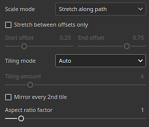

# 功能区路径

<b>功能区</b>路径工具允许您创建沿由3D模型曲面上的点定义的曲线变形的图案。 还可以使用“功能区”沿曲线编写文本。

可以从工具栏的“路径”工具菜单中选择“功能区”工具：

或通过<b>路径类型</b>按钮：

## 概述

“功能区路径”工具与“沿路径绘画”工具的不同之处在于前者绘制图像和素材的方式。

使用基于绘画/画笔的工具时，图像在路径上重复多次，使用色带时，图像沿路径重复并发生变形以遵循其曲线。 画笔的单个组件称为<b>图章</b>，而功能区中的那些组件称为<b>修补程序</b>。

## 设置

### 尺寸

| 参数 | 描述 |
| --- | --- |
| <b>描边宽度</b> | 控制当前描边的全局宽度。 |

### 不透明度

| 参数 | 描述 |
| --- | --- |
| <b>笔触不透明度</b> | 控制当前描边的最终不透明度。 |

### 描边

| 参数 | 描述 |
| --- | --- |
| <b>图像方向</b> | 定义输入图像的方向。 此方向控制图像在路径上的放置方式。 |
| <b>翻转图像</b> | 沿路径的轴/宽度翻转图像。 |
| <b>角</b> | 定义如何在路径上显示尖角（分割切线）。 可能的行为包括：<ul data-preserve-html="true"> <li data-preserve-html="true"><b>斜接连接</b>：尖角/尖角</li> <li data-preserve-html="true"><b>圆角连接</b>：平滑/圆角</li> <li data-preserve-html="true"><b>斜面连接</b>：正方形/平面角</li> <li data-preserve-html="true"><b>剪切连接</b>：再次启动路径。 此模式将创建一个具有专用起始/结束部分的新路径。</li> </ul>下面是角落的外观，按顺序排列：  

 |
| <b>关闭时省略结束</b> | 如果启用，则当路径闭合以进行连续循环时，将删除起始/结束部分。 这适用于拉伸偏移和动态笔触。 |

### 拉伸和拼贴

该功能区路径可以使用两种不同的模式来控制沿路径重复和拉伸图像的方式：

* <b>沿路径拉伸</b>： （默认）将拉伸沿路径重复的图像以适合路径长度
* <b>保持长宽比</b>：沿路径重复的图像将保留其长宽比。 如果图像与路径相比太长，则将被裁剪。

#### 沿路径拉伸

| 参数 | 描述 |
| --- | --- |
| <b>仅在偏移之间伸缩</b> | 如果启用，则在拉伸中间部分时，图像的起始部分和结束部分将保持不变。 使用<b>起始偏移</b>和<b>结束偏移</b>参数定义这些部分的大小。 中间截面将根据起始/终止自动计算。  

 |
| <b>拼贴模式</b> | 定义如何沿路径重复图像。 可能的值为：<ul data-preserve-html="true"> <li data-preserve-html="true"><b>无</b>：图像将不会重复。 它会沿着整条路被拉长。</li> <li data-preserve-html="true"><b>自动</b>：（默认）图像根据其大小和描边宽度自动重复特定次数。</li> <li data-preserve-html="true"><b>自定义</b>：映像按<b>拼贴量</b>参数定义的次数重复。</li> </ul> |
| <b>拼贴数量</b> | 指定图像在<b>自定义</b>拼贴模式下的重复次数。 |
| <b>每隔2个磁贴镜像一次</b> | 每第二次重复一次，沿着路径长度翻转所使用的图像。 |
| <b>长宽比系数</b> | 拉伸或压缩当前图像长宽比。 |

#### 保持纵横比

| 参数 | 描述 |
| --- | --- |
| <b>比率</b> | 定义如何在保持图像比例不变的情况下缩放图像：<ul data-preserve-html="true"> <li data-preserve-html="true"><b>适合路径宽度</b>： （默认）缩放图像以适合路径宽度。 这可能会导致图像被裁剪太长。</li> <li data-preserve-html="true"><b>适合路径长度</b>：调整图像的尺寸，使准确的数目沿路径适合，同时大致保持长宽比。</li> </ul> |
| <b>移除剪切的拼贴</b> | 如果启用，将删除路径上无法完全显示的重复项（如果已裁切）。 如果<b>比例</b>设置为<b>适合路径长度</b>，则禁用此设置。 |
| <b>拼贴模式</b> | 定义如何沿路径重复图像。 可能的值为：<ul data-preserve-html="true"> <li data-preserve-html="true"><b>无</b>：图像将不会重复。 它会沿着整条路被拉长。</li> <li data-preserve-html="true"><b>自动</b>：（默认）图像根据其大小和描边宽度自动重复特定次数。</li> <li data-preserve-html="true"><b>自定义</b>：映像按<b>拼贴量</b>参数定义的次数重复。</li> </ul> |
| <b>每隔2个磁贴镜像一次</b> | 每第二次重复一次，沿着路径长度翻转所使用的图像。 |
| <b>对齐</b> | 定义图像应沿着路径从何处开始。 可能的值为：<ul data-preserve-html="true"> <li data-preserve-html="true"><b>起点对齐</b>：从路径上的第一个点开始绘制图像。</li> <li data-preserve-html="true"><b>居中对齐</b>：将图像绘制在路径的中间。</li> <li data-preserve-html="true"><b>末端对齐</b>：从路径上的最后一个点开始绘制图像。</li> </ul> |
| <b>长宽比系数</b> | 拉伸或压缩当前图像长宽比。 |

### 通道混合

此部分控制路径自身重叠时的混合结果。

| 参数 | 描述 |
| --- | --- |
| <b>Alpha</b> | 控制功能区路径的<b>Alpha</b>部分在其自身重叠的区域中混合的方式，这会影响所有其他声道的混合强度。 可能的值为：<ul data-preserve-html="true"> <li data-preserve-html="true"><b>正常</b>：使用最顶端线段的Alpha。</li> <li data-preserve-html="true"><b>变亮（最大）</b>： （默认）使用最大Alpha值，保留最不透明的段。</li> <li data-preserve-html="true"><b>线性减淡（相加）</b>：添加段的Alpha以将它们累积在一起，从而产生更饱和的值。</li> </ul> |
| <b>正常</b> | 定义<b>正常</b>通道在路径自身重叠的区域中混合的方式。 可能的值为：<ul data-preserve-html="true"> <li data-preserve-html="true"><b>正常</b>：使用最上面的线段的结果。</li> <li data-preserve-html="true"><b>法线映射组合</b>： （默认）将强度相等的线段组合。</li> <li data-preserve-html="true"><b>法线图细节</b>：将最顶层的部分视为其他细节，而底部区域将保持其强度。</li> </ul>此设置独立于为整个图层定义的<b>正常</b>混合模式，该模式在路径自身的自重叠混合之后应用。 <b>注意</b>：如果通道为统一颜色，则禁用此设置。 它仅与位图和Substance资源兼容。 |
| <b>Height</b> | 定义<b>Height</b>通道在路径自身重叠的区域中混合的方式。 可能的值为：<ul data-preserve-html="true"> <li data-preserve-html="true"><b>正常</b>：使用最上面的线段的结果。</li> <li data-preserve-html="true"><b>线性减淡（添加）</b>：将段添加在一起，同时保留其原始强度。</li> <li data-preserve-html="true"><b>变暗（最小值）</b>：仅保留重叠段的最暗/最低值。</li> <li data-preserve-html="true"><b>亮度（最大）</b>： （默认）保持重叠段的最亮/最高值。</li> <li data-preserve-html="true"><b>屏幕</b>：类似于<b>线性减淡</b>，但得到的饱和度较低。</li> </ul>此设置独立于为整个图层定义的<b>Height</b>混合模式，该模式在路径自身的自重叠混合之后应用。 <b>注意</b>：如果通道为统一颜色，则禁用此设置。 它仅与位图和Substance资源兼容。 |

带Height声道的混合模式示例：

## 文本和非方形图像

使用[文本资源](../text-resource.md)或长宽比非方形的图像时，将自动缩放以适应功能区路径。

利用此行为，可以沿路径写入文本或重复图像，如修剪图案。

