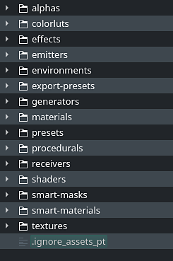

# 排除资源路径中的资源

此页面介绍如何设置忽略文件以指定在[资源](../../interface/assets/assets.md)窗口的搜索过程中将忽略的资源和文件夹。 这样可以避免显示不需要的资源。

>[!NOTE]
>
> 此功能从版本7.2.3开始可用。

## 创建忽略文件

导航到要在其中隐藏资源的资源文件夹的位置。 然后创建名为的文件：

```
.ignore_assets_pt
```


>[!NOTE]
>
> 请注意，文件名必须以点开头。

创建后，它应该如下所示：



## 示例

以下文件内容将放弃除默认库文件夹之外的任何资源和文件夹：

```
## exclude all

* 

 

## re-include library directories

!alphas 

!colorluts 

!effects 

!emitters 

!environments 

!export-presets 

!generators 

!materials 

!presets 

!procedurals 

!receivers 

!shaders 

!smart-masks 

!smart-materials 

!templates 

!textures
```


## 规则和准则

下表显示了应用于ignore文件的一般规则。

>[!NOTE]
>
> 忽略文件的模式匹配区分大小写，与操作系统行为无关。

| 规则 | 描述 | 示例 |
| --- | --- | --- |
| **空白行** | 空行，与任何内容都不匹配。 可用作可读性分隔符。 |  |
| **目录分隔符** | 正斜线用作目录分隔符。 分隔符可能出现在搜索模式的开头、中间或结尾。如果模式开头或中间有一个分隔符（或两者都有），则模式是相对于ignore文件本身的目录级别的。 否则，该模式也可能在低于忽略文件级别的任何级别上匹配。 如果模式末尾有一个分隔符，则会忽略该分隔符，则该模式仍将与文件和目录匹配。 | `folder/filename.extension   folder/sub-folder` |
| **注释行** | 以数字符号（或哈希）开头的行用作注释。 | `# This is a comment` |
| **星号** | 星号与除正斜杠之外的任何字符匹配。 | `# Match anything starting with Alpha   alpha*   # Match any file with given extension   *.jpg` |
| **字符范围** | 可以在括号之间指定字符范围，以匹配文件夹和文件名。<ul data-preserve-html="true"> <li data-preserve-html="true"><b>[abc]</b>：匹配给定列表中的一个字符</li> <li data-preserve-html="true"><b>[a-c]</b>：匹配给定范围中的一个字符</li> <li data-preserve-html="true"><b>[！abc]</b>：匹配给定列表中不包含的一个字符</li> <li data-preserve-html="true"><b>[！a-c]</b>：匹配不在给定范围中的一个字符</li> </ul>Range和list也可以是格式为<b>[0-9]</b>的数字。 | `# Exclude any UDIM image in PNG   *_[0-9][0-9][0-9][0-9].png` |
| **转义字符** | 指示本来会被忽略或用作规则的文本字符。 | `# This is a comment   [#]This/Is/A/Path` |
| **尾随空格** | 除非进行转义，否则将忽略尾随空格。 | `# Match a subfolder with trailing space   folder/subfolder[ ]` |
| **感叹号前缀** | 使用感叹号对图案进行前缀可以消除这种现象。先前模式排除的所有匹配文件都将再次包括在内。 如果排除某个文件的父目录，则无法重新包含该文件。 由于性能原因，爬网不会列出排除的目录，因此包含的文件上的任何模式都不起作用，无论在何处定义这些模式。 | `# Re-include specific file   !my_file_name.png` |
